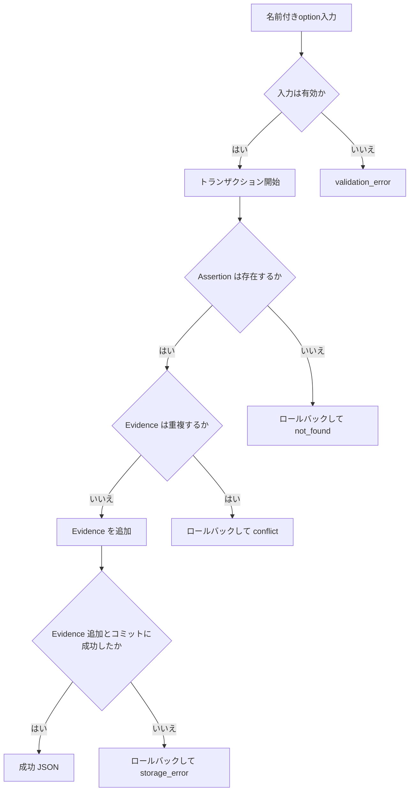
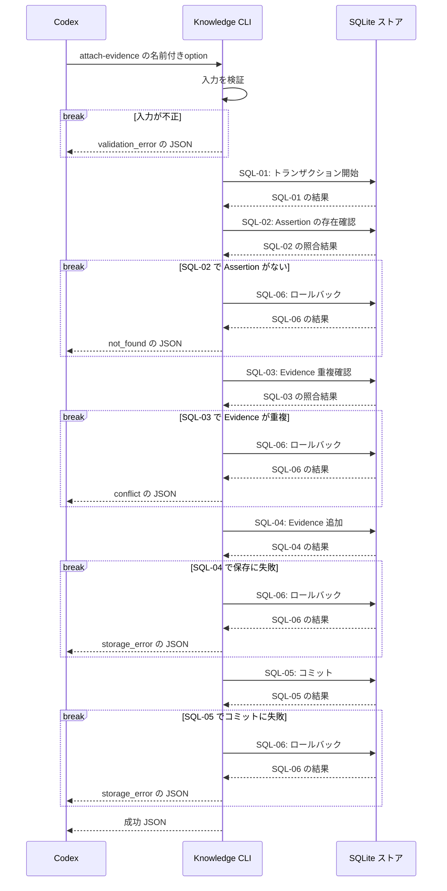

# `knowledge attach-evidence`（v1）

## 用語

- **Assertion（知識の項目）:** ユーザーが知っている可能性を扱う、一つの正規化済みの命題。例:「Go の `defer` は関数を抜けるときに実行される」。
- **Evidence（根拠記録）:** その命題をユーザーが知っていると判断するための、ユーザーの説明・コード・自己申告・訂正などの記録。

## コマンド概要

既存 Assertion に、その Assertion を支える新しい Evidence を履歴として追加する。Evidence の意味的な強度や知識状態は判定しない。

## I / O

Evidence schema は `create` と同一で、既存 Evidence の修正・削除はしない。

```text
knowledge attach-evidence --assertion-id asrt_01 \
  --evidence-kind correction \
  --evidence-text '以前の説明は不正確で、receiverがreadyになるまでblockする理解です' \
  --evidence-observed-at 2026-08-13T00:00:00Z
```

```json
{
  "ok": true,
  "data": {
    "assertion_id": "asrt_01",
    "evidence_id": "evd_02"
  }
}
```

## 入出力項目設計

失敗出力は [共通結果 envelope](../../design.md#共通結果-envelope) に従う。Evidence kindの固定値は `user_explanation`（ユーザー説明）、`user_reasoning`（ユーザー推論）、`user_code`（ユーザーコード）、`self_report`（自己申告）、`concept_recognition`（概念認識）、`correction`（後日の訂正）である。

| 方向 | 項目 | 型・出現回数 | 固定値・意味 |
| --- | --- | --- | --- |
| 入力 | `--assertion-id` | string、1回 | 追加先 Assertion の不透明ID。 |
| 入力 | `--evidence-kind` | 上記string enum、1回 | 追加する根拠の種類。 |
| 入力 | `--evidence-text` | string、1回 | 追加する根拠の原文。 |
| 入力 | `--evidence-observed-at` | RFC 3339 UTC string、1回 | 根拠を観測した時刻。 |
| 出力 | `ok` | boolean、常に出現 | 成功時は固定で `true`。 |
| 出力 | `data` | object、常に出現 | 結果入れ物。 |
| 出力 | `data.assertion_id` | string、常に出現 | Evidenceを追加した Assertion ID。 |
| 出力 | `data.evidence_id` | string、常に出現 | 新規Evidenceの不透明ID。 |

## バリデーション設計

共通のoption構文は [CLI入力規約](../cli-input-conventions.md) に従う。この操作ではEvidence groupをちょうど1件指定する。

| 対象 | 検査 | 不適合時 |
| --- | --- | --- |
| `--assertion-id` | 必須の空でない文字列 | `validation_error` |
| Evidence group | `--evidence-kind`、`--evidence-text`、`--evidence-observed-at` を各1回指定する | `validation_error` |
| `--evidence-kind` | `user_explanation`、`user_reasoning`、`user_code`、`self_report`、`concept_recognition`、`correction` のいずれか | `validation_error` |
| `--evidence-text` | trim 後に空でない文字列 | `validation_error` |
| `--evidence-observed-at` | RFC 3339 UTC の時刻文字列 | `validation_error` |
| 参照先 Assertion | `--assertion-id` が保存済み Assertion を指す | `not_found` |
| Evidence の重複 | 同一 Assertion 内で `kind`・`raw_text`・`observed_at` が同じ Evidence を追加しない | `conflict` |

## フローチャート



## シーケンス図



## DB接続

write transaction。Evidence の複製判定は当該 Assertion 内の `kind`、`raw_text`、`observed_at` の組で行う。

```sql
-- SQL-01: 書込み対象を他の mutation から保護する transaction を開始する。
BEGIN IMMEDIATE;
-- SQL-02: 追加先 Assertion の存在を確認する。
SELECT 1 FROM assertions WHERE assertion_id = :assertion_id;
-- SQL-03: 同じ根拠が既に記録済みかを確認する。
SELECT 1
FROM evidence
WHERE assertion_id = :assertion_id
  AND kind = :kind
  AND raw_text = :raw_text
  AND observed_at = :observed_at;
-- SQL-04: 新しい Evidence を履歴として追加する。
INSERT INTO evidence (evidence_id, assertion_id, kind, raw_text, observed_at, created_at)
VALUES (:evidence_id, :assertion_id, :kind, :raw_text, :observed_at, :created_at);
-- SQL-05: すべての検査と追加が成功した場合だけ確定する。
COMMIT;
-- SQL-06: 失敗した分岐では transaction を取り消す。SQL-05とは排他的に実行する。
ROLLBACK;
```

最初の query が0件なら `not_found`、2番目が1件なら `conflict` として insert 前に rollback する。Evidence は字句 Index の対象ではないため、派生 Index の更新は不要である。
