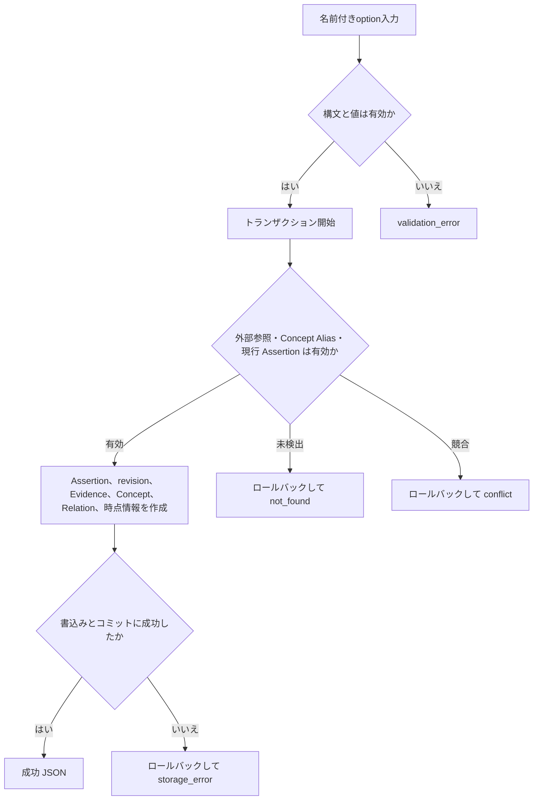

# `knowledge create`（v1）

## 用語

- **Assertion（知識の項目）:** ユーザーが知っている可能性を扱う、一つの正規化済みの命題。例:「Go の `defer` は関数を抜けるときに実行される」。
- **Evidence（根拠記録）:** その命題をユーザーが知っていると判断するための、ユーザーの説明・コード・自己申告・訂正などの記録。
- **Concept（話題の見出し）:** Assertion を探しやすくする話題名。例: `Go`、`defer`。
- **Scope（適用条件）:** その Assertion が成り立つ範囲。例: 対象バージョンや実行環境。
- **Relation（関連）:** Assertion や Concept の間に、明示的に保存するつながり。システムが意味から自動推測するものではない。
- **時点情報:** 有効期間、観測時刻、最終確認時刻など、Assertion がいつの情報かを示す記録。

## コマンド概要

新しい Assertion と、その初期 revision、Evidence、Concept、Scope、Relation、時点情報を一貫して作成する。入力された命題が意味的に同一かどうかは判断しない。

## I / O

Assertion と、その Scope、Concept、Alias、Relation、時点情報、Evidence をまとめて登録する。`supersedes` Relation は専用の `supersede` 操作だけが保存する。

```text
knowledge create \
  --normalized-text 'unbuffered channelへのsendはreceiverがreadyになるまでblockする' \
  --scope-key language --scope-value Go \
  --concept channel --concept-alias 'Go channel' \
  --alias-kind identifier --alias-value 'chan<-' \
  --relation-type prerequisite --relation-target-kind assertion --relation-target-id asrt_00 \
  --evidence-kind user_explanation \
  --evidence-text 'channelって受け側いないとsend側止まりますよね' \
  --evidence-observed-at 2026-08-13T00:00:00Z
```

```json
{
  "ok": true,
  "data": {
    "assertion_id": "asrt_01",
    "revision": 1,
    "evidence_ids": ["evd_01"],
    "concepts": [{ "concept_id": "cpt_01", "name": "channel" }],
    "relation_ids": ["rel_01"]
  }
}
```

## 入出力項目設計

失敗出力は [共通結果 envelope](../../design.md#共通結果-envelope) に従う。Evidence kindは `user_explanation`（ユーザー説明）、`user_reasoning`（ユーザー推論）、`user_code`（ユーザーコード）、`self_report`（自己申告）、`concept_recognition`（概念認識）、`correction`（後日の訂正）である。Relation typeは `related_to`（一般的な関連）、`prerequisite`（前提）、`causes`（原因・結果）、`contributes_to`（寄与）、`contradicts`（矛盾候補）である。

| 方向 | 項目 | 型・出現回数 | 固定値・意味 |
| --- | --- | --- | --- |
| 入力 | `--normalized-text` | string、1回 | 新規Assertionの正規化本文。 |
| 入力 | `--scope-key` / `--scope-value` | stringの組、0回以上 | Assertionの適用範囲。各組はkeyとvalue。 |
| 入力 | `--concept` / `--concept-alias` | string、0回以上 | Conceptの正式名と、その直前のConceptに属する別名。 |
| 入力 | `--alias-kind` / `--alias-value` | enumとstringの組、0回以上 | Assertion Alias。kindは `api_name`（API名）または `identifier`（識別子）。 |
| 入力 | `--relation-type` / `--relation-target-kind` / `--relation-target-id` | enumとenumとstringの組、0回以上 | Relation。target kindは `assertion` または `concept`。ただし `contradicts` の target kindは `assertion` のみ。`supersedes` はここでは指定しない。 |
| 入力 | `--evidence-kind` / `--evidence-text` / `--evidence-observed-at` | enumとstringとRFC 3339 UTC stringの組、1回以上 | 初期Evidenceの種別、原文、観測時刻。 |
| 入力 | `--valid-from` / `--valid-until` / `--version-scope` / `--observed-at` / `--last-verified` | RFC 3339 UTC stringまたはstring、各0または1回 | 時点情報。時刻は前者、`version_scope`は対象版の自由文字列。すべて省略ならTemporal Metadataを作らない。 |
| 出力 | `ok` | boolean、常に出現 | 成功時は固定で `true`。 |
| 出力 | `data` | object、常に出現 | 結果入れ物。 |
| 出力 | `data.assertion_id` | string、常に出現 | 作成したAssertionの不透明ID。 |
| 出力 | `data.revision` | integer、常に出現 | 初期revision。固定で `1`。 |
| 出力 | `data.evidence_ids` | stringのarray、常に出現 | 作成したEvidenceの不透明ID。入力Evidence groupと同じ件数で、1件以上。 |
| 出力 | `data.evidence_ids[]` | string、Evidence ID要素に1回 | 作成したEvidenceの不透明ID。 |
| 出力 | `data.relation_ids` | stringのarray、常に出現 | 作成したRelationの不透明ID。Relationなしは `[]`。 |
| 出力 | `data.relation_ids[]` | string、Relation ID要素に1回 | 作成したRelationの不透明ID。 |
| 出力 | `data.concepts` | array、常に出現 | 関連付けたConcept。各要素は `concept_id`（string）と `name`（string）。指定なしは `[]`。 |
| 出力 | `data.concepts[].concept_id`、`data.concepts[].name` | string / string、Concept要素に各1回 | 関連付けたConceptの不透明IDと正式名。 |

## バリデーション設計

共通のoption構文、繰返しgroup、時点情報の省略規則は [CLI入力規約](../cli-input-conventions.md) に従う。省略可能なgroupは空、時点option未指定は `temporal: null` として保存する。

| 対象 | 検査 | 不適合時 |
| --- | --- | --- |
| `--normalized-text` | 必須。trim 後に空でない文字列 | `validation_error` |
| Evidence group | 必須の1件以上。各groupはkind enum、非空text、RFC 3339 UTCのobserved-atを持つ。同一コマンド内で同じkind・text・observed-atのgroupを重複させない | `validation_error` |
| Scope group | 省略時は空。各keyとvalueは非空で、同じkeyを重複させない | `validation_error` |
| Concept group | 省略時は空。`--concept` は非空、直後に属する `--concept-alias` は非空で、同じConcept名・Aliasを重複させない | `validation_error` |
| Assertion Alias group | 省略時は空。kindは `api_name` または `identifier`、valueは非空で、同じkindとvalueを重複させない | `validation_error` |
| Relation group | 省略時は空。typeは `related_to`、`prerequisite`、`causes`、`contributes_to`、`contradicts` のいずれか。target kindは `assertion` / `concept`、IDは非空。ただし `contradicts` の target kindは `assertion` のみ | `validation_error` |
| 時点option | 省略時は `null`。指定する時刻はRFC 3339 UTCで、`--valid-from` と `--valid-until` が両方ある場合は前者が後者以下 | `validation_error` |
| Relation の参照先 | 指定 `--relation-target-kind` と `--relation-target-id` が保存済みendpointを指す | `not_found` |
| 保存済みデータとの競合 | 同一本文・Scope の現行 Assertion、または別 Concept に属する Concept 名・Alias を新規作成しない | `conflict` |
| 保存処理 | 保存に失敗した場合はstdoutを出力せず rollback する | `storage_error`（exit 1） |

## フローチャート



## シーケンス図

```mermaid
sequenceDiagram
  participant C as Codex
  participant K as Knowledge CLI
  participant S as SQLite ストア
  C->>K: create の名前付きoption
  K->>K: 検証し、不透明 ID を生成
  break 入力が不正
    K-->>C: validation_error の JSON
  end
  K->>S: SQL-01: トランザクション開始
  S-->>K: SQL-01 の結果
  K->>S: SQL-02: Assertion 重複確認
  S-->>K: SQL-02 の照合結果
  break SQL-02 で Assertion が重複
    K->>S: SQL-20: ロールバック
    S-->>K: SQL-20 の結果
    K-->>C: conflict の JSON
  end
  K->>S: SQL-03: Concept 用語を解決
  S-->>K: SQL-03 の照合結果
  break SQL-03 で Concept 名または Alias が別 Concept に属する
    K->>S: SQL-20: ロールバック
    S-->>K: SQL-20 の結果
    K-->>C: conflict の JSON
  end
  K->>S: SQL-04: Relation の Assertion を確認
  S-->>K: SQL-04 の照合結果
  break SQL-04 で指定 Assertion target がない
    K->>S: SQL-20: ロールバック
    S-->>K: SQL-20 の結果
    K-->>C: not_found の JSON
  end
  K->>S: SQL-05: Relation の Concept を確認
  S-->>K: SQL-05 の照合結果
  break SQL-05 で指定 Concept target がない
    K->>S: SQL-20: ロールバック
    S-->>K: SQL-20 の結果
    K-->>C: not_found の JSON
  end
  K->>S: SQL-06: Assertion を追加
  S-->>K: SQL-06 の結果
  break SQL-06 で保存に失敗
    K->>S: SQL-20: ロールバック
    S-->>K: SQL-20 の結果
    K-->>C: storage_error の JSON
  end
  K->>S: SQL-07: 初期 revision を追加
  S-->>K: SQL-07 の結果
  break SQL-07 で保存に失敗
    K->>S: SQL-20: ロールバック
    S-->>K: SQL-20 の結果
    K-->>C: storage_error の JSON
  end
  K->>S: SQL-08: Scope を追加
  S-->>K: SQL-08 の結果
  break SQL-08 で保存に失敗
    K->>S: SQL-20: ロールバック
    S-->>K: SQL-20 の結果
    K-->>C: storage_error の JSON
  end
  K->>S: SQL-09: Concept を追加
  S-->>K: SQL-09 の結果
  break SQL-09 で保存に失敗
    K->>S: SQL-20: ロールバック
    S-->>K: SQL-20 の結果
    K-->>C: storage_error の JSON
  end
  K->>S: SQL-10: Concept 名を追加
  S-->>K: SQL-10 の結果
  break SQL-10 で保存に失敗
    K->>S: SQL-20: ロールバック
    S-->>K: SQL-20 の結果
    K-->>C: storage_error の JSON
  end
  K->>S: SQL-11: Concept Alias を追加
  S-->>K: SQL-11 の結果
  break SQL-11 で保存に失敗
    K->>S: SQL-20: ロールバック
    S-->>K: SQL-20 の結果
    K-->>C: storage_error の JSON
  end
  K->>S: SQL-12: Alias 用語を追加
  S-->>K: SQL-12 の結果
  break SQL-12 で保存に失敗
    K->>S: SQL-20: ロールバック
    S-->>K: SQL-20 の結果
    K-->>C: storage_error の JSON
  end
  K->>S: SQL-13: Assertion と Concept を関連付け
  S-->>K: SQL-13 の結果
  break SQL-13 で保存に失敗
    K->>S: SQL-20: ロールバック
    S-->>K: SQL-20 の結果
    K-->>C: storage_error の JSON
  end
  K->>S: SQL-14: Assertion Alias を追加
  S-->>K: SQL-14 の結果
  break SQL-14 で保存に失敗
    K->>S: SQL-20: ロールバック
    S-->>K: SQL-20 の結果
    K-->>C: storage_error の JSON
  end
  K->>S: SQL-15: 時点情報を追加
  S-->>K: SQL-15 の結果
  break SQL-15 で保存に失敗
    K->>S: SQL-20: ロールバック
    S-->>K: SQL-20 の結果
    K-->>C: storage_error の JSON
  end
  K->>S: SQL-16: Evidence を追加
  S-->>K: SQL-16 の結果
  break SQL-16 で保存に失敗
    K->>S: SQL-20: ロールバック
    S-->>K: SQL-20 の結果
    K-->>C: storage_error の JSON
  end
  K->>S: SQL-17: Relation を追加
  S-->>K: SQL-17 の結果
  break SQL-17 で保存に失敗
    K->>S: SQL-20: ロールバック
    S-->>K: SQL-20 の結果
    K-->>C: storage_error の JSON
  end
  K->>S: SQL-18: 字句 Index を構築
  S-->>K: SQL-18 の結果
  break SQL-18 で保存に失敗
    K->>S: SQL-20: ロールバック
    S-->>K: SQL-20 の結果
    K-->>C: storage_error の JSON
  end
  K->>S: SQL-19: コミット
  S-->>K: SQL-19 の結果
  break SQL-19 でコミットに失敗
    K->>S: SQL-20: ロールバック
    S-->>K: SQL-20 の結果
    K-->>C: storage_error の JSON
  end
  K-->>C: 成功 JSON
```



## DB接続

write transaction。Concept name と Alias は `concept_terms` を入口に既存 Concept を解決し、なければ作成する。`concept_terms` によりConcept名とAliasを横断して一意に保つ。relation target、Concept名 / Alias の帰属、同一本文・Scope の現行 Assertion を、書込み前に同一 transaction で検証する。最後に現行 Assertion の派生字句 Index を構築する。

```sql
-- SQL-01: Assertion と付随データをまとめて作成する transaction を開始する。
BEGIN IMMEDIATE;
-- SQL-02: 同一 normalized_text と Scope 集合を持つ current Assertion があれば conflict。
SELECT a.assertion_id
FROM assertions AS a
JOIN assertion_revisions AS r
  ON r.assertion_id = a.assertion_id AND r.revision = a.current_revision
WHERE r.normalized_text = :normalized_text
  AND NOT EXISTS (
    SELECT 1 FROM json_each(:scope_json) AS requested
    WHERE NOT EXISTS (
      SELECT 1 FROM revision_scopes AS s
      WHERE s.assertion_id = a.assertion_id AND s.revision = a.current_revision
        AND s.scope_key = json_extract(requested.value, '$.key')
        AND s.scope_value = json_extract(requested.value, '$.value')
    )
  )
  AND NOT EXISTS (
    SELECT 1 FROM revision_scopes AS s
    WHERE s.assertion_id = a.assertion_id AND s.revision = a.current_revision
      AND NOT EXISTS (
        SELECT 1 FROM json_each(:scope_json) AS requested
        WHERE json_extract(requested.value, '$.key') = s.scope_key
          AND json_extract(requested.value, '$.value') = s.scope_value
      )
  );
-- SQL-03: 既存 Concept名 / Alias を解決する。
SELECT term, concept_id, term_kind
FROM concept_terms
WHERE term IN (:concept_terms[]);
-- SQL-04: Relation の Assertion target が存在するかを確認する。
SELECT assertion_id AS id FROM assertions WHERE assertion_id IN (:assertion_targets[]);
-- SQL-05: Relation の Concept target が存在するかを確認する。
SELECT concept_id AS id FROM concepts WHERE concept_id IN (:concept_targets[]);

-- SQL-06: 新しい Assertion の安定 ID と初期 revision 番号を作成する。
INSERT INTO assertions (assertion_id, current_revision, created_at)
VALUES (:assertion_id, 1, :created_at);
-- SQL-07: 初期 revision の正規化本文を保存する。
INSERT INTO assertion_revisions (assertion_id, revision, normalized_text, created_at)
VALUES (:assertion_id, 1, :normalized_text, :created_at);
-- SQL-08: 入力Scope groupの各Scopeを初期revisionに保存する。
INSERT INTO revision_scopes (assertion_id, revision, scope_key, scope_value)
VALUES (:assertion_id, 1, :scope_key, :scope_value);
-- SQL-09: 未登録の Concept だけを作成する。
INSERT INTO concepts (concept_id, name, created_at)
VALUES (:concept_id, :concept_name, :created_at)
ON CONFLICT(name) DO NOTHING;
-- SQL-10: Concept 名を検索語台帳へ記録する。
INSERT INTO concept_terms (term, concept_id, term_kind)
VALUES (:concept_name, :resolved_concept_id, 'name')
ON CONFLICT(term) DO NOTHING;
-- SQL-11: Concept Alias を保存する。
INSERT INTO concept_aliases (alias, concept_id)
VALUES (:concept_alias, :resolved_concept_id)
ON CONFLICT(alias) DO NOTHING;
-- SQL-12: Concept Alias を検索語台帳へ記録する。
INSERT INTO concept_terms (term, concept_id, term_kind)
VALUES (:concept_alias, :resolved_concept_id, 'alias')
ON CONFLICT(term) DO NOTHING;
-- SQL-13: Assertion と Concept の対応を保存する。
INSERT INTO assertion_concepts (assertion_id, concept_id)
VALUES (:assertion_id, :resolved_concept_id);
-- SQL-14: API 名または識別子の Assertion Alias を保存する。
INSERT INTO assertion_aliases (assertion_id, alias_kind, alias_value)
VALUES (:assertion_id, :alias_kind, :alias_value);
-- SQL-15: 指定された場合だけ、初期 revision の時点情報を保存する。
INSERT INTO temporal_metadata (
  assertion_id, revision, valid_from, valid_until, version_scope, observed_at, last_verified
) VALUES (
  :assertion_id, 1, :valid_from, :valid_until, :version_scope, :temporal_observed_at, :last_verified
);
-- SQL-16: 初期 Evidence を各要素ごとに履歴として保存する。
INSERT INTO evidence (evidence_id, assertion_id, kind, raw_text, observed_at, created_at)
VALUES (:evidence_id, :assertion_id, :kind, :raw_text, :observed_at, :created_at);
-- SQL-17: 指定された Assertion 起点の Relation を各要素ごとに保存する。
INSERT INTO relations (
  relation_id, source_kind, source_id, relation_type, target_kind, target_id, created_at
) VALUES (
  :relation_id, 'assertion', :assertion_id,
  :relation_type, :target_kind, :target_id, :created_at
);
-- SQL-18: 新しい現行 Assertion の検索用字句 Index 行を構築する。
INSERT INTO assertion_lexical_index (
  assertion_id, normalized_text, concept_name, concept_alias, scope_key, scope_value, assertion_alias
)
SELECT a.assertion_id, r.normalized_text,
       COALESCE(group_concat(DISTINCT c.name), ''),
       COALESCE(group_concat(DISTINCT ca.alias), ''),
       COALESCE(group_concat(DISTINCT s.scope_key), ''),
       COALESCE(group_concat(DISTINCT s.scope_value), ''),
       COALESCE(group_concat(DISTINCT aa.alias_value), '')
FROM assertions AS a
JOIN assertion_revisions AS r ON r.assertion_id = a.assertion_id AND r.revision = a.current_revision
LEFT JOIN assertion_concepts AS ac ON ac.assertion_id = a.assertion_id
LEFT JOIN concepts AS c ON c.concept_id = ac.concept_id
LEFT JOIN concept_aliases AS ca ON ca.concept_id = c.concept_id
LEFT JOIN revision_scopes AS s ON s.assertion_id = r.assertion_id AND s.revision = r.revision
LEFT JOIN assertion_aliases AS aa ON aa.assertion_id = a.assertion_id
WHERE a.assertion_id = :assertion_id
GROUP BY a.assertion_id;
-- SQL-19: すべての作成と派生 Index 更新を確定する。
COMMIT;
-- SQL-20: 失敗した分岐では transaction を取り消す。SQL-19とは排他的に実行する。
ROLLBACK;
```

配列要素ごとの `INSERT` は同じ statement を反復する。空の `scope`、`concepts`、`aliases`、`relations` では該当 insert は0件、`temporal: null` では temporal insert は行わない。事前検証で conflict / not-found / validation error となれば、いずれの insert より前に rollback する。
