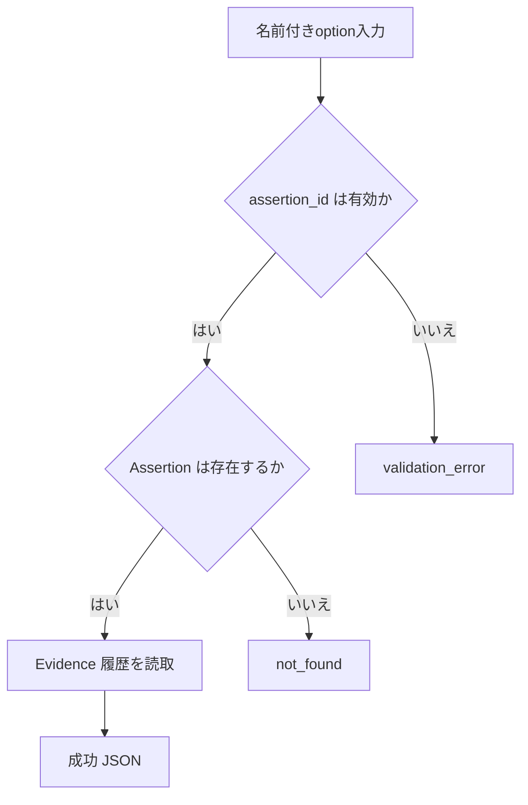
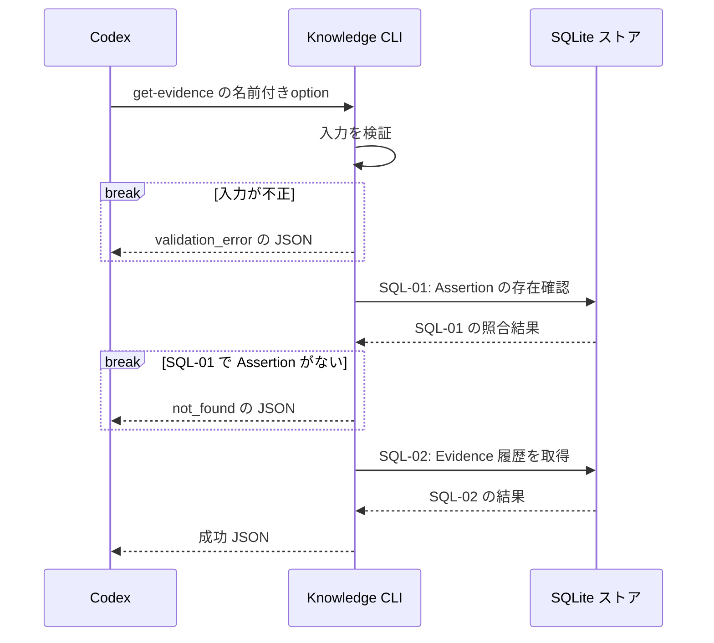

# `knowledge get-evidence`（v1）

## 用語

- **Assertion（知識の項目）:** ユーザーが知っている可能性を扱う、一つの正規化済みの命題。
- **Evidence（根拠記録）:** その命題をユーザーが知っていると判断するための、ユーザーの説明・コード・自己申告・訂正などの記録。

## コマンド概要

指定 Assertion に記録された Evidence の履歴を、観測時刻順に取得する。Evidence がユーザー知識をどの程度裏付けるかは判定しない。

## I / O

指定 Assertion に属する Evidence を `observed_at` 昇順、同時刻は `evidence_id` 昇順で全件返す。過去 Evidence を除外する option は設けない。

```text
knowledge get-evidence --assertion-id asrt_01
```

```json
{
  "ok": true,
  "data": {
    "assertion_id": "asrt_01",
    "evidence": [
      {
        "evidence_id": "evd_01",
        "kind": "user_explanation",
        "raw_text": "channelって受け側いないとsend側止まりますよね",
        "observed_at": "2026-08-13T00:00:00Z"
      }
    ]
  }
}
```

Evidence が0件の場合は、空配列の成功 JSON（exit 0）を返す。

## 入出力項目設計

失敗出力は [共通結果 envelope](../../design.md#共通結果-envelope) に従う。

| 方向 | 項目 | 型・出現回数 | 固定値・意味 |
| --- | --- | --- | --- |
| 入力 | `--assertion-id` | string、1回 | Evidenceを取得する Assertion の不透明ID。 |
| 出力 | `ok` | boolean、常に出現 | 成功時は固定で `true`。 |
| 出力 | `data` | object、常に出現 | 結果入れ物。 |
| 出力 | `data.assertion_id` | string、常に出現 | 指定した Assertion ID。 |
| 出力 | `data.evidence` | array、常に出現 | Evidence履歴。0件は `[]`。 |
| 出力 | `data.evidence[].evidence_id` | string、Evidence要素に1回 | Evidenceの不透明ID。 |
| 出力 | `data.evidence[].kind` | string enum、Evidence要素に1回 | `user_explanation`=ユーザー説明、`user_reasoning`=ユーザー推論、`user_code`=ユーザーコード、`self_report`=自己申告、`concept_recognition`=概念認識、`correction`=後日の訂正。 |
| 出力 | `data.evidence[].raw_text` | string、Evidence要素に1回 | 根拠の原文。 |
| 出力 | `data.evidence[].observed_at` | RFC 3339 UTC string、Evidence要素に1回 | 根拠を観測した時刻。 |

## バリデーション設計

共通のoption構文は [CLI入力規約](../cli-input-conventions.md) に従う。

| 対象 | 検査 | 不適合時 |
| --- | --- | --- |
| `--assertion-id` | 必須の空でない文字列 | `validation_error` |
| 参照先 Assertion | `assertion_id` が保存済み Assertion を指す | `not_found` |

## フローチャート



## シーケンス図



## DB接続

read-only。

```sql
-- SQL-01: 指定 Assertion が存在するかを先に確認する。
SELECT 1 FROM assertions WHERE assertion_id = :assertion_id;

-- SQL-02: Assertion に属する Evidence 履歴を観測時刻順で取得する。
SELECT evidence_id, kind, raw_text, observed_at
FROM evidence
WHERE assertion_id = :assertion_id
ORDER BY observed_at ASC, evidence_id ASC;
```

最初の query が0件なら `not_found` とし、2つ目の query は実行しない。
