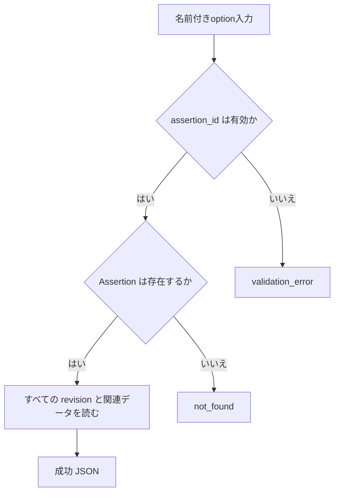
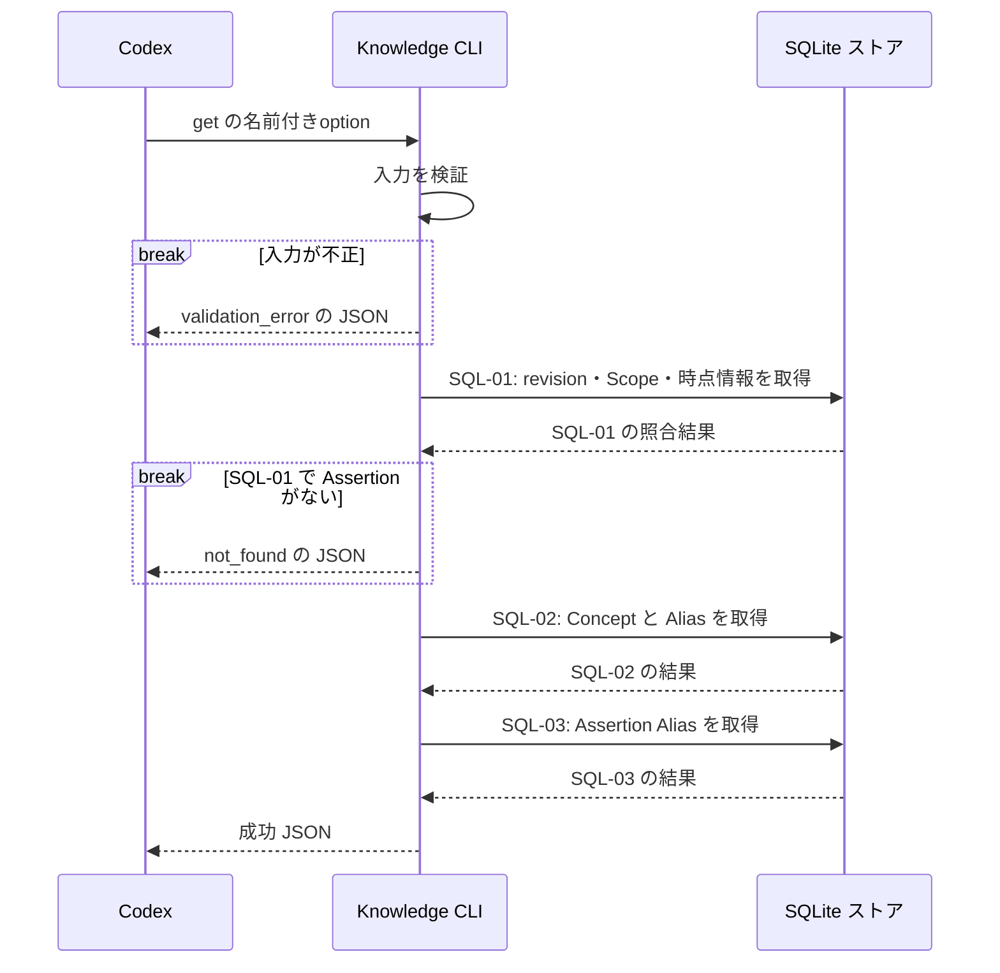

# `knowledge get`（v1）

## 用語

- **Assertion（知識の項目）:** ユーザーが知っている可能性を扱う、一つの正規化済みの命題。例:「Go の `defer` は関数を抜けるときに実行される」。
- **revision（改訂版）:** Assertion を直したときに追加される、その時点の本文と条件の履歴。古い改訂版は削除しない。
- **Concept（話題の見出し）:** Assertion を探しやすくする話題名。例: `Go`、`defer`。
- **Alias（別名）:** API 名や識別子など、同じ Assertion を探すための別の検索語。
- **Scope（適用条件）:** その Assertion が成り立つ範囲。例: 対象バージョンや実行環境。

## コマンド概要

指定 Assertion の現行表現、全 revision 履歴、Scope、時点情報、Concept、Alias を取得する。Evidence は含めず、`get-evidence` で別途取得する。

## I / O

現行 revision、全 revision の本文・Scope・Temporal Metadata、Concept、API名・Identifier Alias を返す。Evidence は `get-evidence` で取得する。`current_revision` が利用時点の表現、`revisions` が保持済み履歴である。

```text
knowledge get --assertion-id asrt_01
```

```json
{
  "ok": true,
  "data": {
    "assertion_id": "asrt_01",
    "current_revision": 2,
    "revisions": [{
      "revision": 1,
      "normalized_text": "unbuffered channelへのsendはreceiverがreadyになるまでblockする",
      "scope": [{ "key": "language", "value": "Go" }],
      "temporal": null
    }, {
      "revision": 2,
      "normalized_text": "unbuffered channelへのsendは対応するreceiverがreadyになるまでblockする",
      "scope": [{ "key": "language", "value": "Go" }],
      "temporal": {
        "valid_from": null,
        "valid_until": null,
        "version_scope": null,
        "observed_at": null,
        "last_verified": null
      }
    }],
    "concepts": [{ "concept_id": "cpt_01", "name": "channel", "aliases": [] }],
    "aliases": [{ "kind": "identifier", "value": "chan<-" }]
  }
}
```

## 入出力項目設計

失敗出力は [共通結果 envelope](../../design.md#共通結果-envelope) に従う。

| 方向 | 項目 | 型・出現回数 | 固定値・意味 |
| --- | --- | --- | --- |
| 入力 | `--assertion-id` | string、1回 | 取得する Assertion の不透明ID。 |
| 出力 | `ok` | boolean、常に出現 | 成功時は固定で `true`。 |
| 出力 | `data` | object、常に出現 | 結果入れ物。 |
| 出力 | `data.assertion_id` | string、常に出現 | 指定した Assertion ID。 |
| 出力 | `data.current_revision` | integer、常に出現 | 利用時点の現行revision番号。 |
| 出力 | `data.revisions` | array、常に出現 | revision履歴。 |
| 出力 | `data.revisions[].revision`、`data.revisions[].normalized_text` | integer / string、各revision要素に各1回 | revision番号と正規化本文。 |
| 出力 | `data.revisions[].scope` | array、各revision要素に1回 | 当該revisionのScope。Scopeなしは `[]`。 |
| 出力 | `data.revisions[].scope[].key`、`data.revisions[].scope[].value` | string / string、Scope要素に各1回 | Scopeのkeyとvalue。 |
| 出力 | `data.revisions[].temporal` | object または `null`、各revision要素に1回 | 時点情報。未作成なら `null`。 |
| 出力 | `data.revisions[].temporal.valid_from`、`data.revisions[].temporal.valid_until`、`data.revisions[].temporal.observed_at`、`data.revisions[].temporal.last_verified` | RFC 3339 UTC stringまたは`null`、temporalがobjectのとき各1回 | 有効開始・終了、観測、最終確認の時刻。 |
| 出力 | `data.revisions[].temporal.version_scope` | stringまたは`null`、temporalがobjectのとき1回 | 対象版の自由文字列。 |
| 出力 | `data.concepts` | array、常に出現 | 関連Concept。各要素は `concept_id`（string）、`name`（string）、`aliases`（string array）。 |
| 出力 | `data.concepts[].concept_id`、`data.concepts[].name` | string / string、Concept要素に各1回 | Conceptの不透明IDと正式名。 |
| 出力 | `data.concepts[].aliases` | stringのarray、Concept要素に1回 | 当該ConceptのAlias。Aliasなしは `[]`。 |
| 出力 | `data.concepts[].aliases[]` | string、Alias要素に1回 | Concept Aliasの文字列。 |
| 出力 | `data.aliases` | array、常に出現 | Assertion Alias。Aliasなしは `[]`。 |
| 出力 | `data.aliases[].kind`、`data.aliases[].value` | string enum / string、Alias要素に各1回 | kindは `api_name`（API名）または `identifier`（識別子）、valueは保存したAlias。 |

## バリデーション設計

共通のoption構文は [CLI入力規約](../cli-input-conventions.md) に従う。

| 対象 | 検査 | 不適合時 |
| --- | --- | --- |
| `--assertion-id` | 必須の空でない文字列 | `validation_error` |
| 参照先 Assertion | `assertion_id` が保存済み Assertion を指す | `not_found` |

## フローチャート



## シーケンス図



## DB接続

read-only。最初の query は全 revision と Scope / Temporal を返す。2つ目と3つ目の query で Concept / Concept Alias と Assertion Alias を hydration し、CLI が revision と Concept ごとに配列へ集約する。

```sql
-- SQL-01: Assertion の全 revision、各 revision の Scope、時点情報を取得する。
SELECT a.assertion_id, a.current_revision, r.revision, r.normalized_text,
       s.scope_key, s.scope_value, t.valid_from, t.valid_until,
       t.version_scope, t.observed_at, t.last_verified
FROM assertions AS a
JOIN assertion_revisions AS r ON r.assertion_id = a.assertion_id
LEFT JOIN revision_scopes AS s
  ON s.assertion_id = r.assertion_id AND s.revision = r.revision
LEFT JOIN temporal_metadata AS t
  ON t.assertion_id = r.assertion_id AND t.revision = r.revision
WHERE a.assertion_id = :assertion_id
ORDER BY r.revision ASC;

-- SQL-02: Assertion に紐付く Concept とその Alias を取得する。
SELECT ac.assertion_id, c.concept_id, c.name, ca.alias
FROM assertion_concepts AS ac
JOIN concepts AS c ON c.concept_id = ac.concept_id
LEFT JOIN concept_aliases AS ca ON ca.concept_id = c.concept_id
WHERE ac.assertion_id = :assertion_id
ORDER BY c.concept_id ASC, ca.alias ASC;

-- SQL-03: Assertion に直接付与した API 名・識別子 Alias を取得する。
SELECT alias_kind, alias_value
FROM assertion_aliases
WHERE assertion_id = :assertion_id
ORDER BY alias_kind ASC, alias_value ASC;
```
