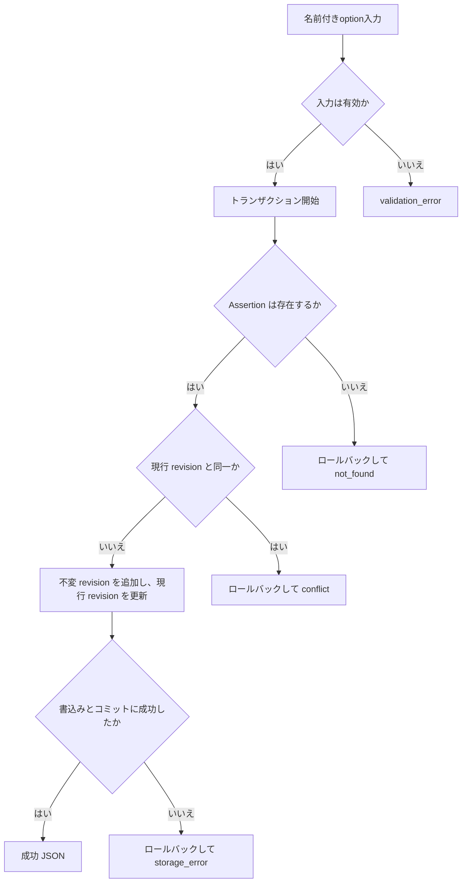
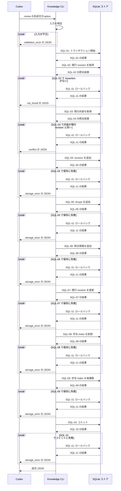

# `knowledge revise`（v1）

## 用語

- **Assertion（知識の項目）:** ユーザーが知っている可能性を扱う、一つの正規化済みの命題。
- **revision（改訂版）:** Assertion を直したときに追加される、その時点の本文と条件の履歴。古い改訂版は削除しない。
- **Scope（適用条件）:** その Assertion が成り立つ範囲。例: 対象バージョンや実行環境。
- **時点情報:** 有効期間、観測時刻、最終確認時刻など、Assertion がいつの情報かを示す記録。

## コマンド概要

既存 Assertion の本文、Scope、時点情報を新しい immutable revision として追加し、現行 revision を更新する。旧 revision と Evidence は削除・変更しない。

## I / O

Concept と Evidence は変更しない。旧 revision は削除せず、新 revision を作り `current_revision` を進める。

```text
knowledge revise --assertion-id asrt_01 \
  --normalized-text 'unbuffered channelへのsendは対応するreceiverがreadyになるまでblockする' \
  --scope-key language --scope-value Go
```

```json
{
  "ok": true,
  "data": {
    "assertion_id": "asrt_01",
    "previous_revision": 1,
    "revision": 2
  }
}
```

## 入出力項目設計

失敗出力は [共通結果 envelope](../../design.md#共通結果-envelope) に従う。

| 方向 | 項目 | 型・出現回数 | 固定値・意味 |
| --- | --- | --- | --- |
| 入力 | `--assertion-id` | string、1回 | revisionを追加するAssertionの不透明ID。 |
| 入力 | `--normalized-text` | string、1回 | 新revisionの正規化本文。 |
| 入力 | `--scope-key` / `--scope-value` | stringの組、0回以上 | 新revisionのScope。省略時は空Scope、指定時はこの集合。 |
| 入力 | `--valid-from` / `--valid-until` / `--version-scope` / `--observed-at` / `--last-verified` | RFC 3339 UTC stringまたはstring、各0または1回 | 新revisionの時点情報。時刻は前者、`version_scope`は対象版の自由文字列。すべて省略なら `temporal` は `null`。 |
| 出力 | `ok` | boolean、常に出現 | 成功時は固定で `true`。 |
| 出力 | `data` | object、常に出現 | 結果入れ物。 |
| 出力 | `data.assertion_id` | string、常に出現 | 更新したAssertion ID。 |
| 出力 | `data.previous_revision`、`data.revision` | integer / integer、常に出現 | 更新前のrevision番号と、新規に作成した現行revision番号。 |

## バリデーション設計

共通のoption構文と時点情報の省略規則は [CLI入力規約](../cli-input-conventions.md) に従う。Scope groupを指定しなければ空のScope、時点optionを指定しなければ `temporal: null` とする。

| 対象 | 検査 | 不適合時 |
| --- | --- | --- |
| `--assertion-id` | 必須の空でない文字列 | `validation_error` |
| `--normalized-text` | 必須。trim 後に空でない文字列 | `validation_error` |
| Scope group | 省略時は空。指定時は `--scope-key` と `--scope-value` を対にし、同じkeyを重複させない | `validation_error` |
| 時点option | 省略時は `temporal: null`。指定する時刻はRFC 3339 UTCで、`--valid-from` と `--valid-until` が両方ある場合は前者が後者以下 | `validation_error` |
| 参照先 Assertion | `--assertion-id` が保存済み Assertion を指す | `not_found` |
| revision の重複 | 本文・Scope・時点情報が現行 revision とすべて同じでない | `conflict` |

## フローチャート



## シーケンス図



## DB接続

write transaction。revision は current+1 で、競合を避けるため current row を transaction 内で取得する。本文、Scope、Temporal の同一性を検証してから、新 revision の Scope / Temporal を保存し、現行 Assertion の派生字句 Index を再構築する。

```sql
-- SQL-01: 現行 revision の確認から Index 再構築までを保護する transaction を開始する。
BEGIN IMMEDIATE;
-- SQL-02: 更新対象 Assertion の現行 revision 番号を取得する。
SELECT current_revision
FROM assertions
WHERE assertion_id = :assertion_id;
-- SQL-03: 現行本文・Scope・時点情報を取得し、入力optionから組み立てた値との同一性を判定する。
SELECT r.normalized_text, s.scope_key, s.scope_value,
       t.valid_from, t.valid_until, t.version_scope, t.observed_at, t.last_verified
FROM assertion_revisions AS r
LEFT JOIN revision_scopes AS s
  ON s.assertion_id = r.assertion_id AND s.revision = r.revision
LEFT JOIN temporal_metadata AS t
  ON t.assertion_id = r.assertion_id AND t.revision = r.revision
WHERE r.assertion_id = :assertion_id AND r.revision = :current_revision;
-- SQL-04: 新しい不変 revision の本文を追加する。
INSERT INTO assertion_revisions (assertion_id, revision, normalized_text, created_at)
VALUES (:assertion_id, :next_revision, :normalized_text, :created_at);
-- SQL-05: 入力Scope groupの各Scopeを新しいrevisionに追加する。
INSERT INTO revision_scopes (assertion_id, revision, scope_key, scope_value)
VALUES (:assertion_id, :next_revision, :scope_key, :scope_value);
-- SQL-06: 指定された場合だけ、新しい revision の時点情報を追加する。
INSERT INTO temporal_metadata (
  assertion_id, revision, valid_from, valid_until, version_scope, observed_at, last_verified
) VALUES (
  :assertion_id, :next_revision, :valid_from, :valid_until, :version_scope, :observed_at, :last_verified
);
-- SQL-07: Assertion が参照する現行 revision を進める。
UPDATE assertions
SET current_revision = :next_revision
WHERE assertion_id = :assertion_id;
-- SQL-08: 古い現行表現の字句 Index 行を取り除く。
DELETE FROM assertion_lexical_index WHERE assertion_id = :assertion_id;
-- SQL-09: 更新後の現行 Assertion から字句 Index 行を再構築する。
INSERT INTO assertion_lexical_index (
  assertion_id, normalized_text, concept_name, concept_alias, scope_key, scope_value, assertion_alias
)
SELECT a.assertion_id, r.normalized_text,
       COALESCE(group_concat(DISTINCT c.name), ''),
       COALESCE(group_concat(DISTINCT ca.alias), ''),
       COALESCE(group_concat(DISTINCT s.scope_key), ''),
       COALESCE(group_concat(DISTINCT s.scope_value), ''),
       COALESCE(group_concat(DISTINCT aa.alias_value), '')
FROM assertions AS a
JOIN assertion_revisions AS r ON r.assertion_id = a.assertion_id AND r.revision = a.current_revision
LEFT JOIN assertion_concepts AS ac ON ac.assertion_id = a.assertion_id
LEFT JOIN concepts AS c ON c.concept_id = ac.concept_id
LEFT JOIN concept_aliases AS ca ON ca.concept_id = c.concept_id
LEFT JOIN revision_scopes AS s ON s.assertion_id = r.assertion_id AND s.revision = r.revision
LEFT JOIN assertion_aliases AS aa ON aa.assertion_id = a.assertion_id
WHERE a.assertion_id = :assertion_id
GROUP BY a.assertion_id;
-- SQL-10: revision、現行参照、Index の更新を同時に確定する。
COMMIT;
-- SQL-11: 失敗した分岐では transaction を取り消す。SQL-10とは排他的に実行する。
ROLLBACK;
```

最初の query が0件なら `not_found` とする。次の current revision 読取と入力optionから組み立てた本文・Scope・Temporalを比較し、すべて同一なら `conflict` として書込み前に rollback する。Scope groupが空なら `revision_scopes` insert は0件、時点optionが未指定なら `temporal_metadata` insert は行わない。
