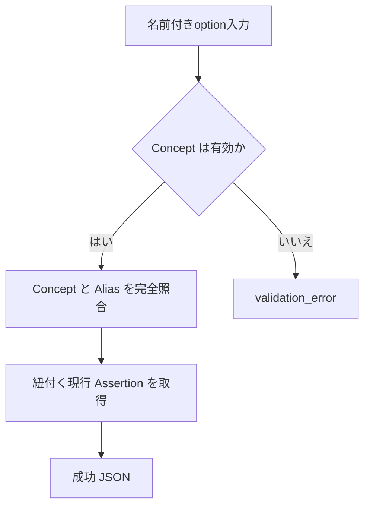
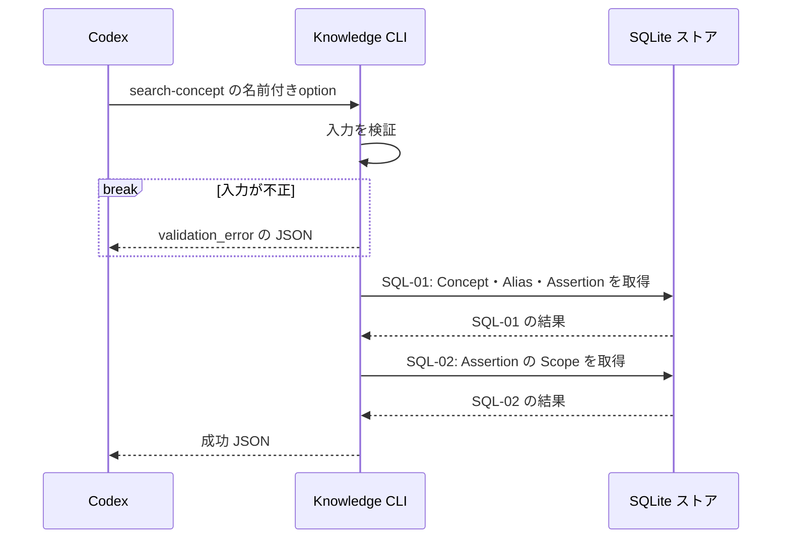

# `knowledge search-concept`（v1）

## 用語

- **Concept（話題の見出し）:** Assertion を探しやすくする話題名。例: `Go`、`defer`。
- **Alias（別名）:** 同じ Concept を探すための別の表記や呼び名。
- **Assertion（知識の項目）:** ユーザーが知っている可能性を扱う、一つの正規化済みの命題。

## コマンド概要

Concept 名または Alias を起点に、その Concept に紐付く現行 Assertion を取得する。未登録の Concept は空の結果として返す。

## I / O

保存済み Concept名またはAliasと完全一致する1 Concept を入口に、紐付く現行 Assertion を返す。Concept名とAliasは横断して一意のため、同じ文字列が複数 Concept を指すことはない。

```text
knowledge search-concept --concept channel
```

```json
{
  "ok": true,
  "data": {
    "concept": { "concept_id": "cpt_01", "name": "channel" },
    "results": [
      {
        "assertion_id": "asrt_01",
        "normalized_text": "unbuffered channelへのsendはreceiverがreadyになるまでblockする",
        "revision": 1,
        "scope": [{ "key": "language", "value": "Go" }]
      }
    ]
  }
}
```

## 入出力項目設計

失敗出力は [共通結果 envelope](../../design.md#共通結果-envelope) に従う。

| 方向 | 項目 | 型・出現回数 | 固定値・意味 |
| --- | --- | --- | --- |
| 入力 | `--concept` | string、1回 | 完全一致で探す Concept 名またはConcept Alias。 |
| 出力 | `ok` | boolean、常に出現 | 成功時は固定で `true`。 |
| 出力 | `data` | object、常に出現 | 結果入れ物。 |
| 出力 | `data.concept` | object または `null`、常に出現 | 一致したConcept。未登録時は `null`。 |
| 出力 | `data.concept.concept_id`、`data.concept.name` | string / string、`data.concept` がobjectのとき各1回 | Conceptの不透明IDと正式名。 |
| 出力 | `data.results` | array、常に出現 | 当該Conceptに紐付く現行 Assertion。0件は `[]`。 |
| 出力 | `data.results[].assertion_id`、`data.results[].normalized_text`、`data.results[].revision` | string / string / integer、各要素に各1回 | Assertion ID、現行本文、現行revision番号。 |
| 出力 | `data.results[].scope` | array、各要素に1回 | AssertionのScope。Scopeなしは `[]`。 |
| 出力 | `data.results[].scope[].key`、`data.results[].scope[].value` | string / string、Scope要素に各1回 | Scopeのkeyとvalue。 |

## バリデーション設計

共通のoption構文は [CLI入力規約](../cli-input-conventions.md) に従う。

| 対象 | 検査 | 不適合時 |
| --- | --- | --- |
| `--concept` | 必須の文字列。trim 後に空でない | `validation_error` |
| 保存済み Concept | 未登録は入力不正ではなく、`concept: null` と空の `results` を返す | 成功（exit 0） |

## フローチャート



## シーケンス図



## DB接続

read-only。最初の query で完全一致する Concept と現行 Assertion を得て、2つ目の query で response の Scope を hydration する。Conceptが未登録なら1つ目の query は0件となり、`concept: null` と空配列を返す。

```sql
-- SQL-01: 完全一致する Concept / Alias と、そこに紐付く現行 Assertion を取得する。
SELECT c.concept_id, c.name, a.assertion_id, r.normalized_text, a.current_revision
FROM concept_terms AS ct
JOIN concepts AS c ON c.concept_id = ct.concept_id
LEFT JOIN assertion_concepts AS ac ON ac.concept_id = c.concept_id
LEFT JOIN assertions AS a ON a.assertion_id = ac.assertion_id
LEFT JOIN assertion_revisions AS r
  ON r.assertion_id = a.assertion_id AND r.revision = a.current_revision
WHERE ct.term = :concept
ORDER BY a.assertion_id ASC;

-- SQL-02: 検索結果 Assertion の現行 Scope を取得する。
SELECT s.assertion_id, s.scope_key, s.scope_value
FROM revision_scopes AS s
JOIN assertions AS a
  ON a.assertion_id = s.assertion_id AND a.current_revision = s.revision
JOIN assertion_concepts AS ac ON ac.assertion_id = a.assertion_id
JOIN concept_terms AS ct ON ct.concept_id = ac.concept_id
WHERE ct.term = :concept
ORDER BY s.assertion_id ASC, s.scope_key ASC;
```
