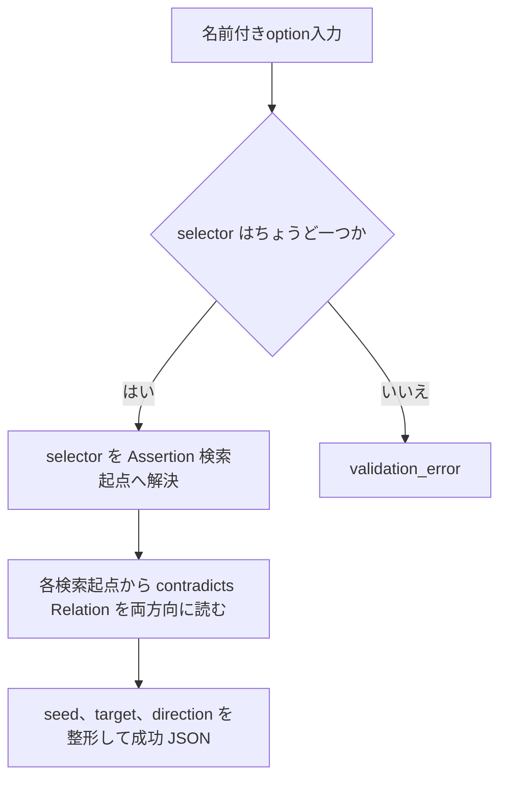
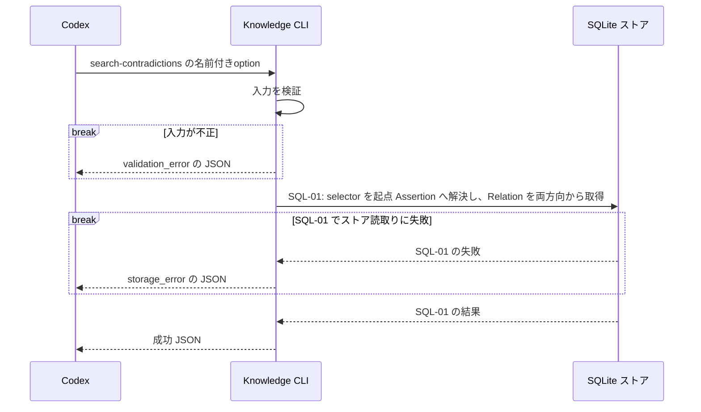

# `knowledge search-contradictions`（v1）

## 用語

- **Assertion（知識の項目）:** ユーザーが知っている可能性を扱う、一つの正規化済みの命題。
- **Concept（話題の見出し）:** Assertion を探しやすくする話題名。例: `Go`、`defer`。
- **Relation（関連）:** Assertion や Concept の間に、明示的に保存するつながり。`contradicts` は「矛盾候補として登録された関連」を表すだけで、正誤を確定しない。
- **検索起点（`seed`）:** この結果で selector に一致した Assertion。Concept selector のときは、その Concept に属する Assertion の一つである。
- **相手（`target`）:** `seed` と同じ Relation の反対側の Assertion。常にこの値を `get` または `get-evidence` の `--assertion-id` に渡せる。
- **保存方向（`direction`）:** Relation が `seed` から保存されているか、`seed` へ保存されているかを示す値。候補の正誤や優劣を表さない。

## コマンド概要

Assertion または Concept を検索起点に、保存済み `contradicts` Relation の相手 Assertion を取得する。`target` は保存された Relation の source / target 向きに依存せず常に検索起点の相手であり、`direction` が保存上の向きを残す。矛盾の正誤やユーザー知識状態は判定しない。

## I / O

Concept を指定したときは、その Concept 自身ではなく所属 Assertion を検索起点候補へ展開する。一つの Relation の両端が同じ Concept に属するときは、各 endpoint を `seed` とする二つの結果を返す。同じ `relation_id` が複数回現れても、`seed` が異なれば別の「相手を確認する経路」であるため、結果を統合しない。

```text
knowledge search-contradictions --assertion-id asrt_01
```

```json
{
  "ok": true,
  "data": {
    "results": [
      {
        "relation_id": "rel_02",
        "direction": "outgoing",
        "seed": {
          "kind": "assertion",
          "id": "asrt_01"
        },
        "target": {
          "kind": "assertion",
          "id": "asrt_09",
          "normalized_text": "..."
        }
      }
    ]
  }
}
```

Relation がない場合は、空の `results` を持つ成功 JSON（exit 0）を返す。

## 入出力項目設計

失敗出力は [共通結果 envelope](../../design.md#共通結果-envelope) に従う。

| 方向 | 項目 | 型・出現回数 | 固定値・意味 |
| --- | --- | --- | --- |
| 入力 | `--assertion-id` | string、いずれか一方を1回 | 矛盾候補を探す Assertion の不透明ID。 |
| 入力 | `--concept` | string、いずれか一方を1回 | 矛盾候補を探す Concept名またはAlias。該当 Concept に属する Assertion を検索起点候補へ展開する。 |
| 出力 | `ok` | boolean、常に出現 | 成功時は固定で `true`。 |
| 出力 | `data` | object、常に出現 | 結果入れ物。 |
| 出力 | `data.results` | array、常に出現 | selector に一致した各 Assertion 起点の `contradicts` Relation。0件は `[]`。同じ Relation の両端が selector に一致するときは、`seed` ごとに2要素を持つ。 |
| 出力 | `data.results[].relation_id` | string、各要素に1回 | 保存済み Relation の不透明ID。同じ Relation が別 `seed` で複数回現れ得る。 |
| 出力 | `data.results[].direction` | string enum、各要素に1回 | `outgoing` = `seed` が保存済み Relation の source、`incoming` = `seed` が target。 |
| 出力 | `data.results[].seed` | object、各要素に1回 | selector に一致した、この結果の検索起点 Assertion。 |
| 出力 | `data.results[].seed.kind` | string enum、seedに1回 | 固定で `assertion`。 |
| 出力 | `data.results[].seed.id` | string、seedに1回 | この結果で selector に一致した Assertion の不透明ID。 |
| 出力 | `data.results[].target` | object、各要素に1回 | 常に `seed` と反対側の矛盾候補 Assertion。 |
| 出力 | `data.results[].target.kind` | string enum、targetに1回 | 固定で `assertion`。 |
| 出力 | `data.results[].target.id` | string、targetに1回 | 相手 Assertion の不透明ID。`knowledge get --assertion-id` と `knowledge get-evidence --assertion-id` へそのまま渡せる。 |
| 出力 | `data.results[].target.normalized_text` | string、targetに1回 | 相手 Assertion の現行正規化本文。 |

## バリデーション設計

共通のoption構文は [CLI入力規約](../cli-input-conventions.md) に従う。

| 対象 | 検査 | 不適合時 |
| --- | --- | --- |
| selector | `--assertion-id` または `--concept` の一方だけを指定する | `validation_error` |
| `--assertion-id` | 指定時は空でない文字列 | `validation_error` |
| `--concept` | 指定時は trim 後に空でない文字列 | `validation_error` |
| 保存済み endpoint | 指定 Assertion が不存在、または Concept が未登録なら、候補なしとして空の `results` を返す | 成功（exit 0） |

## フローチャート



## シーケンス図



## DB接続

read-only。Assertion selector はその Assertion だけを検索起点とする。Concept selector は、一致した Concept に属する Assertion 全てを検索起点とする。`contradicts` は Assertion 間 Relation に限る。各検索起点ごとに保存上の source / target の反対側を論理 `target` として返し、`direction` に保存方向を入れる。両端が Concept selector に一致する Relation は、各 endpoint を `seed` とする2行を返すため、相手を一意に受け渡せる。

```sql
-- SQL-01: selector を Assertion 検索起点へ解決し、contradicts Relation を両方向から取得して相手と保存方向を整形する。
WITH selected_concept(concept_id) AS (
  SELECT c.concept_id
  FROM concepts AS c
  LEFT JOIN concept_aliases AS ca ON ca.concept_id = c.concept_id
  WHERE :concept IS NOT NULL AND (c.name = :concept OR ca.alias = :concept)
), selected_seed(kind, id) AS (
  SELECT 'assertion', :assertion_id
  WHERE :assertion_id IS NOT NULL
  UNION
  SELECT 'assertion', ac.assertion_id
  FROM assertion_concepts AS ac
  JOIN selected_concept AS sc ON sc.concept_id = ac.concept_id
), candidates AS (
  SELECT r.relation_id,
         'outgoing' AS direction,
         ss.kind AS seed_kind,
         ss.id AS seed_id,
         r.target_kind AS target_kind,
         r.target_id AS target_id
  FROM relations AS r
  JOIN selected_seed AS ss
    ON r.source_kind = ss.kind AND r.source_id = ss.id
  WHERE r.relation_type = 'contradicts'
    AND r.target_kind = 'assertion'
  UNION ALL
  SELECT r.relation_id,
         'incoming' AS direction,
         ss.kind AS seed_kind,
         ss.id AS seed_id,
         r.source_kind AS target_kind,
         r.source_id AS target_id
  FROM relations AS r
  JOIN selected_seed AS ss
    ON r.target_kind = ss.kind AND r.target_id = ss.id
  WHERE r.relation_type = 'contradicts'
    AND r.source_kind = 'assertion'
)
SELECT c.relation_id, c.direction, c.seed_kind, c.seed_id,
       c.target_kind, c.target_id,
       target_revision.normalized_text AS target_normalized_text
FROM candidates AS c
JOIN assertions AS target_assertion ON target_assertion.assertion_id = c.target_id
JOIN assertion_revisions AS target_revision
  ON target_revision.assertion_id = target_assertion.assertion_id
 AND target_revision.revision = target_assertion.current_revision
ORDER BY c.relation_id ASC, c.seed_id ASC, c.direction ASC;
```
