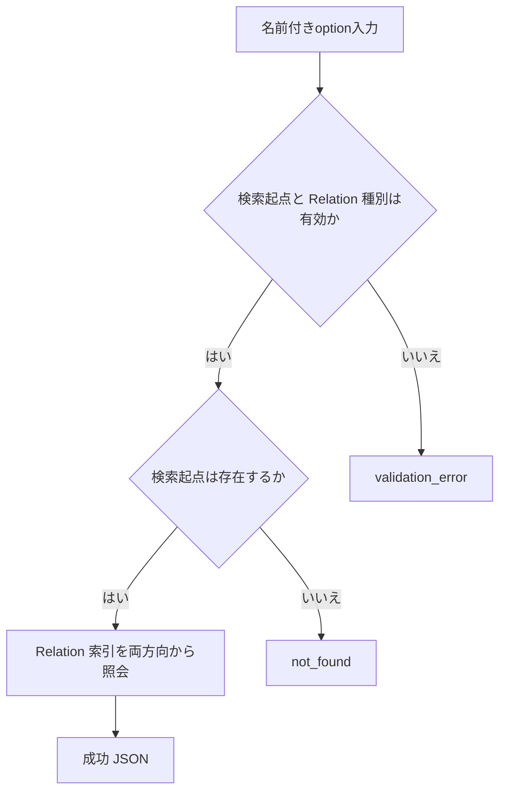
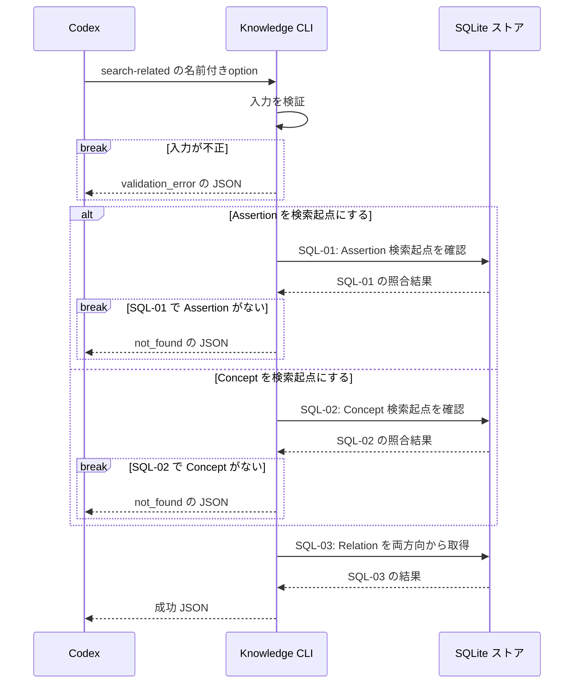

# `knowledge search-related`（v1）

## 用語

- **Assertion（知識の項目）:** ユーザーが知っている可能性を扱う、一つの正規化済みの命題。
- **Concept（話題の見出し）:** Assertion を探しやすくする話題名。例: `Go`、`defer`。
- **Relation（関連）:** Assertion や Concept の間に、明示的に保存するつながり。システムが意味から自動推測するものではない。
- **検索起点:** 関連を探し始める Assertion または Concept。結果の `target` は、この検索起点の相手を表す。

## コマンド概要

Assertion または Concept を検索起点に、指定した Relation 種別の接続先を保存方向にかかわらず取得する。結果の `target` は常に検索起点の相手を表す。

## I / O

`target` は常に検索起点 `seed` と反対側の endpoint を表す。`direction` は保存済み Relation が `seed` から出る場合に `outgoing`、`seed` へ入る場合に `incoming` とし、Relation の保存向きを保持する。

```text
knowledge search-related --seed-kind assertion --seed-id asrt_01 \
  --relation-type prerequisite --relation-type causes
```

```json
{
  "ok": true,
  "data": {
    "results": [
      {
        "relation_id": "rel_01",
        "relation_type": "causes",
        "direction": "outgoing",
        "target": { "kind": "assertion", "id": "asrt_02", "normalized_text": "..." }
      }
    ]
  }
}
```

Relation がない場合は、空の `results` を持つ成功 JSON（exit 0）を返す。

## 入出力項目設計

失敗出力は [共通結果 envelope](../../design.md#共通結果-envelope) に従う。Relation typeの固定値は、`related_to`（一般的な関連）、`prerequisite`（前提）、`causes`（原因・結果）、`contributes_to`（寄与）、`contradicts`（矛盾候補）、`supersedes`（置換）である。

| 方向 | 項目 | 型・出現回数 | 固定値・意味 |
| --- | --- | --- | --- |
| 入力 | `--seed-kind` | string enum、1回 | 検索起点の種別。`assertion` または `concept`。 |
| 入力 | `--seed-id` | string、1回 | 検索起点の不透明ID。 |
| 入力 | `--relation-type` | 上記string enum、0回以上 | 返すRelationの種別絞込み。省略時は全種別。 |
| 出力 | `ok` | boolean、常に出現 | 成功時は固定で `true`。 |
| 出力 | `data` | object、常に出現 | 結果入れ物。 |
| 出力 | `data.results` | array、常に出現 | 検索起点に接続するRelation。0件は `[]`。 |
| 出力 | `data.results[].relation_id`、`data.results[].relation_type` | string / 上記string enum、各結果要素に各1回 | Relationの不透明IDと保存済み種別。 |
| 出力 | `data.results[].direction` | string enum、各結果要素に1回 | `outgoing`=検索起点から出る保存向き、`incoming`=検索起点へ入る保存向き。 |
| 出力 | `data.results[].target` | object、各結果要素に1回 | 常に検索起点と反対側のendpoint。 |
| 出力 | `data.results[].target.kind`、`data.results[].target.id` | string enum / string、targetに各1回 | kindは `assertion` / `concept`、idはendpointの不透明ID。 |
| 出力 | `data.results[].target.normalized_text` | string、target kindが`assertion`のとき1回、それ以外は省略 | target Assertionの現行正規化本文。 |

## バリデーション設計

共通のoption構文は [CLI入力規約](../cli-input-conventions.md) に従う。

| 対象 | 検査 | 不適合時 |
| --- | --- | --- |
| `--seed-kind` と `--seed-id` | 両方必須。kindは `assertion` または `concept`、IDは空でない文字列 | `validation_error` |
| `--relation-type` | 省略時は全種別。繰返し指定時は各値が `related_to`、`prerequisite`、`causes`、`contributes_to`、`contradicts`、`supersedes` のいずれか | `validation_error` |
| 検索起点 | `seed.kind` に対応する保存済み endpoint を指す | `not_found` |

## フローチャート



## シーケンス図



## DB接続

read-only。最初に seed の kind に対応する table で存在を確認する。relation filter は request で省略時に全種別、指定時は `:relation_types` の各値へ展開する。SQL は保存上の source / target のうち `seed` と反対側を論理 `target` として選ぶ。論理 `target` が Assertion の場合は現行本文を hydration し、Concept の場合は本文を含めない。

```sql
-- SQL-01: Assertion を検索起点にした場合の存在を確認する。
SELECT assertion_id AS id FROM assertions
WHERE :seed_kind = 'assertion' AND assertion_id = :seed_id;
-- SQL-02: Concept を検索起点にした場合の存在を確認する。
SELECT concept_id AS id FROM concepts
WHERE :seed_kind = 'concept' AND concept_id = :seed_id;

-- SQL-03: 検索起点に接続する Relation を両方向から取り出し、相手を論理 target として整形する。
WITH matching_relations AS (
  SELECT r.relation_id, r.relation_type,
         CASE WHEN r.source_kind = :seed_kind AND r.source_id = :seed_id
              THEN 'outgoing' ELSE 'incoming' END AS direction,
         CASE WHEN r.source_kind = :seed_kind AND r.source_id = :seed_id
              THEN r.target_kind ELSE r.source_kind END AS target_kind,
         CASE WHEN r.source_kind = :seed_kind AND r.source_id = :seed_id
              THEN r.target_id ELSE r.source_id END AS target_id
  FROM relations AS r
  WHERE ((r.source_kind = :seed_kind AND r.source_id = :seed_id)
      OR (r.target_kind = :seed_kind AND r.target_id = :seed_id))
  AND (:all_relation_types = 1 OR r.relation_type IN (:relation_types[]))
)
-- SQL-03（続き）: target が Assertion の場合だけ、その現行本文を付加して結果を返す。
SELECT mr.relation_id, mr.relation_type, mr.direction, mr.target_kind, mr.target_id,
       target_revision.normalized_text AS target_normalized_text
FROM matching_relations AS mr
LEFT JOIN assertions AS target_assertion
  ON mr.target_kind = 'assertion' AND target_assertion.assertion_id = mr.target_id
LEFT JOIN assertion_revisions AS target_revision
  ON target_revision.assertion_id = target_assertion.assertion_id
 AND target_revision.revision = target_assertion.current_revision
ORDER BY mr.relation_id ASC;
```
