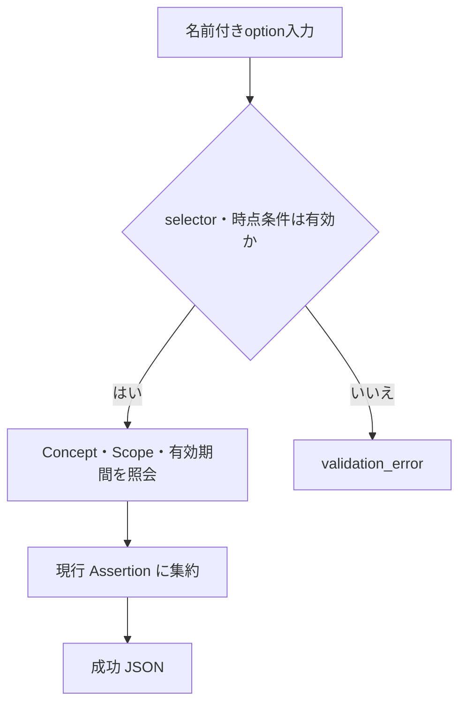
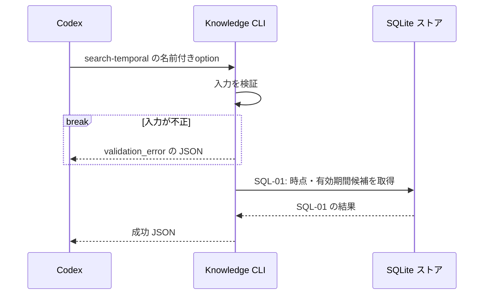

# `knowledge search-temporal`（v1）

## 用語

- **Assertion（知識の項目）:** ユーザーが知っている可能性を扱う、一つの正規化済みの命題。
- **Concept（話題の見出し）:** Assertion を探しやすくする話題名。例: `Go`、`defer`。
- **Scope（適用条件）:** その Assertion が成り立つ範囲。例: 対象バージョンや実行環境。
- **時点情報:** 有効期間、観測時刻、最終確認時刻など、Assertion がいつの情報かを示す記録。

## コマンド概要

Concept または Scope を条件に、時点情報を持つ現行 Assertion を取得する。指定時点または指定有効期間がある場合は、保存済み有効期間との機械的な包含・重複だけで絞り込む。候補の新しさ・正しさ・優先度は判定しない。

## I / O

指定 ConceptまたはScopeに属し、Temporal Metadata を持つ現行 Assertion を候補として返す。どの candidate が新しい・正しいかは判断しない。

```text
knowledge search-temporal --concept channel \
  --scope-key language --scope-value Go \
  --at 2026-08-14T00:00:00Z
```

```json
{
  "ok": true,
  "data": {
    "results": [
      {
        "assertion_id": "asrt_01",
        "normalized_text": "...",
        "temporal": {
          "valid_from": "2025-01-01T00:00:00Z",
          "valid_until": null,
          "version_scope": "Go 1.24",
          "observed_at": "2026-08-13T00:00:00Z",
          "last_verified": null
        }
      }
    ]
  }
}
```

## 入出力項目設計

失敗出力は [共通結果 envelope](../../design.md#共通結果-envelope) に従う。

| 方向 | 項目 | 型・出現回数 | 固定値・意味 |
| --- | --- | --- | --- |
| 入力 | `--concept` | string、0または1回 | Concept名またはAliasによる絞込み。省略時はこの条件を使わない。 |
| 入力 | `--scope-key` / `--scope-value` | stringの組、0回以上 | Scopeによる絞込み。各組はkeyとvalue。省略時はScopeで絞り込まない。 |
| 入力 | `--at` | RFC 3339 UTC string、0または1回 | 検証後に固定幅UTCへ正規化する。この時点を保存済み有効期間が包含する候補へ絞り込む。 |
| 入力 | `--valid-from` / `--valid-until` | RFC 3339 UTC stringの組、0または1組 | 検証後に固定幅UTCへ正規化する検索有効期間。この期間と保存済み有効期間が重複する候補へ絞り込む。 |
| 出力 | `ok` | boolean、常に出現 | 成功時は固定で `true`。 |
| 出力 | `data` | object、常に出現 | 結果入れ物。 |
| 出力 | `data.results` | array、常に出現 | Temporal Metadataを持つ現行Assertion。0件は `[]`。 |
| 出力 | `data.results[].assertion_id`、`data.results[].normalized_text` | string / string、各結果要素に各1回 | Assertionの不透明IDと現行本文。 |
| 出力 | `data.results[].temporal` | object、各結果要素に1回 | 時点情報。 |
| 出力 | `data.results[].temporal.valid_from`、`data.results[].temporal.valid_until`、`data.results[].temporal.observed_at`、`data.results[].temporal.last_verified` | 固定幅UTCのRFC 3339 stringまたは`null`、temporalに各1回 | 有効開始・終了、観測、最終確認の時刻。 |
| 出力 | `data.results[].temporal.version_scope` | stringまたは`null`、temporalに1回 | 対象版の自由文字列。 |

## バリデーション設計

共通のoption構文は [CLI入力規約](../cli-input-conventions.md) に従う。

| 対象 | 検査 | 不適合時 |
| --- | --- | --- |
| selector | `--concept`、Scope group の少なくとも一方を指定する | `validation_error` |
| `--concept` | 指定時は trim 後に空でない文字列 | `validation_error` |
| Scope group | 指定時は1件以上。`--scope-key` と `--scope-value` は規約どおり対にし、同じkeyを重複させない | `validation_error` |
| `--at` | RFC 3339 UTCの時刻文字列として解析して固定幅UTCへ正規化する。`--valid-from`／`--valid-until` と同時に指定しない | `validation_error` |
| 検索有効期間 | `--valid-from` と `--valid-until` を対で指定する。各値をRFC 3339 UTCとして解析・正規化し、開始は終了以下 | `validation_error` |
| 保存済みデータとの照合 | Concept 未登録または条件一致なしは入力不正ではなく、空の `results` を返す | 成功（exit 0） |

## フローチャート



## シーケンス図



## DB接続

read-only。

```sql
-- SQL-01: Concept / Scope 条件をすべて満たし、任意の時点・有効期間条件に一致する。
-- valid_from / valid_until とbind値は固定幅UTCなので、TEXT比較は時系列比較と同じ順序になる。
-- 時点情報を持つ現行 Assertion を取得する。
SELECT DISTINCT a.assertion_id, r.normalized_text, t.valid_from, t.valid_until,
       t.version_scope, t.observed_at, t.last_verified
FROM assertions AS a
JOIN assertion_revisions AS r
  ON r.assertion_id = a.assertion_id AND r.revision = a.current_revision
JOIN temporal_metadata AS t
  ON t.assertion_id = r.assertion_id AND t.revision = r.revision
LEFT JOIN assertion_concepts AS ac ON ac.assertion_id = a.assertion_id
LEFT JOIN concepts AS c ON c.concept_id = ac.concept_id
LEFT JOIN concept_aliases AS ca ON ca.concept_id = c.concept_id
WHERE (:concept IS NULL OR c.name = :concept OR ca.alias = :concept)
  AND (
    (:at IS NULL AND :valid_from IS NULL AND :valid_until IS NULL)
    OR (
      :at IS NOT NULL
      AND (t.valid_from IS NOT NULL OR t.valid_until IS NOT NULL)
      AND (t.valid_from IS NULL OR t.valid_from <= :at)
      AND (t.valid_until IS NULL OR t.valid_until >= :at)
    )
    OR (
      :valid_from IS NOT NULL
      AND :valid_until IS NOT NULL
      AND (t.valid_from IS NOT NULL OR t.valid_until IS NOT NULL)
      AND (t.valid_until IS NULL OR t.valid_until >= :valid_from)
      AND (t.valid_from IS NULL OR t.valid_from <= :valid_until)
    )
  )
  AND (
    json_array_length(:scope_json) = 0
    OR NOT EXISTS (
      SELECT 1
      FROM json_each(:scope_json) AS requested
      WHERE NOT EXISTS (
        SELECT 1
        FROM revision_scopes AS s
        WHERE s.assertion_id = a.assertion_id
          AND s.revision = a.current_revision
          AND s.scope_key = json_extract(requested.value, '$.key')
          AND s.scope_value = json_extract(requested.value, '$.value')
      )
    )
  )
ORDER BY a.assertion_id ASC;
```

Concept / Alias の join で同一 Assertion が複数行に一致しても、`DISTINCT` により各 Assertion を1件だけ返す。`scope` の複数条件は、指定された key/value のすべてを現行 revision が持つ場合に一致する（AND集合）。`--at` は保存済み有効期間がその時点を包含するとき一致し、検索有効期間は保存済み有効期間と両端を含む重複で一致する。保存済み有効期間の片側`null`は開放境界、両側`null`は時点条件がある照会では不一致である。
