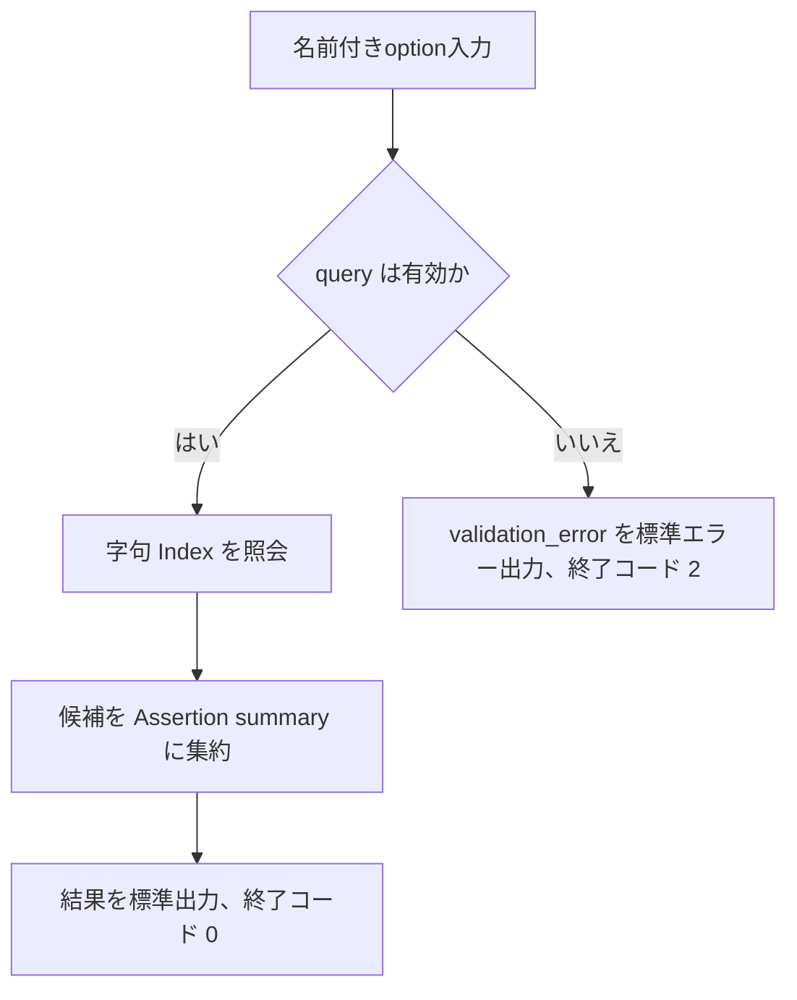
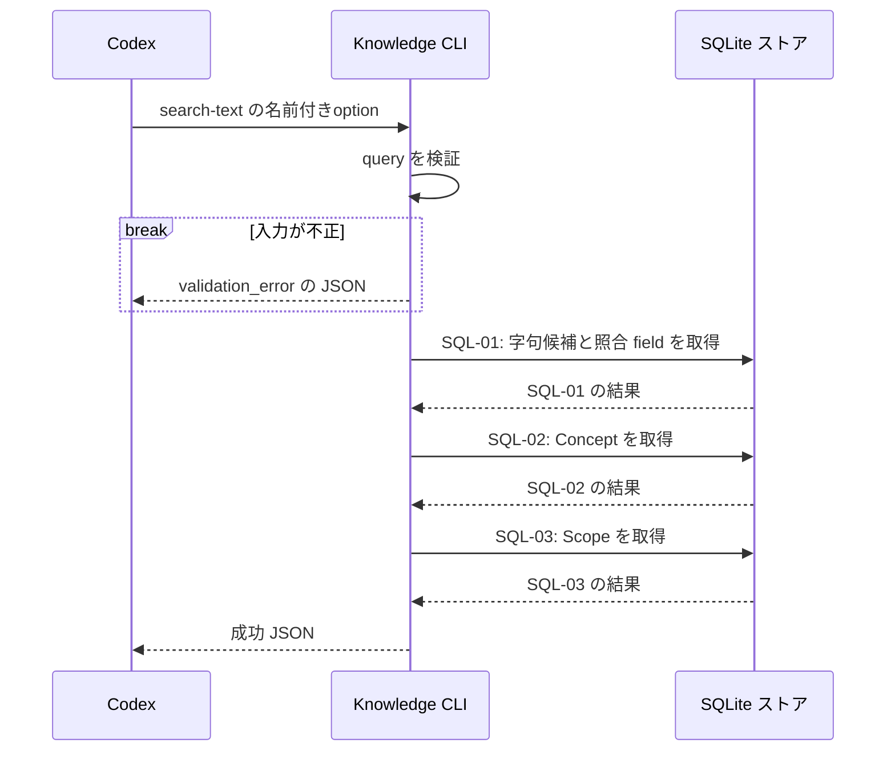

# `knowledge search-text`（v1）

## 用語

- **Assertion（知識の項目）:** ユーザーが知っている可能性を扱う、一つの正規化済みの命題。例:「Go の `defer` は関数を抜けるときに実行される」。
- **Concept（話題の見出し）:** Assertion を探しやすくする話題名。例: `Go`、`defer`。
- **Alias（別名）:** API 名や識別子など、同じ Assertion を探すための別の検索語。
- **Scope（適用条件）:** その Assertion が成り立つ範囲。例: 対象バージョンや実行環境。
- **字句照合:** 単語や文字列が一致するかで探す方法。言い換えた同じ意味を探す意味検索は、初期提供には含まれない。

## コマンド概要

本文、Concept、Alias、Scope を字句照合し、一致する現行 Assertion を取得する。初期提供では意味検索を行わない。

## I / O

Assertion本文、Concept名・Alias、Scope key/value、API名・Identifierとして保存された文字列を字句照合する。

```text
knowledge search-text --query channel
```

成功時は stdout、0件も成功である。`matched_fields` は `assertion_text`、`concept`、`alias`、`scope_key`、`scope_value` の配列である。

```json
{
  "ok": true,
  "data": {
    "results": [
      {
        "assertion_id": "asrt_01",
        "normalized_text": "unbuffered channelへのsendはreceiverがreadyになるまでblockする",
        "revision": 1,
        "concepts": [{ "concept_id": "cpt_01", "name": "channel" }],
        "scope": [{ "key": "language", "value": "Go" }],
        "matched_fields": ["assertion_text", "concept"]
      }
    ]
  }
}
```

検索結果は、照合した field 数の降順、同数なら `assertion_id` の昇順に並べる。

## 入出力項目設計

失敗時の `error` object、stderr、exit code は [設計本文の共通結果 envelope](../../design.md#共通結果-envelope) に従う。この節は値の意味を定めるものであり、受理／拒否の条件は次節だけに記載する。

| 方向 | 項目 | 型・出現回数 | 固定値・意味 |
| --- | --- | --- | --- |
| 入力 | `--query` | string、1回 | 字句照合する検索文字列。 |
| 出力 | `ok` | boolean、常に出現 | 成功時は固定で `true`。 |
| 出力 | `data` | object、常に出現 | この操作の結果入れ物。 |
| 出力 | `data.results` | array、常に出現 | 現行 Assertion の候補。0件は `[]`。 |
| 出力 | `data.results[].assertion_id`、`data.results[].normalized_text`、`data.results[].revision` | string / string / integer、各結果要素に各1回 | Assertionの不透明ID、現行正規化本文、現行revision番号。 |
| 出力 | `data.results[].concepts` | array、各結果要素に1回 | 関連Concept。Conceptなしは `[]`。 |
| 出力 | `data.results[].concepts[].concept_id`、`data.results[].concepts[].name` | string / string、Concept要素に各1回 | Conceptの不透明IDと正式名。 |
| 出力 | `data.results[].scope` | array、各結果要素に1回 | Scope。Scopeなしは `[]`。 |
| 出力 | `data.results[].scope[].key`、`data.results[].scope[].value` | string / string、Scope要素に各1回 | Scopeのkeyとvalue。 |
| 出力 | `data.results[].matched_fields` | string enumのarray、各結果要素に1回 | 照合した保存field。`assertion_text`=本文、`concept`=Concept名またはAlias、`alias`=Assertion Alias、`scope_key`=Scope key、`scope_value`=Scope value。 |
| 出力 | `data.results[].matched_fields[]` | string enum、照合field要素に1回 | `matched_fields` の各値。 |

## バリデーション設計

共通のoption構文は [CLI入力規約](../cli-input-conventions.md) に従う。

| 対象 | 検査 | 不適合時 |
| --- | --- | --- |
| `--query` | 必須の文字列。trim 後に空でない | `validation_error` |
| 字句照合用の内部値 | 検証済み `--query` を単一の FTS5 phrase としてエスケープする。これは CLI 内部値であり公開optionではない | 該当なし |

## フローチャート



## シーケンス図



## DB接続

read-only。1つ目の query は派生字句 Index から候補・照合 field・順序を確定する。以降の query は候補 Assertion ごとの Concept と Scope を hydration し、CLI が同じ `assertion_id` 単位で配列へ集約する。照合はすべて FTS5 の同じ `:fts_query` と tokenizer 規則を用いる。`:fts_query` は `--query` を単一のFTS5 phraseとしてエスケープした内部値であり、公開optionではない。

```sql
-- SQL-01: FTS5 の字句 Index から一致候補を集め、照合した field ごとの hit を計算する。
WITH candidate AS (
  SELECT assertion_id FROM assertion_lexical_index
  WHERE assertion_lexical_index MATCH :fts_query
), assertion_text_match AS (
  SELECT assertion_id FROM assertion_lexical_index
  WHERE assertion_lexical_index MATCH ('normalized_text : ' || :fts_query)
), concept_match AS (
  SELECT assertion_id FROM assertion_lexical_index
  WHERE assertion_lexical_index MATCH ('concept_name : ' || :fts_query)
), concept_alias_match AS (
  SELECT assertion_id FROM assertion_lexical_index
  WHERE assertion_lexical_index MATCH ('concept_alias : ' || :fts_query)
), assertion_alias_match AS (
  SELECT assertion_id FROM assertion_lexical_index
  WHERE assertion_lexical_index MATCH ('assertion_alias : ' || :fts_query)
), scope_key_match AS (
  SELECT assertion_id FROM assertion_lexical_index
  WHERE assertion_lexical_index MATCH ('scope_key : ' || :fts_query)
), scope_value_match AS (
  SELECT assertion_id FROM assertion_lexical_index
  WHERE assertion_lexical_index MATCH ('scope_value : ' || :fts_query)
), ranked AS (
  SELECT candidate.assertion_id,
         assertion_text_match.assertion_id IS NOT NULL AS assertion_text_hit,
         concept_match.assertion_id IS NOT NULL AS concept_hit,
         (concept_alias_match.assertion_id IS NOT NULL
           OR assertion_alias_match.assertion_id IS NOT NULL) AS alias_hit,
         scope_key_match.assertion_id IS NOT NULL AS scope_key_hit,
         scope_value_match.assertion_id IS NOT NULL AS scope_value_hit
  FROM candidate
  LEFT JOIN assertion_text_match USING (assertion_id)
  LEFT JOIN concept_match USING (assertion_id)
  LEFT JOIN concept_alias_match USING (assertion_id)
  LEFT JOIN assertion_alias_match USING (assertion_id)
  LEFT JOIN scope_key_match USING (assertion_id)
  LEFT JOIN scope_value_match USING (assertion_id)
)
-- SQL-01（続き）: hit 数の降順で、候補 Assertion の現行本文と照合 field を返す。
SELECT a.assertion_id, r.normalized_text, a.current_revision,
       assertion_text_hit, concept_hit, alias_hit, scope_key_hit, scope_value_hit
FROM ranked
JOIN assertions AS a ON a.assertion_id = ranked.assertion_id
JOIN assertion_revisions AS r ON r.assertion_id = a.assertion_id AND r.revision = a.current_revision
ORDER BY (assertion_text_hit + concept_hit + alias_hit + scope_key_hit + scope_value_hit) DESC,
         a.assertion_id ASC;

-- SQL-02: 検索結果 Assertion に紐付く Concept を取得する。
SELECT ac.assertion_id, c.concept_id, c.name
FROM assertion_concepts AS ac
JOIN concepts AS c ON c.concept_id = ac.concept_id
WHERE ac.assertion_id IN (:candidate_ids[])
ORDER BY ac.assertion_id ASC, c.concept_id ASC;

-- SQL-03: 検索結果 Assertion の現行 Scope を取得する。
SELECT assertion_id, scope_key, scope_value
FROM revision_scopes
WHERE (assertion_id, revision) IN (
  SELECT assertion_id, current_revision FROM assertions WHERE assertion_id IN (:candidate_ids[])
)
ORDER BY assertion_id ASC, scope_key ASC;
```
