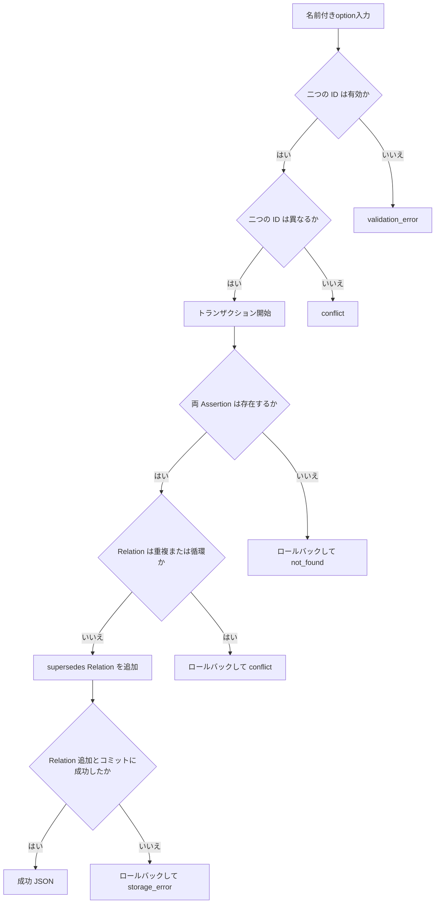
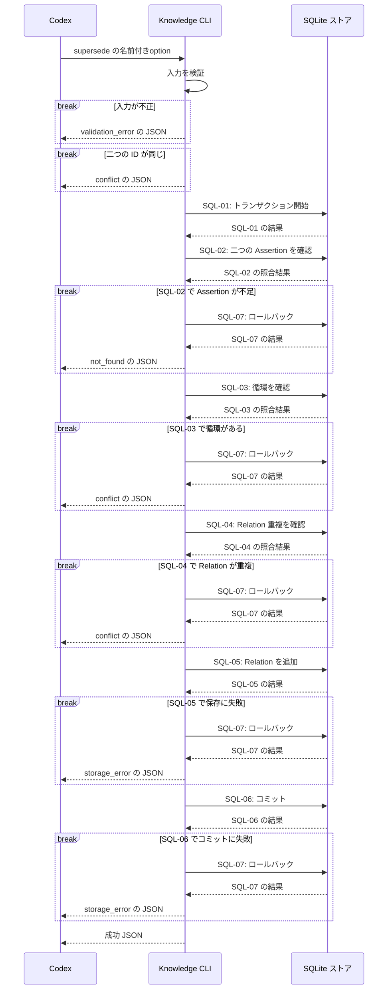

# `knowledge supersede`（v1）

## 用語

- **Assertion（知識の項目）:** ユーザーが知っている可能性を扱う、一つの正規化済みの命題。
- **Relation（関連）:** Assertion や Concept の間に、明示的に保存するつながり。システムが意味から自動推測するものではない。
- **`supersedes` Relation（置換の関連）:** 新しい Assertion が古い Assertion を置き換える、と記録する関連。古い Assertion 自体は削除しない。

## コマンド概要

既存 Assertion 間に置換を表す `supersedes` Relation を追加する。置換が事実として妥当かどうかは判断せず、自己参照・重複・循環だけを拒否する。

## I / O

旧 Assertion を削除せず、`replacement_assertion_id` から `superseded_assertion_id` への `supersedes` relation を保存する。

```text
knowledge supersede --superseded-assertion-id asrt_01 \
  --replacement-assertion-id asrt_02
```

```json
{
  "ok": true,
  "data": {
    "relation_id": "rel_03",
    "relation_type": "supersedes",
    "superseded_assertion_id": "asrt_01",
    "replacement_assertion_id": "asrt_02"
  }
}
```

CLI は、置換が事実として妥当かどうかは判断しない。

## 入出力項目設計

失敗出力は [共通結果 envelope](../../design.md#共通結果-envelope) に従う。

| 方向 | 項目 | 型・出現回数 | 固定値・意味 |
| --- | --- | --- | --- |
| 入力 | `--superseded-assertion-id` | string、1回 | 置き換えられる旧Assertionの不透明ID。 |
| 入力 | `--replacement-assertion-id` | string、1回 | 旧Assertionを置き換える新Assertionの不透明ID。 |
| 出力 | `ok` | boolean、常に出現 | 成功時は固定で `true`。 |
| 出力 | `data` | object、常に出現 | 結果入れ物。 |
| 出力 | `data.relation_id` | string、常に出現 | 保存した置換Relationの不透明ID。 |
| 出力 | `data.relation_type` | string、常に出現 | 固定で `supersedes`。 |
| 出力 | `data.superseded_assertion_id`、`data.replacement_assertion_id` | string / string、常に出現 | 置換される旧Assertion IDと、それを置き換える新Assertion ID。 |

## バリデーション設計

共通のoption構文は [CLI入力規約](../cli-input-conventions.md) に従う。

| 対象 | 検査 | 不適合時 |
| --- | --- | --- |
| `--superseded-assertion-id` | 必須の空でない文字列 | `validation_error` |
| `--replacement-assertion-id` | 必須の空でない文字列 | `validation_error` |
| 二つの ID の組 | 同じ ID を指定しない | `conflict` |
| 参照先 Assertion | 両方の ID が保存済み Assertion を指す | `not_found` |
| 置換 Relation の整合性 | 同じ Relation が未登録であり、追加しても既存 `supersedes` と循環しない | `conflict` |

## フローチャート



## シーケンス図



## DB接続

write transaction。追加する relation は `replacement_assertion_id` → `superseded_assertion_id` である。したがって、`superseded_assertion_id` から既存 `supersedes` を辿って `replacement_assertion_id` に到達する場合に循環として拒否する。ID存在確認、重複・循環検出、insert は単一 transaction 内で行う。

```sql
-- SQL-01: ID 存在確認、循環検出、Relation 追加を一貫して行う transaction を開始する。
BEGIN IMMEDIATE;
-- SQL-02: 置換元と置換先の二つの Assertion が存在するかを確認する。
SELECT assertion_id
FROM assertions
WHERE assertion_id IN (:superseded_assertion_id, :replacement_assertion_id);

-- SQL-03: 置換元から既存 supersedes をたどり、置換先へ到達して循環しないかを確認する。
WITH RECURSIVE lineage(assertion_id) AS (
  SELECT target_id
  FROM relations
  WHERE source_kind = 'assertion'
    AND source_id = :superseded_assertion_id
    AND relation_type = 'supersedes'
  UNION
  SELECT r.target_id
  FROM relations AS r
  JOIN lineage AS l ON r.source_id = l.assertion_id
  WHERE r.source_kind = 'assertion'
    AND r.relation_type = 'supersedes'
)
SELECT 1 FROM lineage WHERE assertion_id = :replacement_assertion_id;

-- SQL-04: 同じ置換 Relation がすでに記録されていないかを確認する。
SELECT 1
FROM relations
WHERE source_kind = 'assertion'
  AND source_id = :replacement_assertion_id
  AND relation_type = 'supersedes'
  AND target_kind = 'assertion'
  AND target_id = :superseded_assertion_id;

-- SQL-05: 置換先から置換元への supersedes Relation を追加する。
INSERT INTO relations (
  relation_id, source_kind, source_id, relation_type, target_kind, target_id, created_at
) VALUES (
  :relation_id, 'assertion', :replacement_assertion_id,
  'supersedes', 'assertion', :superseded_assertion_id, :created_at
);
-- SQL-06: 検証と追加がすべて成功した場合だけ確定する。
COMMIT;
-- SQL-07: 失敗した分岐では transaction を取り消す。SQL-06とは排他的に実行する。
ROLLBACK;
```
