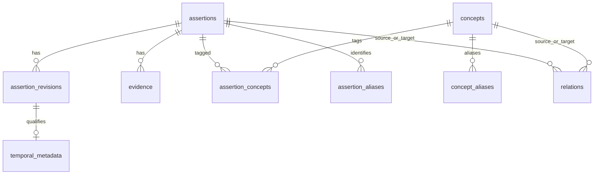

# FEAT-001 Database Schema Reference（SQLite v1）

> DEC-FEAT-002 により人間承認済み。これは保存先を定めず、ローカル SQLite 内の論理 schema と migration 契約だけを定める。

## Migration

| Version | 依存 | 前提 | 適用内容 | 成功後 | 失敗・中断 |
| --- | --- | --- | --- | --- | --- |
| 1 | なし | 対象DBに application schema が未初期化 | 下記全table・Indexを単一 transaction で作成 | `schema_migrations` に version 1 を1件記録 | transaction rollback。再実行可能。 |

同一 version が適用済みなら何も変更せず成功する。将来 migration は連番で、既存 Assertion ID、Evidence、Relation、履歴を破壊せずに追加する。Semantic Index は FEAT-006 が正規 table から構築し、v1 には持たない。

適用手順は次のとおりである。まず SQLite 組込みの `sqlite_schema` を読み、FEAT-001 が所有する table / virtual table の存在を検査する。いずれも存在しない空 Store だけが未初期化であり、下記DDLと version記録を単一 transaction で実行する。`schema_migrations` を含む一部だけが存在する、または `schema_migrations` があって version 1 以外・不整合な履歴を持つ状態は `storage_error` とする。全schemaが存在し version 1 が記録済みなら DDL を実行せず成功する。DDLまたは記録のいずれかが失敗したら rollback し、version 1 は記録しない。

```sql
SELECT name
FROM sqlite_schema
WHERE type IN ('table', 'virtual table')
  AND name IN (
    'schema_migrations', 'assertions', 'assertion_revisions', 'revision_scopes',
    'evidence', 'concepts', 'concept_terms', 'concept_aliases', 'assertion_concepts',
    'assertion_aliases', 'temporal_metadata', 'relations', 'assertion_lexical_index'
  )
ORDER BY name ASC;

SELECT version FROM schema_migrations ORDER BY version;
-- このqueryは、前のschema検査で全schemaの存在を確認した場合だけ実行する。
```

## Table と関係

- `assertions` は安定した Assertion identity と現行 revision を保持する。
- `assertion_revisions` は正規化本文とその時点の Scope の immutable 履歴である。
- `evidence` は Assertion に属する immutable 根拠である。
- `concepts`、`concept_terms` と `concept_aliases` は検索アンカーである。`concept_terms` は Concept名とAliasを横断して一意にし、`assertion_concepts` は現行 Assertion との多対多である。`assertion_aliases` は API名・Identifier の検索語を保持する。
- `relations` は Assertion／Concept 間の明示済み relation を保存する。CLI は relation の意味を推論しない。
- `temporal_metadata` は Assertion revision に任意で一対一に結び付く。



## テーブル設計

### `schema_migrations`

Schema の適用済み version を記録する。

| 列 | SQLite型 | NULL | Key / 制約 | 説明 |
| --- | --- | --- | --- | --- |
| `version` | INTEGER | 不可 | PRIMARY KEY | 適用済み migration の連番。v1 は `1`。 |
| `applied_at` | TEXT | 不可 |  | 適用完了時刻。 |

### `assertions`

Assertion の安定識別子と、利用対象となる現行 revision を保持する。

| 列 | SQLite型 | NULL | Key / 制約 | 説明 |
| --- | --- | --- | --- | --- |
| `assertion_id` | TEXT | 不可 | PRIMARY KEY | Assertion の安定 ID。 |
| `current_revision` | INTEGER | 不可 | `CHECK (>= 1)` | 現行 revision 番号。参照整合性は同一 transaction の CLI validation で保証する。 |
| `created_at` | TEXT | 不可 |  | Assertion 作成時刻。 |

### `assertion_revisions`

Assertion の正規化本文を immutable な revision として保持する。

| 列 | SQLite型 | NULL | Key / 制約 | 説明 |
| --- | --- | --- | --- | --- |
| `assertion_id` | TEXT | 不可 | PKの一部、FK → `assertions` | 所属 Assertion。 |
| `revision` | INTEGER | 不可 | PKの一部、`CHECK (>= 1)` | Assertion 内の revision 番号。 |
| `normalized_text` | TEXT | 不可 | 空白除去後に空でない | 正規化済み本文。 |
| `created_at` | TEXT | 不可 |  | 当該 revision の作成時刻。 |

### `revision_scopes`

各 Assertion revision に属する Scope の key/value を保持する。

| 列 | SQLite型 | NULL | Key / 制約 | 説明 |
| --- | --- | --- | --- | --- |
| `assertion_id` | TEXT | 不可 | PKの一部、複合FK → `assertion_revisions` | 所属 Assertion。 |
| `revision` | INTEGER | 不可 | PKの一部、複合FK → `assertion_revisions` | 所属 revision。 |
| `scope_key` | TEXT | 不可 | PKの一部、空白除去後に空でない | Scope の種別。 |
| `scope_value` | TEXT | 不可 | 空白除去後に空でない | Scope の値。 |

### `evidence`

Assertion を支える immutable な Evidence を保持する。

| 列 | SQLite型 | NULL | Key / 制約 | 説明 |
| --- | --- | --- | --- | --- |
| `evidence_id` | TEXT | 不可 | PRIMARY KEY | Evidence の安定 ID。 |
| `assertion_id` | TEXT | 不可 | FK → `assertions` | 根拠対象 Assertion。 |
| `kind` | TEXT | 不可 | 定義済み6種の enum | Evidence の種類。 |
| `raw_text` | TEXT | 不可 | 空白除去後に空でない | 根拠となる原文。 |
| `observed_at` | TEXT | 不可 |  | 根拠を観測した時刻。 |
| `created_at` | TEXT | 不可 |  | Evidence を記録した時刻。 |

### `concepts`

検索アンカーとなる Concept の正規名を保持する。

| 列 | SQLite型 | NULL | Key / 制約 | 説明 |
| --- | --- | --- | --- | --- |
| `concept_id` | TEXT | 不可 | PRIMARY KEY | Concept の安定 ID。 |
| `name` | TEXT | 不可 | UNIQUE、空白除去後に空でない | Concept の正規名。 |
| `created_at` | TEXT | 不可 |  | Concept 作成時刻。 |

### `concept_terms`

Concept の正規名と Alias を横断して一意にする検索語台帳である。

| 列 | SQLite型 | NULL | Key / 制約 | 説明 |
| --- | --- | --- | --- | --- |
| `term` | TEXT | 不可 | PRIMARY KEY、空白除去後に空でない | 正規名または Alias の検索語。 |
| `concept_id` | TEXT | 不可 | FK → `concepts` | 検索語が指す Concept。 |
| `term_kind` | TEXT | 不可 | `name` / `alias` | 検索語の種別。 |

### `concept_aliases`

Concept に属する Alias を保持する。

| 列 | SQLite型 | NULL | Key / 制約 | 説明 |
| --- | --- | --- | --- | --- |
| `alias` | TEXT | 不可 | PRIMARY KEY、空白除去後に空でない | Alias。 |
| `concept_id` | TEXT | 不可 | FK → `concepts` | Alias が指す Concept。 |

### `assertion_concepts`

現行 Assertion と Concept の多対多対応を保持する。

| 列 | SQLite型 | NULL | Key / 制約 | 説明 |
| --- | --- | --- | --- | --- |
| `assertion_id` | TEXT | 不可 | 複合PRIMARY KEY、FK → `assertions` | 対象 Assertion。 |
| `concept_id` | TEXT | 不可 | 複合PRIMARY KEY、FK → `concepts` | 紐付く Concept。 |

### `assertion_aliases`

Assertion に付随する API 名または Identifier の検索語を保持する。

| 列 | SQLite型 | NULL | Key / 制約 | 説明 |
| --- | --- | --- | --- | --- |
| `assertion_id` | TEXT | 不可 | 複合PRIMARY KEY、FK → `assertions` | 対象 Assertion。 |
| `alias_kind` | TEXT | 不可 | 複合PRIMARY KEY、`api_name` / `identifier` | Alias の種別。 |
| `alias_value` | TEXT | 不可 | 複合PRIMARY KEY、空白除去後に空でない | 検索語。 |

### `temporal_metadata`

Assertion revision に任意で一対一に対応する時点・有効期間情報を保持する。

| 列 | SQLite型 | NULL | Key / 制約 | 説明 |
| --- | --- | --- | --- | --- |
| `assertion_id` | TEXT | 不可 | 複合PRIMARY KEY、複合FK → `assertion_revisions` | 対象 Assertion。 |
| `revision` | INTEGER | 不可 | 複合PRIMARY KEY、複合FK → `assertion_revisions` | 対象 revision。 |
| `valid_from` | TEXT | 可 | `valid_until` 以下（両方指定時） | 有効期間の開始。 |
| `valid_until` | TEXT | 可 | `valid_from` 以上（両方指定時） | 有効期間の終了。 |
| `version_scope` | TEXT | 可 |  | 対象バージョンの範囲。 |
| `observed_at` | TEXT | 可 |  | 観測時刻。 |
| `last_verified` | TEXT | 可 |  | 最終検証時刻。 |

### `relations`

Assertion または Concept を endpoint とする明示済み Relation を保持する。

| 列 | SQLite型 | NULL | Key / 制約 | 説明 |
| --- | --- | --- | --- | --- |
| `relation_id` | TEXT | 不可 | PRIMARY KEY | Relation の安定 ID。 |
| `source_kind` | TEXT | 不可 | `assertion` / `concept` | 保存上の起点 endpoint 種別。 |
| `source_id` | TEXT | 不可 |  | 保存上の起点 endpoint ID。 |
| `relation_type` | TEXT | 不可 | 定義済み6種の enum | Relation の種別。 |
| `target_kind` | TEXT | 不可 | `assertion` / `concept` | 保存上の終点 endpoint 種別。 |
| `target_id` | TEXT | 不可 |  | 保存上の終点 endpoint ID。 |
| `created_at` | TEXT | 不可 | 自己参照禁止、endpoint組合せ UNIQUE | Relation 作成時刻。`supersedes` と `contradicts` は Assertion→Assertion のみ。 |

endpoint の実在は種別ごとの table を横断するため、CLI が mutation 時に検証する。

### `assertion_lexical_index`（FTS5 virtual table）

現行 Assertion の字句検索用に、複数の検索対象を結合した派生 Index を保持する。

| 列 | SQLite型 | NULL | Key / 制約 | 説明 |
| --- | --- | --- | --- | --- |
| `assertion_id` | TEXT | 可 | `UNINDEXED` | Index 行が表す Assertion ID。 |
| `normalized_text` | TEXT | 可 |  | 現行 revision の正規化本文。 |
| `concept_name` | TEXT | 可 |  | 紐付く Concept の正規名。 |
| `concept_alias` | TEXT | 可 |  | 紐付く Concept Alias。 |
| `scope_key` | TEXT | 可 |  | 現行 Scope の key。 |
| `scope_value` | TEXT | 可 |  | 現行 Scope の value。 |
| `assertion_alias` | TEXT | 可 |  | Assertion Alias。 |

## Index 設計

| Index | 対象 | 主な利用目的 |
| --- | --- | --- |
| `idx_scopes_key_value` | `revision_scopes(scope_key, scope_value)` | Scope による絞り込み。 |
| `idx_evidence_assertion` | `evidence(assertion_id, observed_at)` | Assertion ごとの Evidence 取得。 |
| `idx_aliases_concept` | `concept_aliases(concept_id)` | Concept の Alias 取得。 |
| `idx_concept_terms_concept` | `concept_terms(concept_id)` | Concept の検索語取得。 |
| `idx_assertion_concepts_concept` | `assertion_concepts(concept_id, assertion_id)` | Concept から Assertion への検索。 |
| `idx_assertion_aliases_value` | `assertion_aliases(alias_value, assertion_id)` | Assertion Alias による検索。 |
| `idx_relations_source` | `relations(source_kind, source_id, relation_type)` | 保存上の source endpoint からの Relation 検索。 |
| `idx_relations_target` | `relations(target_kind, target_id, relation_type)` | 保存上の target endpoint からの Relation 検索。 |
| `idx_temporal_window` | `temporal_metadata(valid_from, valid_until)` | 時点・有効期間による検索。 |

## DDL

```sql
BEGIN IMMEDIATE;

CREATE TABLE schema_migrations (
  version INTEGER PRIMARY KEY,
  applied_at TEXT NOT NULL
);

CREATE TABLE assertions (
  assertion_id TEXT PRIMARY KEY,
  current_revision INTEGER NOT NULL CHECK (current_revision >= 1),
  created_at TEXT NOT NULL
);

CREATE TABLE assertion_revisions (
  assertion_id TEXT NOT NULL,
  revision INTEGER NOT NULL CHECK (revision >= 1),
  normalized_text TEXT NOT NULL CHECK (length(trim(normalized_text)) > 0),
  created_at TEXT NOT NULL,
  PRIMARY KEY (assertion_id, revision),
  FOREIGN KEY (assertion_id) REFERENCES assertions(assertion_id)
);

CREATE TABLE revision_scopes (
  assertion_id TEXT NOT NULL,
  revision INTEGER NOT NULL,
  scope_key TEXT NOT NULL CHECK (length(trim(scope_key)) > 0),
  scope_value TEXT NOT NULL CHECK (length(trim(scope_value)) > 0),
  PRIMARY KEY (assertion_id, revision, scope_key),
  FOREIGN KEY (assertion_id, revision)
    REFERENCES assertion_revisions(assertion_id, revision)
);

CREATE TABLE evidence (
  evidence_id TEXT PRIMARY KEY,
  assertion_id TEXT NOT NULL,
  kind TEXT NOT NULL CHECK (kind IN (
    'user_explanation', 'user_reasoning', 'user_code',
    'self_report', 'concept_recognition', 'correction'
  )),
  raw_text TEXT NOT NULL CHECK (length(trim(raw_text)) > 0),
  observed_at TEXT NOT NULL,
  created_at TEXT NOT NULL,
  FOREIGN KEY (assertion_id) REFERENCES assertions(assertion_id)
);

CREATE TABLE concepts (
  concept_id TEXT PRIMARY KEY,
  name TEXT NOT NULL UNIQUE CHECK (length(trim(name)) > 0),
  created_at TEXT NOT NULL
);

CREATE TABLE concept_terms (
  term TEXT PRIMARY KEY CHECK (length(trim(term)) > 0),
  concept_id TEXT NOT NULL,
  term_kind TEXT NOT NULL CHECK (term_kind IN ('name', 'alias')),
  FOREIGN KEY (concept_id) REFERENCES concepts(concept_id)
);

CREATE TABLE concept_aliases (
  alias TEXT PRIMARY KEY CHECK (length(trim(alias)) > 0),
  concept_id TEXT NOT NULL,
  FOREIGN KEY (concept_id) REFERENCES concepts(concept_id)
);

CREATE TABLE assertion_concepts (
  assertion_id TEXT NOT NULL,
  concept_id TEXT NOT NULL,
  PRIMARY KEY (assertion_id, concept_id),
  FOREIGN KEY (assertion_id) REFERENCES assertions(assertion_id),
  FOREIGN KEY (concept_id) REFERENCES concepts(concept_id)
);

CREATE TABLE assertion_aliases (
  assertion_id TEXT NOT NULL,
  alias_kind TEXT NOT NULL CHECK (alias_kind IN ('api_name', 'identifier')),
  alias_value TEXT NOT NULL CHECK (length(trim(alias_value)) > 0),
  PRIMARY KEY (assertion_id, alias_kind, alias_value),
  FOREIGN KEY (assertion_id) REFERENCES assertions(assertion_id)
);

CREATE TABLE temporal_metadata (
  assertion_id TEXT NOT NULL,
  revision INTEGER NOT NULL,
  valid_from TEXT,
  valid_until TEXT,
  version_scope TEXT,
  observed_at TEXT,
  last_verified TEXT,
  PRIMARY KEY (assertion_id, revision),
  CHECK (valid_from IS NULL OR valid_until IS NULL OR valid_from <= valid_until),
  FOREIGN KEY (assertion_id, revision)
    REFERENCES assertion_revisions(assertion_id, revision)
);

CREATE TABLE relations (
  relation_id TEXT PRIMARY KEY,
  source_kind TEXT NOT NULL CHECK (source_kind IN ('assertion', 'concept')),
  source_id TEXT NOT NULL,
  relation_type TEXT NOT NULL CHECK (relation_type IN (
    'related_to', 'prerequisite', 'causes', 'contributes_to',
    'contradicts', 'supersedes'
  )),
  target_kind TEXT NOT NULL CHECK (target_kind IN ('assertion', 'concept')),
  target_id TEXT NOT NULL,
  created_at TEXT NOT NULL,
  CHECK (NOT (source_kind = target_kind AND source_id = target_id)),
  CHECK (
    relation_type <> 'supersedes'
    OR (source_kind = 'assertion' AND target_kind = 'assertion')
  ),
  CHECK (
    relation_type <> 'contradicts'
    OR (source_kind = 'assertion' AND target_kind = 'assertion')
  ),
  UNIQUE (source_kind, source_id, relation_type, target_kind, target_id)
);

CREATE VIRTUAL TABLE assertion_lexical_index USING fts5(
  assertion_id UNINDEXED,
  normalized_text,
  concept_name,
  concept_alias,
  scope_key,
  scope_value,
  assertion_alias
);
CREATE INDEX idx_scopes_key_value ON revision_scopes(scope_key, scope_value);
CREATE INDEX idx_evidence_assertion ON evidence(assertion_id, observed_at);
CREATE INDEX idx_aliases_concept ON concept_aliases(concept_id);
CREATE INDEX idx_concept_terms_concept ON concept_terms(concept_id);
CREATE INDEX idx_assertion_concepts_concept ON assertion_concepts(concept_id, assertion_id);
CREATE INDEX idx_assertion_aliases_value ON assertion_aliases(alias_value, assertion_id);
CREATE INDEX idx_relations_source ON relations(source_kind, source_id, relation_type);
CREATE INDEX idx_relations_target ON relations(target_kind, target_id, relation_type);
CREATE INDEX idx_temporal_window ON temporal_metadata(valid_from, valid_until);

INSERT INTO schema_migrations (version, applied_at)
VALUES (1, :applied_at);
COMMIT;
```

## Schema Notes

- SQLite の外部キー制約を有効化してから migration と mutation を実行する。
- `assertions.current_revision` が同一 Assertion の revision を指すことは、同一 transaction 内の CLI validation で保証する。循環外部キーを避けるため、この参照は SQLite foreign key にはしない。
- `assertion_lexical_index` は現行 Assertion の本文、Concept名・Alias、Scope key/value、Assertion Alias を検索用に結合した派生データである。mutation と migration は同じ transaction 内で当該 Assertion の行を再構築する。これは v1 の字句候補取得に用い、JSON 契約を変えず将来 migration で置換できる。
- `concept_terms` は Concept名とAliasを横断して一意にする内部制約である。新しい Concept名またはAliasが既存 term と異なる Concept を指す場合、CLI は `conflict` として mutation を行わない。
- `relations` の endpoint 存在性は kind ごとの table を横断するため DDL の foreign key では表せない。CLI が mutation 時に検証する。
- `supersedes` は Assertion→Assertion のみを許可する。DDL はendpoint種別と自己参照を拒否し、CLI は加えて循環を拒否する。
