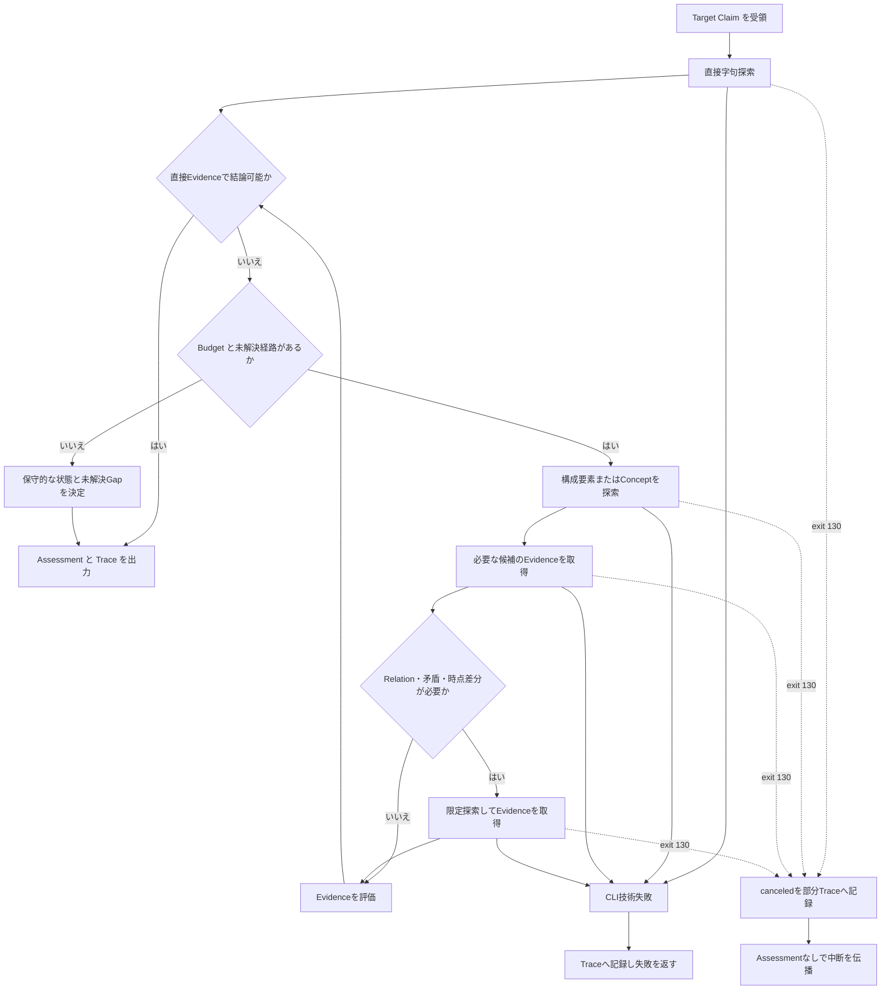
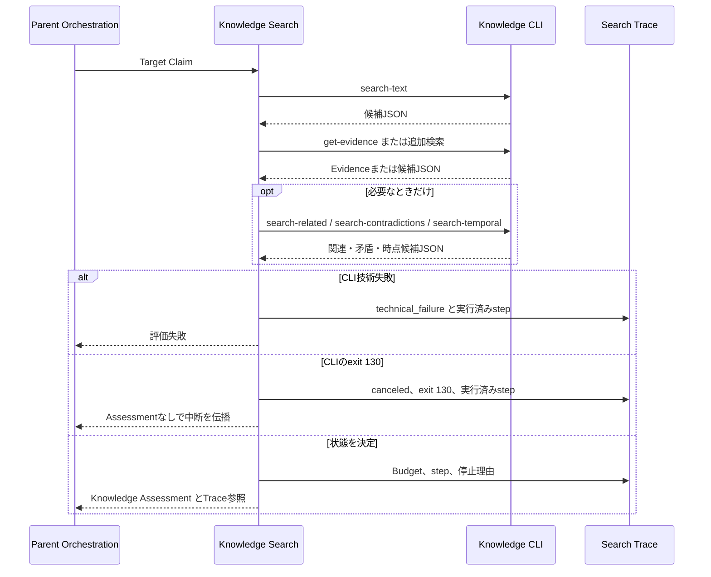

# FEAT-002 詳細設計: Claim ごとの Agentic Knowledge Assessment

## Feature Summary

Codex の Knowledge Search が、Article Analysisから渡された一つのTarget Claimを既存の Knowledge CLI で反復探索し、Evidenceに還元できるKnowledge Assessmentを作る。CLIは検索・取得だけを決定論的に実行し、Claimの意味、検索戦略、Evidence強度、状態判定はCodexが担う。

## Scope / Out of Scope

対象要件と範囲は [requirements.md](requirements.md) に従う。既存CLIの11操作を消費するだけで、新しいCLI operation、JSON wire schema、SQLite migration、永続Search Trace、公開Budget設定は導入しない。

## Related Requirements / Business Rules

- REQ-004、REQ-005、REQ-019〜021、NFR-001〜003、NFR-006。
- BR-002により空結果は`no_evidence`の材料であり未知の断定ではない。
- BR-003により導出可能性は`known`へ昇格しない。BR-006により確信度は熟達ラベルではない。
- BR-007によりRelationは探索経路であり、単独で理解のEvidenceにしない。BR-010によりCLIへ意味判断を移さない。
- Semantic SearchはDEC-REQ-001により初期提供では使わない。

## Behavioral Scenarios

### 前提とTrigger

Article Analysisが、本文、必要ならScope・時点文脈を含む単一Claimを渡す。Knowledge CLIが利用可能であり、成功JSONを返した場合だけ評価を継続する。

### Main Flow

1. Claimの固有語、API名、識別子、Scopeを用いて`search-text`を一度実行し、直接候補を得る。
2. 直接候補とClaimの意味を比較し、直接一致・部分一致・関連・前提・矛盾・時点差分のどれが未解決かを記録する。
3. 未解決なら、Claimの構成要素または明示的なConceptを最大3件選び、`search-text`または`search-concept`で探索する。
4. 新しい候補について、必要なものだけ`get-evidence`を実行する。候補間の明示Relationが追加判断に必要な場合だけ、深さ1まで`search-related`を実行し、得たAssertionも必要ならEvidenceを取得する。
5. Claimまたは候補に矛盾・旧versionの可能性がある場合だけ、`search-contradictions`または`search-temporal`を合計2回まで実行し、判断対象のAssertionのEvidenceを取得する。上限後は未解決部分をKnowledge Gapへ残す。
6. 取得済みEvidenceを評価し、状態・確信度・Known・Knowledge Gap・矛盾・時点差分をAssessmentへ、全操作過程をTraceへ記録して終了する。

### Alternate / Error Flows

- 直接候補がなく、構成要素・Concept・RelationからもEvidence付き候補へ到達しない場合は`no_evidence`とする。これはユーザーが知らないという意味ではない。
- CLIが`validation_error`、`not_found`、`storage_error`、`internal_error`、またはJSONプロトコル不整合を返した場合は、状態を出力せず`technical_failure`としてTraceに記録し、呼出側へ失敗を伝える。`validation_error`は事前検証をすり抜けた内部の操作生成不整合であり再試行しない。空配列と混同しない。
- CLIがresponse開始前の`Ctrl-C`でexit 130・無出力となった場合は、`technical_failure`ではなく`canceled`として部分Traceへ記録し、Assessmentなしで中断を呼出側へ伝播する。Parent Orchestration自体も中断済みなら部分Traceの生成・保存を行わない。
- 反対の結論を支えるEvidenceがあり、強さ・時点・適用Scopeを比較しても優位な結論へ収束しない場合は`uncertain`とする。
- Budgetを使い切ったとき、未解決部分はKnowledge Gapとして残し、得られたEvidenceだけで最も保守的な状態を選ぶ。未観測を未知へ変換しない。

## Selected Design Analyses

- Use case、主/代替/異常flow、責務、状態分類、CLI境界、Trace、受入設計を選択した。複数の責務境界と停止・失敗の戻り先があるためフローチャートとシーケンス図を作成した。
- 独立した永続状態遷移図は不要。AssessmentとTraceは一実行ごとの派生成果物であり、本Featureでは保存・更新しない。

## Responsibilities

| 責務 | 担当 | 担当しないこと |
| --- | --- | --- |
| Claimを一つ渡す | Article Analysis / 呼出側 | 本Feature内での記事再分解 |
| Query・構成要素・探索継続・状態の意味判断 | Codex Knowledge Search | CLIへ判断規則を委譲 |
| 決定論的検索・取得 | Knowledge CLI | semantic equivalence、Evidence強度、状態判定 |
| Evidenceと結果の解釈 | Codex Knowledge Search | Relationの存在だけで理解を推定 |
| Assessmentの利用 | Reading Value | 知識状態の再判定 |
| Budget・再調査上限の実行制御 | Parent Orchestration | 公開設定の追加 |

## Interaction

## Interfaces / Data

### 入力

- Target Claim: 一つの独立評価可能な命題本文。Article Claimの役割・重要度・位置・Supportは受け取れても、状態の判定根拠にはユーザーKnowledge Evidenceを用いる。
- 任意文脈: Claimに明示されるScope、対象version、時点。未指定なら推測して検索filterを追加しない。

### 既存CLI利用契約

| 意図 | 既存operation | 使用条件 |
| --- | --- | --- |
| 直接・構成要素の字句候補 | `search-text` | 最初の1回と、最大3回の拡張探索 |
| 明示Conceptの候補 | `search-concept` | Claimから選んだConceptがあるとき |
| 候補の詳細 | `get` | SummaryだけでScope・Temporalの確認が不足するとき |
| Evidence履歴 | `get-evidence` | 最大4候補。状態の主張には原則これを要する |
| 明示Relationの拡張 | `search-related` | 深さ1、最大2回のRelation探索内 |
| 矛盾候補 | `search-contradictions` | Claimまたは候補に反対命題の可能性があるとき |
| 時点差分候補 | `search-temporal` | Claimにversion・時点文脈またはConcept/Scope selectorがあり、候補Temporalが判断を左右するとき。時点だけでは呼ばない |

各operationの名前付きoption、success/error JSON、stdout/stderr、exit codeはFEAT-001の[Command Catalog](../FEAT-001/design/command-catalog.md)および各operation資料を変更せず利用する。`search-semantic`は呼び出さない。

### Assessment Schema

正式な成果物構造は[assessment-template.md](design/assessment-template.md)に従う。状態は必ず一つ、Confidenceは`high`、`medium`、`low`の一つとする。Traceは[search-trace.md](design/search-trace.md)に従い、Assessment本文へ全操作ログを重複させない。

## State Classification

状態は「ユーザーの熟達度」ではなく、評価Claimに対する観測の結論である。次の規則を上から適用する。いずれもEvidence原文、Scope、時点、Claimとの意味対応をCodexが評価する。

| 優先 | 状態 | 成立条件 | Confidenceの目安 |
| --- | --- | --- | --- |
| 1 | `uncertain` | 相反するEvidence、または複数のもっともらしい意味対応があり、強さ・時点・Scopeを比較しても優位な結論がない | low〜medium |
| 2 | `contradicted` | Claimと両立しない理解を直接支えるEvidenceが優位で、Claimを支持する同等以上の現行Evidenceがない | medium〜high |
| 3 | `outdated` | Claimと同一主題・Scopeについて、現行のversion/時点に対し古い理解だけをEvidenceが支持し、より新しい訂正またはTemporal根拠がその差分を示す | medium〜high |
| 4 | `known` | Claim全体を直接または意味的に同等なAssertionとして支えるstrong Evidenceがあり、矛盾・時点差分がない | high |
| 5 | `partially_known` | Claimの一部または構成知識にはEvidenceがあるが、全体の因果・相互作用・判断を直接にも導出的にも支えられない | medium |
| 6 | `inferable` | Claim自体の直接Evidenceはないが、必要な構成知識と明示RelationからClaimを導ける。導出経路もEvidenceで支持される | medium |
| 7 | `no_evidence` | 探索した経路でClaimまたは構成要素を支える利用可能なEvidenceがない | low |

`known`と`inferable`、`partially_known`の差は直接性と完全性である。Concept一致、Relation存在、検索候補の類似だけは、いずれの状態でもEvidenceを補わない。`no_evidence`は「知らない」ではなく「本システムに判断根拠がない」である。

## Budget / Stop Conditions

DEC-FEAT-008の最大12 CLI呼出し、Evidence 4件、Relation深さ1を適用する。内訳は、直接・構成要素・Concept探索が最大4回、候補詳細・Relation・矛盾・時点差分探索が合計最大4回、Evidence取得が最大4回である。この補助探索のうち`search-contradictions`と`search-temporal`は合計最大2回とし、Traceの`contradiction_temporal_calls`で観測する。2回に達した後はこれらを実行せず、未解決部分をKnowledge Gapに残す。停止理由は次のいずれか一つをTraceへ記録する。

- `strong_conclusion`: `known`、`contradicted`、`outdated`を高いConfidenceで支持するEvidenceが得られ、未探索経路が結論を覆しにくい。
- `saturation`: 未解決のClaim部分に対する候補・Evidenceをすべて評価済み。
- `no_increment`: 新しい候補またはEvidenceを得ない探索が連続し、別の未探索経路がない。
- `no_expandable_path`: 構成要素、Concept、ID、Scope、時点など次の決定的検索入力がない。
- `budget_exhausted`: 固定上限に到達。
- `technical_failure`: CLIの`validation_error`、`not_found`、`storage_error`、`internal_error`、またはJSONプロトコル不整合。Assessmentを返さない。
- `canceled`: CLIのexit 130。error JSON・error codeとして扱わず、Assessmentなしで中断を伝播する。

## Error / Edge Cases

- 空Store、未登録Concept、空検索結果は成功結果であり、`no_evidence`以外の技術errorにしない。
- CodexはCLI呼出し前に既存operation資料に照らしてoptionの必須性、enum、selector、繰返し値の組を検証する。CLIが`validation_error`を返した場合は内部の操作生成不整合として`technical_failure`にし、同じ入力で再試行しない。
- `not_found`は、前stepで得たIDとの不整合として`technical_failure`にする。推測したIDを再利用しない。
- CLIのexit 130はerror JSONを期待せず、`canceled`としてoperationとexit codeだけを部分Traceに残す。Parent Orchestrationも中断済みなら診断成果物の生成・保存を試みない。
- ClaimのScopeまたは時点が不明なら、Scope/Temporal filterを捏造せず、Assessmentにその限界を記す。
- Evidenceが0件のAssertion、ConceptだけのRelation、Semantic類似候補は、Knownの根拠に使わない。
- 訂正Evidenceが過去の理解を覆す場合、過去Evidenceを削除せず、優位性と時点を説明する。

## Security / NFR Considerations

Evidence原文は個人知識データである。Traceには最小限の入力要約とIDを記し、不要なEvidence原文の複製を避ける。AssessmentはEvidenceまで追跡可能にし、結果・Trace・技術失敗を混同しない。検索Budgetは有限性を保証するが、ユーザーの知識量の上限や熟達度を表さない。

## Acceptance / Test Design

1. 空StoreではTraceが直接探索と停止理由を示し、Assessmentは`no_evidence`かつ未知断定を含まない。
2. Claim全体にstrong EvidenceがあるFixtureでは`known`、Evidence ID、high Confidenceを返す。
3. 構成知識だけがあるFixtureでは、全体を直接に支持しなければ`partially_known`、明示Relationを含む導出が成立するときだけ`inferable`を返す。
4. 反対命題の優位なEvidenceがあるFixtureでは`contradicted`、古いversionを新しい訂正が覆すFixtureでは`outdated`を返す。
5. 競合Evidenceが解消不能なFixtureでは`uncertain`を返し、任意の優位性を捏造しない。
6. Relationのみ、質問のみ、AI説明のみ、EvidenceなしAssertionは`known`の根拠にしない。
7. 同一queryの再実行、Relation深さ2、`search-contradictions`と`search-temporal`の合計3回目、Evidence 5件目、CLI 13回目を行わず、Traceに各Budgetと停止理由を残す。
8. `validation_error`、`not_found`、`storage_error`、`internal_error`、プロトコル不整合では状態を返さず、operation、既存error code、非再試行理由をTraceへ残して呼出側へ失敗を伝える。
9. exit 130・無出力ではerror codeを捏造せず、部分Traceにoperationとexit codeだけを残してAssessmentなしで中断を伝播する。Parent Orchestrationも中断済みならTraceを出力・保存しない。

Scenario A〜JをまたぐFixtureセットと層別評価の所有はFEAT-005にある。本Featureは上記の個別評価可能な成果物・判定規則を提供する。

## Assumptions

- Article Analysisは一つの独立評価可能なClaimを渡す。粗すぎるClaimを本Featureが勝手に再分解しない。
- 具体的なBudgetはASM-002を解消するL2 DecisionとしてDEC-FEAT-008に固定した。評価結果によりFeature内で変更可能である。
- 初期提供のAssessmentとTraceはCodex間のMarkdown成果物であり、永続保存要件はない。

## Decisions

- [DEC-FEAT-008](decisions/DEC-FEAT-008.md): 固定Budgetと探索順序。
- FEAT-001で承認済みのCLI/SQLite/JSON契約をそのまま消費し、変更しない。

## Open Issues

なし。記事入力UI（UI-001）と記事の再調査はFEAT-003の範囲であり、FEAT-002の実装準備を阻害しない。
