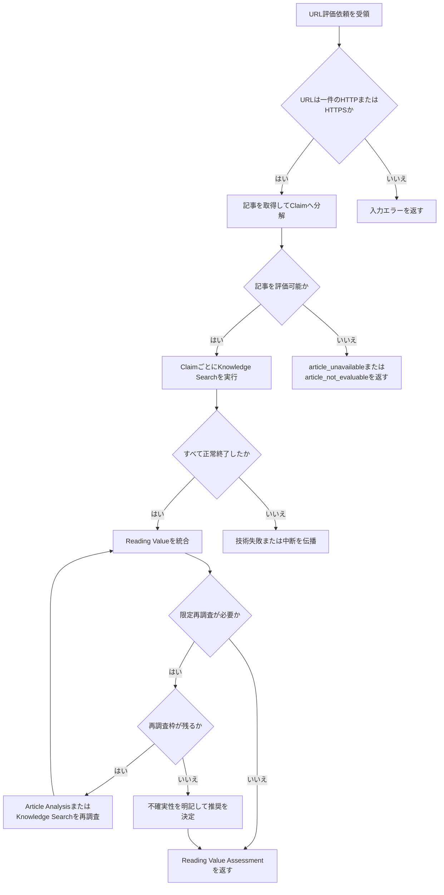
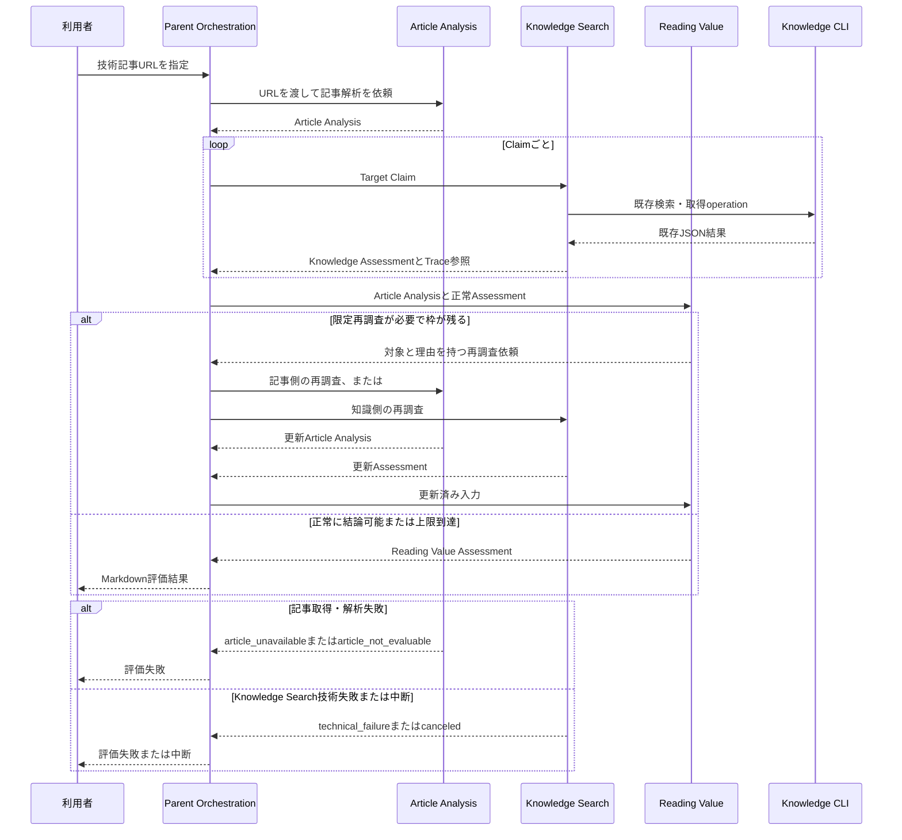

# FEAT-003 詳細設計: URL記事の読書価値評価

## Feature Summary

利用者がCodex会話で一件の技術記事URLを指定すると、Codex側のParent Orchestrationが記事を取得してArticle Claimへ分解し、各ClaimのFEAT-002 Knowledge Assessmentを統合して、`read_full`、`read_selected`、`skip`のいずれかを理由付きMarkdownで返す。記事の一般的品質ではなく、利用者固有の認識利得とAttention Costを評価する。

## Scope / Out of Scope

対象範囲は[requirements.md](requirements.md)に従う。入口はDEC-FEAT-010で承認されたCodex会話のみであり、URLを一件受け取って会話内に結果を返す。Article Claim、Assessment、Trace、Reading Value Assessmentは実行中の成果物であり、記事本文や評価結果をKnowledge Storeへ保存・更新しない。

## Implementation Deliverables / Placement

このFeatureの実装先は親リポジトリの `skills/reading-value/` である。`documents/docs/features/FEAT-003/` は正規設計であり、実行時の機能を置く場所ではない。実装担当者は次の成果物を作成する。

| 配置先 | 作成物 | 責務 | 依存先 |
| --- | --- | --- | --- |
| `skills/reading-value/SKILL.md` | Reading Value Workflow | URL一件の受付から最終Markdown返却までを開始・停止し、Article Analysis、Claim単位のKnowledge Search、Assessment Map、再調査上限を制御する。 | `skills/knowledge-search/SKILL.md`、この記事Featureのreference群 |
| `skills/reading-value/references/article-analysis.md` | 記事解析・取得契約 | URL検査、検査済みIPへの固定、リダイレクト、本文可否、Article ClaimとClaim Reconciliationを定める。 | [Article Analysis成果物契約](design/article-analysis-template.md)、DEC-FEAT-012 |
| `skills/reading-value/references/reading-value.md` | 推奨統合契約 | Assessment Map、推奨規則、再調査、最終成果物の必須Sectionを定める。 | [Reading Value成果物契約](design/reading-value-template.md)、DEC-FEAT-011 |
| `skills/reading-value/references/verification.md` | 検証契約 | このFeatureのAcceptanceを、正常・失敗・安全境界の再現可能な確認手順へ対応付ける。 | 本書のAcceptance / Test Design |

`skills/knowledge-search/` は既存の依存先であり、ClaimごとのAssessmentとTraceを返す。そこへ記事取得・推奨判断を追加しない。Knowledge CLIの `cmd/`、`internal/`、SQLite migration、公開CLI JSONはこのFeatureの実装対象外である。

## Related Requirements / Business Rules

- REQ-001〜003、REQ-006〜008、REQ-019〜020、BR-001、BR-003、BR-009、BR-010、NFR-001〜003・005〜006、CON-002〜003・006。
- BR-001により、記事の一般的品質や情報量ではなく利用者にとっての有意味な認識利得とAttention Costを評価する。
- BR-003により、`inferable`を`known`として扱わない。BR-009により、未知Claim数だけで推奨を決めない。BR-010により、意味判断と推奨はCodexが担い、CLIへ移さない。
- FEAT-002の正常終了したKnowledge Assessmentだけを使用し、7状態・Evidence強度・Search Traceを再判定しない。

## Behavioral Scenarios

### Trigger / Preconditions

- 利用者がCodex会話で一件の絶対HTTPまたはHTTPS URLを指定し、読書価値の評価を依頼する。
- URLは公開アクセス可能な技術記事を指し、公開性の検査はDEC-FEAT-012に従う。認証、ローカルファイル、社内ネットワーク、対話操作が必要なコンテンツは初期提供の対象外とする。
- FEAT-002のKnowledge Searchと既存Knowledge CLIが利用可能である。

### Main Flow

1. Parent Orchestrationは、URLが一件の絶対HTTPまたはHTTPS URLであることを確認し、記事の取得をArticle Analysisへ依頼する。
2. Article Analysisは取得された完全な評価対象本文を確認し、記事概要と、本文・役割・重要度・位置・Support・適用文脈を持つ独立評価可能なClaim群を[Article Analysis成果物](design/article-analysis-template.md)として返す。記事全文を一括でKnowledge Searchへ渡さない。
3. Parent Orchestrationは各Claimを一件ずつFEAT-002 Knowledge Searchへ渡し、成功したKnowledge AssessmentとTrace参照を集める。
4. Reading ValueはArticle AnalysisとAssessmentを統合する。Assessmentの状態、Claimの役割・重要度・Support、Applicability、Attention Costを評価して、認識利得候補とReliabilityを説明する。
5. 重要ClaimのSupport・位置が不足する、または重要Claimの`no_evidence`／`uncertain`が読書推奨を左右する場合だけ、Reading Valueは理由を明記してArticle AnalysisまたはKnowledge Searchへ再調査を依頼する。Parent OrchestrationはDEC-FEAT-011に従い合計2回まで実行する。
6. Reading Valueは[Reading Value Assessment成果物](design/reading-value-template.md)を作り、利用者へ会話内で提示する。

### Alternate / Error Flows

- URLが空、複数、相対URL、HTTP/HTTPS以外の場合は、評価を開始せず入力エラーとしてURL一件の指定を求める。
- 記事を取得できない、DEC-FEAT-012の公開性検査に失敗する、本文が得られない、アクセス拒否・認証要求・動的表示により中心本文またはClaimの根拠となる節を確認できない場合は`article_unavailable`として失敗を返す。Claim、Assessment、推奨を捏造しない。ナビゲーション等の非本文要素だけが欠落する場合は、`content_limitations`へ記録して評価を続けられる。
- 記事が技術記事と確認できない、または評価可能な主張を抽出できない場合は`article_not_evaluable`として失敗を返す。要約や一般的品質評価に代替しない。
- 一つでもKnowledge Searchが`technical_failure`または`canceled`で終わった場合は、Reading Valueを作らない。失敗または中断を呼出側へ伝播し、部分的なAssessmentを`no_evidence`や`skip`へ変換しない。
- 再調査上限に達しても重要な不確実性が残る場合は、Claim–Assessment対応が有効な正常Assessmentだけを用いて保守的に推奨し、`Limitations`へ残す。

### Postconditions

- 正常時は一件のReading Value Assessmentが会話内に返り、各推奨理由はClaim位置、Assessment、およびSupportまで追跡できる。
- 失敗・中断時は読書推奨を返さず、記事・Knowledge Storeを変更しない。

## Selected Design Analyses

- Use case、主/代替/異常flow、責務、成果物契約、再調査制御、Error・NFR・受入設計を選択した。複数のCodexワークフロー、外部記事、Knowledge CLIをまたぎ、再調査と失敗の戻り先が実装判断を左右するため、フローチャートとシーケンス図を作成した。
- 永続的な状態遷移、SQLite schema、JSON CLI/API形式契約、operation別資料は不要。本Featureは新しい永続StoreやJSON CLI/APIを導入せず、Codex会話とCodex間Markdown成果物だけを扱う。

## Responsibilities

| 責務 | 担当 | 担当しないこと |
| --- | --- | --- |
| URL受領、全体開始・終了、再調査回数の制御、最終提示 | Parent Orchestration | Claim意味・知識状態・推奨の再判断 |
| 記事取得、本文確認、Claim分解、役割・重要度・位置・Supportの記録 | Article Analysis | 利用者Knowledgeの検索・評価、知識更新 |
| ClaimごとのEvidence探索とKnowledge Assessment | FEAT-002 Knowledge Search | 記事の再分解、読書価値の決定 |
| Assessmentと記事側の情報の統合、Gain・Reliability・Attention Cost・推奨の判断 | Reading Value | Assessmentの状態やEvidence強度の再判定 |
| 決定論的なKnowledge検索・取得 | Knowledge CLI | 記事理解、検索戦略、読書推奨 |

## Interaction

## Interfaces / Data

### 利用者入力と返却

- 入力はCodex会話に含まれる一件の絶対HTTPまたはHTTPS URLだけである。URL fragmentは記事内位置の補助に使えても、別記事の入力とは扱わない。
- 正常返却はMarkdownのReading Value Assessmentであり、必須Sectionとfieldは[reading-value-template.md](design/reading-value-template.md)に従う。
- 入力エラーはURL再指定を求め、`article_unavailable`と`article_not_evaluable`は記事が評価できなかった技術的または内容上の理由を平易に返す。これらはKnowledge Assessmentの状態ではない。
- `technical_failure`と`canceled`の返却はFEAT-002のKnowledge Search Workflow契約に従い、Assessmentも読書推奨も作らない。

### Article Claim と Assessment

- Article Claimの必須属性は本文、役割、重要度、位置、Supportである。Scope、対象version、時点文脈は記事が明示する場合に記録し、明示されない場合は「なし」とする。詳細な表現は[article-analysis-template.md](design/article-analysis-template.md)に従う。
- Parent OrchestrationはClaimの役割・重要度・位置・Support・適用文脈を改変せずにKnowledge Searchへ渡す。Knowledge Searchは正常Assessmentだけを返し、Reading Valueはその`Status`、`Confidence`、`Known`、`Knowledge Gap`、Supporting Evidence、Contradictions、Temporal Issuesを再判定せずに利用する。
- AssessmentとTraceは実行中のCodex間Markdown成果物である。Article本文、Claim、Assessment、Trace、最終評価を永続Storeへ書き込まない。
- Parent Orchestrationは各Claim IDを、正常完了した一つのKnowledge Assessment実行時参照と、そのAssessmentのSearch Trace実行時参照へ対応付けるAssessment Mapを作る。Reading ValueはMapにないClaimまたは正常Assessment以外を参照できず、このMapを成果物にも出力する。
- Article再調査では、`claim`、`scope`、`target_version`、`temporal_context` がすべて同一のClaimだけがMapを維持する。変更・追加Claimは旧Mapを無効にしてFEAT-002を再実行し、削除ClaimはMapから除外する。これはDEC-FEAT-011のArticle再調査に含まれる。

### Reading Recommendation Rules

| 推奨 | 成立条件 | 必須説明 |
| --- | --- | --- |
| `read_full` | 高い認識利得候補が記事全体に分散する、またはClaim間の因果・構造・判断が全体文脈なしには得られない | 全文が必要な理由、中心Gain、Reliability、低優先箇所があればその扱い |
| `read_selected` | 重要で十分にSupportされたGainが特定位置へ限定され、残りが既知・低重要度・根拠不足・再包装などで相対的に低価値 | 読む位置、飛ばす位置、各Gain、根拠とReliability |
| `skip` | 主な内容が既知、またはGain候補が低重要度・低適用性・根拠不足で、Attention Costを正当化しない | 読まない理由、未知を断定していないこと、重要な例外があればその位置 |

`known`は原則Fact Gainを小さくするが、新たな構造化があればStructural Gainを持ち得る。`partially_known`は不足部分が因果・判断・実践知であればGainを持ち得る。`inferable`はStructuralまたはUnderstanding Gainを持ち得る。`contradicted`／`outdated`は信頼できるSupportと適用可能性があればCorrectionまたはPractical Gainを持ち得る。`no_evidence`は未知の断定でなく新規可能性として扱い、`uncertain`は追加調査の候補またはLimitationsとする。

## Contract Completeness

| 性質 | 状態 | 根拠 |
| --- | --- | --- |
| 永続データまたは履歴 | not_applicable | Article Analysis、Assessment、Trace、Reading Value Assessmentは実行内Markdown成果物であり、永続化・更新を行わない。 |
| Command / CLI / API境界 | not_applicable | 新しい公開CLI/APIを追加しない。既存Knowledge CLIはFEAT-001/002の契約を変更せず消費する。 |
| 検索・一覧・取得 | not_applicable | 本FeatureはKnowledge Storeの検索契約を導入せず、FEAT-002が既存CLIを利用する。記事取得は利用者指定URLの一回の内容取得であり、検索サービスではない。 |
| 更新・重複・原子性 | not_applicable | Knowledge Store、記事、実行成果物を更新しない。 |
| Schema / Store / Index | not_applicable | SQLite migration、Store、Index、公開設定を追加・変更しない。 |
| テスト用データ状態 | complete | Article、Claim、Assessment、期待推奨を組み合わせるFixtureと、外部取得失敗を再現するfixtureで検証する。 |

SQLite形式契約、JSON CLI/API wire schema、Operation Documentation Coverage Gateはいずれもnot_applicableである。理由は新しいSQLite／関係DBまたはJSON CLI／APIを導入せず、既存契約を変更しないためである。

## Error / Edge Cases

- リダイレクト後の最終URLがHTTP/HTTPS以外、または本文が利用不能な場合は`article_unavailable`とし、部分本文から評価を推測しない。
- 初期URL、名前解決結果、各リダイレクト先のいずれかがDEC-FEAT-012の公開性検査に失敗した場合は、当該宛先へ接続せず`article_unavailable`にする。接続は検査済みIPへ固定し、接続時の再名前解決を許さない。
- 同じURLが複数回入力された場合も、評価結果をKnowledge Evidenceに変換せず、各依頼を独立実行とする。記事内容の変化を前回結果から推測しない。
- 記事内の主張が矛盾する、Supportが主張だけである、位置が特定できない場合は、Claimごとにその制限を残し、Reliabilityを過大に表現しない。
- `read_selected`で位置が特定不能なGainは、読む対象として推薦しない。全体文脈が必要なら`read_full`の根拠にするか、ReliabilityとLimitationsに残す。
- 読む位置が空になる`read_selected`、または読むべき高価値部分を説明しない`read_full`は無効な成果物とする。
- Article AnalysisまたはReading Valueの出力だけで利用者のKnowledgeを更新しない。

## Security / NFR Considerations

- 記事取得は、初期URLと各リダイレクト先について接続前にDEC-FEAT-012の公開性検査を行い、検査済みIPへ接続先を固定する。認証情報、Cookie・セッション情報、フォーム送信その他の状態変更を伴う操作を試みない。URLと本文を不要に永続化しない。
- 記事本文とKnowledge Evidenceは最小限の必要範囲で扱い、最終結果・Traceへ不要な原文複製をしない。
- 推奨の根拠はClaim位置、Support、Assessmentへ追跡可能にする。再調査回数はDEC-FEAT-011、Claimごとの検索BudgetはFEAT-002に従う。
- 既存CLIの論理契約を変更せず、Semantic SearchはDEC-REQ-001により使わない。

## Acceptance / Test Design

1. 正常な技術記事URLを与えると、Article Analysisに複数Claimの必須属性があり、記事全文を一括でKnowledge Searchへ渡さない。
2. すべての正常Assessmentを入力に、Reading Valueが三つの推奨のいずれか一つと、Why、Read、Skip、Knowledge Gains、Reliability、Conclusionを返す。
3. 高価値Gainが全体へ分散するFixtureでは`read_full`となり、全体文脈が必要な理由を説明する。
4. 記事大半が既知で、一部の重要かつ位置特定可能なGapまたはPractical/Structural GainがあるFixtureでは`read_selected`となり、読む箇所・飛ばす箇所・Gain・Reliabilityを示す（Scenario I）。
5. 未観測または些末なClaimだけでは`read_full`にせず、根拠・重要度・適用可能性・Attention Costを説明して`skip`または限定的な推奨を選ぶ（Scenario A/J）。
6. `inferable`を`known`へ、`no_evidence`を未知へ、`uncertain`を確定Gainへ変換しない。
7. Reading ValueがArticle側またはKnowledge側の不足を理由付きで起票した場合、合計2回までだけ対象を限定して再調査し、上限後はLimitationsへ残す。
8. 空・複数・相対・非HTTP(S) URLは入力エラーとなる。取得不可、認証要求、本文なしは`article_unavailable`、評価可能なClaimなしは`article_not_evaluable`となり、推奨を返さない。
9. Knowledge Searchの`technical_failure`または`canceled`ではReading Valueを作らず、知識状態や`skip`へ変換しない。
10. Article Evaluationの実行後もKnowledge Storeへの更新操作がないこと、記事評価・AI説明をEvidenceとして追加しないことを確認する（Scenario G）。
11. Reading Valueの各Claim参照は、Assessment Mapを通じて一つの正常Knowledge AssessmentとそのSearch Traceへ追跡できる。
12. Article再調査で意味的に同一のClaimだけが既存Assessmentを維持し、変更・追加Claimは再評価され、削除Claimは最終評価から除外される。
13. 初期URL、名前解決結果またはリダイレクト先が公開性検査に失敗した場合は、当該宛先へ接続せず`article_unavailable`となる。
14. 中心本文またはClaimの根拠となる節が欠ける取得は失敗とし、Claimと推奨を作成しない。非本文要素だけの欠落は`content_limitations`に記録して正常評価できる。
15. URL検査後に名前解決結果が変わっても、検査済みIP以外へ接続しない。取得能力がこの固定を保証できない場合は`article_unavailable`となる。
16. Claimの`scope`、`target_version`、`temporal_context`が変わる再調査は変更Claimとして再評価され、同じ四項目のClaimだけがAssessment Mapを再利用できる。

Scenario A〜J全体を横断するFixture評価基盤の所有はFEAT-005にある。本Featureは上記の単体評価可能な契約とoracleを提供する。

## Assumptions

- ASM-001に従い、初期提供は公開アクセス可能な技術記事だけを対象とする。
- 記事取得はCodex Runtimeが利用可能な読み取り能力を使い、特定のブラウザ、スクレイパー、保存方式、外部サービスを固定しない。
- Article Analysisは全ての内容断片ではなく、読書価値を左右する独立評価可能なClaimを抽出する。除外した断片はCoverage Notesで説明する。

## Decisions

- [DEC-FEAT-010](decisions/DEC-FEAT-010.md): Codex会話をURL評価の利用者入口とするL3承認。
- [DEC-FEAT-011](decisions/DEC-FEAT-011.md): 再調査を合計2回までに制限するL2決定。
- [DEC-FEAT-012](decisions/DEC-FEAT-012.md): 記事取得の公開ネットワーク境界を定めるL2決定。
- FEAT-002のCodex側Knowledge Search Workflow、およびFEAT-001の既存Knowledge CLI契約を変更せず消費する。

## Open Issues

なし。
