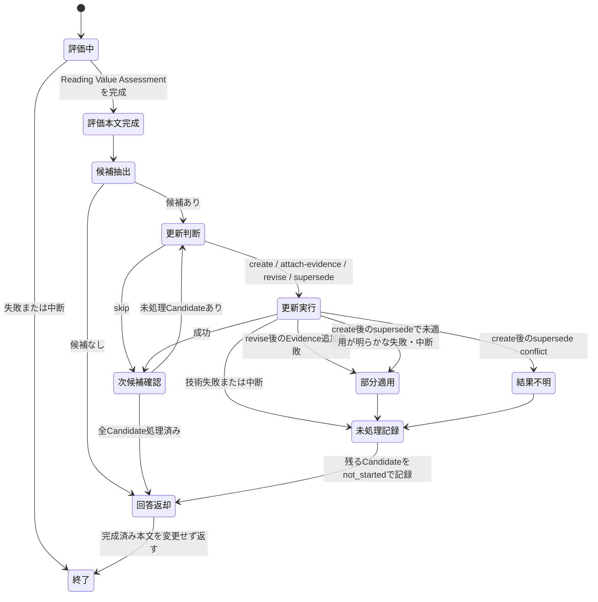
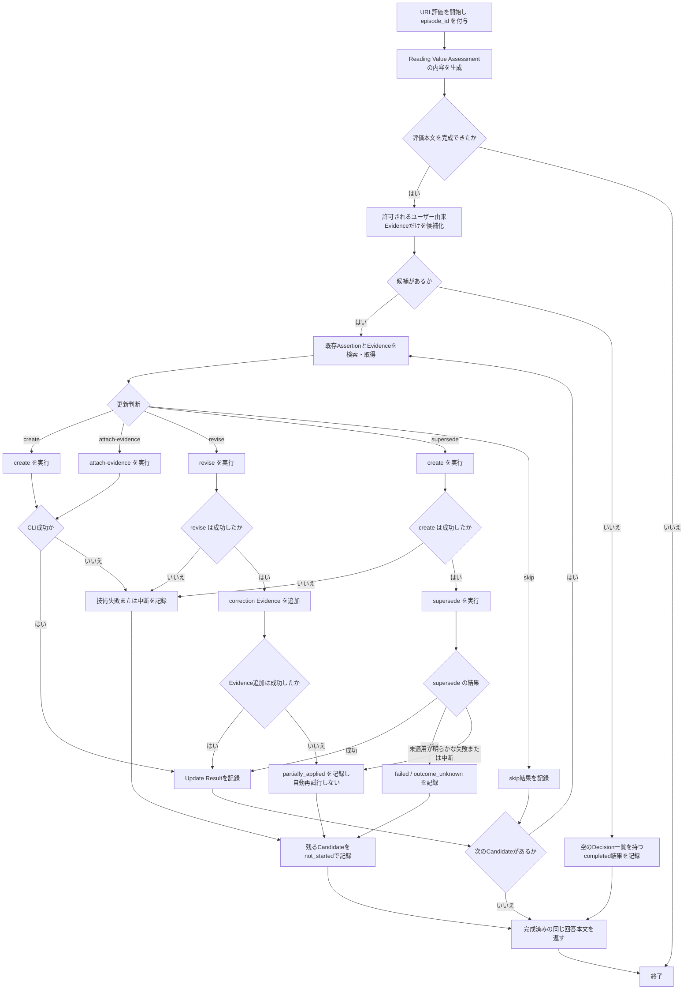
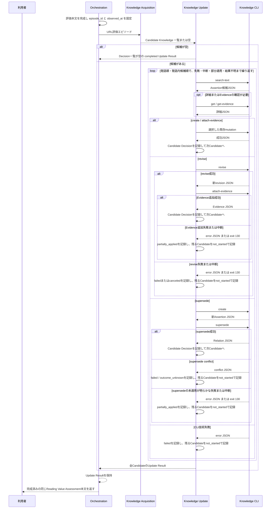

# FEAT-004 詳細設計: 会話・作業からの知識 Evidence 更新

> **状態:** `completed` — 実行順は [DEC-FEAT-015](decisions/DEC-FEAT-015.md) で確定。独立設計レビューと人間承認を完了し、実装へ引き渡す。

## Feature Summary

ユーザーが技術記事URLを渡すと、CodexはReading Value Assessmentの内容を完成させる。その後、会話へ返す前に、当該URL評価ワークフローだけからユーザー知識のEvidence候補を抽出し、Knowledge Updateが既存Assertionとの照合と既存Knowledge CLI操作の選択を行う。更新結果は完成済みの回答本文を変えない。

候補抽出と更新判断はCodexが担い、Knowledge CLIは選ばれた検索・保存操作を決定論的に実行する。候補が抽出されたことは、保存または知識保有の判定を意味しない。

## Scope / Out of Scope

スコープと対象外は[要件再構成](requirements.md)に従う。追加して、対象エピソードはURL評価ワークフローに限定し、URL評価に無関係な通常会話、別作業、保存済み履歴、失敗・中断したURL評価は扱わない。

FEAT-001の既存CLI/SQLite/JSON契約をそのまま消費し、公開operation、option、JSON field、SQLite schema、migrationを追加・変更しない。

## Related Requirements / Business Rules

- REQ-015〜REQ-019
- BR-004、BR-005、BR-006、BR-008、BR-010
- NFR-001、NFR-003、NFR-004、NFR-006

## Behavioral Scenarios

### 正常フロー

1. ユーザーが技術記事URLを渡して評価を依頼する。Orchestrationは開始時にその実行だけを表す不透明な`episode_id`を割り当てる。
2. Article Analysis、Knowledge Search、Reading ValueがURL評価を行い、Reading Value Assessmentの内容を完成させる。この時点をEpisode完了時刻として固定するが、回答本文はまだ会話へ返さない。Evidenceの`observed_at`には各ユーザー寄与の観測時刻を使う。
3. Knowledge Acquisitionは、当該`episode_id`に属するユーザー由来の技術的説明、推論、コード、訂正、自己申告、技術判断だけを読み、独立評価可能なCandidate Knowledgeへ分ける。
4. 各候補に対し、CLIへそのまま渡せる完全なEvidence原文、表示用の必要最小限の抜粋、Evidence kind、強度、観測時刻、発話内候補順、正規化候補、Scope/時点の明示情報、抽出理由を残す。強度は説明・推論・コード・訂正、および理由を伴う技術判断を`strong`、自己申告を`moderate`、概念認識だけを`weak`とする。理由を伴わない技術判断は候補にしない。複合的な寄与は根拠種類ごとに候補を分ける。質問だけ、AIだけの説明、記事本文・閲覧・評価・要約だけは候補を作らない。
5. Knowledge Updateは、各Candidateの`search_queries`を先頭から順に一回ずつ`search-text --query`へ渡す。先頭queryは候補Assertionそのもので、訂正Evidenceに引用符で囲まれた旧命題がある場合だけ完全な引用文を二番目に置け、以後は原文に明示されたConcept・Alias・Identifierだけである。空結果でも次queryへ進み、返ったAssertion IDを初出順に重複除去して、その集合だけを必要時に`get`と`get-evidence`で確認する。検索失敗・中断では残りqueryと後続Candidateを実行しない。意味的同一性、Evidenceの強度、訂正・置換の意味はCodexが判断する。字句検索で到達できない別表現の既存Assertionは発見できないため、未発見の意味的重複を防止することは保証しない。
6. 候補を発話順・発話内候補順に処理する。候補ごとに`create`、`attach-evidence`、`revise`、`supersede`、`skip`を一つ選ぶ。成功・skip後は次候補へ進む。失敗・中断・部分適用・結果不明では後続Candidateを処理せず`not_started`としてUpdate Resultへ残す。
7. 全候補が処理済み、または技術失敗・中断がUpdate Resultへ記録された時点で、完成済みのURL評価への回答本文を変更せず会話へ返す。

### 更新判断

| 判断 | 選択条件 | CLI実行 | 結果 |
| --- | --- | --- | --- |
| `create` | 現行Assertionに意味的に同一な対象がなく、許可されるユーザー由来Evidenceがある。 | `create` | 新Assertionと初期Evidenceを保存する。 |
| `attach-evidence` | 現行Assertionが候補と意味的に同一で、追加Evidenceが未記録である。 | `attach-evidence` | Assertionのrevisionを変えず、Evidence履歴を追加する。 |
| `revise` | 同じAssertion identityについて、ユーザーの訂正が正規化本文、Scope、またはTemporal Metadataを変える必要がある。 | `revise`、必要なら`attach-evidence` | 新revisionを追加し、訂正Evidenceも履歴に残す。 |
| `supersede` | 旧Assertionとは別identityの新しい理解が、旧Assertionを置き換えるとユーザー由来Evidenceが示す。 | `create`、続けて`supersede` | 新Assertionを作り、旧Assertionを削除せず置換Relationを追加する。 |
| `skip` | 許可済みCandidateだが、命題として不十分、Evidenceが知識根拠にならない、または既に同じEvidenceが記録済み。質問・AI・記事本文など入力境界から除外された発言にはCandidateもDecisionも作らない。 | なし | 保存しない理由を残す。 |

`revise`は表現・適用条件・時点情報の訂正だけに使う。異なる命題を同一Assertionへ上書きしない。訂正Evidenceが必要な`revise`は、先に`revise`、次に`attach-evidence`を実行する。前者が成功して後者が失敗または中断した場合は、新revisionを削除せず`partially_applied`とする。

`supersede`では新Assertionの`create`成功後に`supersede`が失敗しても、新Assertionを削除しない。これは既存CLIが削除operationを持たず、履歴保全を優先するためである。複数操作の後段で失敗・中断した候補は、先行成功があるため`partially_applied`とし、同じ入力で自動再試行しない。既存relationの読取operationがないため、`supersede`の`conflict`は既適用と断定せず、`failed`かつ結果不明として記録する。

### 代替・異常フロー

- URL評価が失敗または中断し、回答が完了しない場合: Candidate Knowledgeを抽出せず、Knowledge Storeを変更しない。
- 抽出対象に許可されるEvidenceがない場合: Decision一覧が空で全体状態が`completed`のUpdate Resultを返し、CLIを呼ばない。
- `search-text`が空結果の場合: `create`を選択し得る。空結果はエラーでも「ユーザーが知らない」でもない。
- CLIの`validation_error`、`not_found`、`storage_error`、`internal_error`、JSONプロトコル不整合の場合: 当該候補を技術失敗として止め、以後の候補を自動処理しない。URL評価結果や知識状態を捏造しない。
- `attach-evidence`が`conflict`の場合: `get-evidence`でkind・原文・観測時刻が完全一致する既存Evidenceを確認できるときだけ、既適用として成功扱いにする。それ以外は技術失敗とする。
- `create`が`conflict`の場合: `search-text`、`get`、`get-evidence`で既存AssertionとEvidenceの同一性を確認できるときだけ、既適用または`attach-evidence`へ切り替える。確認できなければ技術失敗とする。
- `revise`の`conflict`、または`supersede`の`conflict`が発生した場合: 同一Episodeを自動再実行しないため既適用扱いにしない。`supersede`はRelation読取がないため、特に保存済みかを推測しない。
- CLIのexit 130: error JSONを期待せず、先行mutationがなければKnowledge Updateを`canceled`として呼出側へ伝播する。先行mutationがある二操作列の後段で起きた場合は`partially_applied`に中断operationを残す。いずれも後続候補を処理しない。

## Selected Design Analyses

| 分析 | 採否 | 理由 |
| --- | --- | --- |
| ユースケース、主・代替・異常flow | 採用 | 評価本文完成、候補抽出、操作選択、CLI失敗、回答返却で観測可能な挙動が分岐する。 |
| 状態 | 採用 | URL評価完了前後、候補処理、部分適用、中断を区別する必要がある。 |
| 相互作用・シーケンス | 採用 | Codex workflowと既存CLIの境界、`supersede`の二操作、失敗時の戻り先が実装判断を左右する。 |
| Domain rule、契約、エラー、冪等性、履歴、テスト | 採用 | BR-004〜BR-010と更新の安全性を具体化するため。 |
| UI state | 不採用 | UI-001は未決であり、本FeatureはURL評価完了という論理イベントを受け取る。画面状態は定義しない。 |
| DB schema / migration | 不採用 | 新しいStoreやCLI operationを導入しない。FEAT-001の既決schemaを消費する。 |
| operation別CLI文書 | 不採用 | 新しい公開CLI operationを提供せず、既存operationの資料を変更せず参照する。 |

## Responsibilities

| 論理責務 | 担当 | 担当しないこと |
| --- | --- | --- |
| URL評価の開始・`episode_id`の付与・評価本文の完成通知・最終返却 | Orchestration | Evidenceの意味判断、Store更新 |
| Candidate Knowledgeの抽出・除外 | Knowledge Acquisition | 自動保存、知識状態の断定 |
| 既存Knowledgeとの意味照合・操作選択 | Knowledge Update | CLIへ意味判断を委譲 |
| 検索・取得・保存・transaction | Knowledge CLI | 候補抽出、操作選択、Evidence強度評価 |
| URL評価結果の提示 | Reading Value / 呼出側 | 更新の成功を回答の成功条件にすること |

## Implementation Deliverables / Placement

実行時のWorkflow Skillは、親リポジトリ (`knowledge/`) の `skills/` 配下に置く。これは適用中の`AGENTS.md`が「Knowledgeプロダクトに付随するCodex workflow Skill」を`skills/<skill-name>/`に配置すると定め、既存のURL評価入口が`skills/reading-value/`にあるためである。

| root-relative配置先 | 作成・変更 | 責務 | 依存・接続先 |
| --- | --- | --- | --- |
| `skills/reading-value/SKILL.md` | 変更 | Reading Value Assessmentの内容を完成後、会話へ返す前に当該EpisodeをKnowledge Acquisitionへ渡し、Knowledge Updateの完了後に同じ本文を返す。回答本文の成功条件にはしない。 | 既存のURL評価Workflow。新設する`knowledge-acquisition`、`knowledge-update`。 |
| `skills/knowledge-acquisition/SKILL.md` | 作成 | Episodeから許可されたユーザー由来寄与だけをCandidate Knowledgeへ抽出し、除外規則とEvidence強度の導出を適用する。 | `reading-value`からEpisodeを受け、`knowledge-update`へCandidateを渡す。 |
| `skills/knowledge-acquisition/references/artifact-contract.md` | 作成 | EpisodeとCandidate KnowledgeのMarkdown項目、追跡ID、原文、観測時刻、Evidence kind、強度導出を定義する。 | `design/workflow-contracts.md`。 |
| `skills/knowledge-acquisition/references/verification.md` | 作成 | 許可入力、質問・AI・記事本文の除外、訂正、観測時刻の受入確認を定義する。 | `SKILL.md`とartifact contract。 |
| `skills/knowledge-update/SKILL.md` | 作成 | 候補を既存Knowledgeと照合し、検索、更新操作選択、失敗・中断・部分適用の制御を行う。 | `knowledge-acquisition`のCandidate、既存Knowledge CLI。 |
| `skills/knowledge-update/references/artifact-contract.md` | 作成 | Update DecisionとUpdate ResultのMarkdown項目、状態、失敗理由、操作結果を定義する。 | `design/workflow-contracts.md`。 |
| `skills/knowledge-update/references/cli-operations.md` | 作成 | 利用可能な既存CLI operation、JSON応答、error code、exit codeを実行時参照として固定する。 | FEAT-001の既決CLI契約。 |
| `skills/knowledge-update/references/verification.md` | 作成 | create、attach、revise、supersede、skip、conflict、exit 130、protocol errorの受入確認を定義する。 | `SKILL.md`とartifact contract。 |

`cmd/knowledge/`、`internal/`、SQLite migration、Knowledge CLIの公開operation・JSONは変更しない。既存CLIを呼び出すWorkflow実装だけを追加・変更する。

## State / Interaction

## Interfaces / Data

入力・出力の論理契約は[workflow-contracts.md](design/workflow-contracts.md)に定義する。Codex workflow間の成果物はMarkdownを基本とし、候補・判断・実行結果は同じ`episode_id`と`candidate_id`で追跡する。

CLI利用はFEAT-001の[Command Catalog](../FEAT-001/design/command-catalog.md)および各operation資料に従う。利用できるoperationは`search-text`、`get`、`get-evidence`、`create`、`attach-evidence`、`revise`、`supersede`だけであり、`search-semantic`は呼ばない。

## Contract Completeness

| Gate | 状態 | 設計 |
| --- | --- | --- |
| 永続データ / 履歴 | complete | 新規永続データは作らない。Evidence、revision、supersedes RelationはFEAT-001の既決契約で不変に保持する。 |
| JSON CLI | complete（既存契約を消費） | 新operation・fieldなし。既存7 operationのoption、JSON、exit codeを変更せず利用する。 |
| 検索・取得 | complete | `search-text`から必要時だけ`get`/`get-evidence`へ進み、空結果とnot-foundを区別する。 |
| 更新・重複・原子性 | complete | 1候補の通常mutationは既存CLIの単一transactionに委ねる。`revise`+`attach-evidence`と`create`+`supersede`は二CLI操作で原子的ではなく、後段失敗を`partially_applied`または結果不明の`failed`として返す。同一Episodeの自動再実行はしない。 |
| Schema / Store / Index | not_applicable | 新規または変更なし。 |
| Operation Documentation | not_applicable | 公開CLI operationを追加・変更しないCodex workflowであるため。 |

## Error / Edge Cases

- URL本文またはCodex回答に現れる技術内容を、ユーザーのEvidenceとして扱わない。
- ユーザーが「分からない」「これは何か」と質問しただけの発言はCandidateもDecisionも作らず、CandidateゼロならDecision一覧が空・全体状態`completed`となる。未知は保存しない。
- `concept_recognition`は概念の認識だけを示す弱いEvidenceであり、強い説明・推論・コードと同じ結論にしない。
- 後日の訂正は`correction` Evidenceとして必ず残す。旧Evidenceと旧Assertionは物理削除しない。
- 同一URLの別実行は別の`episode_id`であり得る。同じ原文・kind・observed_atのEvidenceだけを既存CLIの重複規則により既適用扱いにする。異なる時刻の同一発言を、根拠なく同一Evidenceとして統合しない。
- 候補間に依存があっても、ある候補の技術失敗後に後続候補を自動実行しない。部分的なKnowledge Store更新の有無はUpdate Resultで明示する。
- Evidence strengthはKnowledge Storeの永続fieldではない。保存済みの`kind`と`raw_text`を正規根拠として、Knowledge SearchまたはKnowledge Updateが都度再評価する派生判断であり、Candidate Knowledgeに出すstrengthは`evidence_kind`と`evidence_raw_text`に基づくその時点の説明用である。

## Security / NFR Considerations

- エピソードとEvidence原文は個人知識データである。Candidate KnowledgeとUpdate Resultは必要な原文・ID・理由だけを持ち、URL本文・Codex応答全文を複製しない。
- 初期提供はローカル専用で、共有・同期・外部送信を追加しない。
- 更新処理の失敗はURL評価への回答を改変せず、検索・候補抽出・更新・CLI実行のどこで止まったかを区別可能にする。

## Acceptance / Test Design

1. Reading Value Assessmentの内容を完成後、会話へ返す前だけ候補抽出を開始し、URL評価自体の失敗・中断時はCLIを呼ばずStoreを不変に保つ。
2. ユーザーの説明・推論・コード・後日の訂正、および理由を伴う技術判断は`strong`、明示的自己申告は`moderate`、概念認識だけは`weak`として候補化できる。理由を伴わない技術判断は候補化しない。複合的な寄与は根拠種類ごとに別Candidateとなる。
3. Codexの説明、URL記事、閲覧・評価・要約、質問だけでは候補もCLI更新も作られない。
4. 検索で発見・確認できた既存Assertionと同一の新Evidenceは`attach-evidence`、発見できた同一Assertionがない命題は`create`、表現・Scope・時点の訂正は`revise`、別identityへの置換は`create`後の`supersede`を選ぶ。字句検索で発見できない意味的重複は、初期の字句検索提供では防止対象に含めない。
5. `attach-evidence`の完全一致conflictは既適用確認後だけ成功扱いにし、不一致conflictは失敗として止める。
6. `revise`後のEvidence追加、または`supersede`の後段が未適用と分かる失敗・中断では、先行して成功したrevisionまたは新Assertionを削除せず、`partially_applied`、成功ID、失敗operationを結果へ残す。`supersede`の`conflict`は保存済みと断定できないため、この扱いの例外として`failure_reason: outcome_unknown`の`failed`にする。
7. CLI validation、not-found、storage、internal、JSON不整合、exit 130ごとに、知識状態や更新成功を捏造せず、後続候補を自動実行しない。
8. Fixtureは少なくとも、空候補（Decision一覧が空、全体状態`completed`）、説明・推論・コード・訂正・理由を伴う技術判断の`strong`、自己申告の`moderate`、概念認識の`weak`、理由を伴わない技術判断の除外、複合寄与の候補分割、質問のみ、AI説明のみ、候補Assertion→訂正時の引用旧命題→原文明示のConcept・Alias・Identifierを順に検索する操作列、検索IDの初出順重複除去、検索失敗時の残りquery・Candidate停止、重複Evidence、複数Candidateの順次成功・skip、途中失敗後の残るCandidateの`not_started`、`revise`成功後のEvidence追加失敗・exit 130の`partially_applied`、置換後段の未適用失敗・中断、および`supersede conflict`の`failed/outcome_unknown`を再現する。候補は発話順・発話内候補順で処理されることを確認する。Scenario A〜Jとの受入評価の統合所有はFEAT-005に置く。

## Assumptions

- URL評価を開始するOrchestrationは、実行のあいだ不変な`episode_id`と評価本文の完成時刻を渡せる。これはCodex workflow内部の論理契約であり、Knowledge CLIの公開契約ではない。
- Candidate KnowledgeとUpdate Resultは当該URL評価実行の呼出側へ返す一時的なMarkdown成果物であり、新しい永続ledgerを導入しない。プロセス中断・応答喪失後の同一`episode_id`再開は初期提供でサポートしない。
- Knowledge AcquisitionとKnowledge Updateは、評価本文を完成させた後、会話へ返す前に同一Workflow内で同期実行する。更新結果の利用者表示はUI-001の範囲である。

## Decisions

- [DEC-FEAT-013](decisions/DEC-FEAT-013.md): URL評価のAssessment本文完成後、当該ワークフローだけを自動取り込みする。
- [DEC-FEAT-014](decisions/DEC-FEAT-014.md): 複数CLI操作の後段失敗時に補償削除・自動再実行を行わない。
- [DEC-FEAT-015](decisions/DEC-FEAT-015.md): 評価本文完成後、会話へ返す前に更新を同期実行し、本文は更新結果で変えない。
- 一候補のCLI技術失敗・中断後、後続候補を自動実行しない（L2）。

## Open Issues

なし。独立設計レビューの指摘は別途是正・再レビューする。
