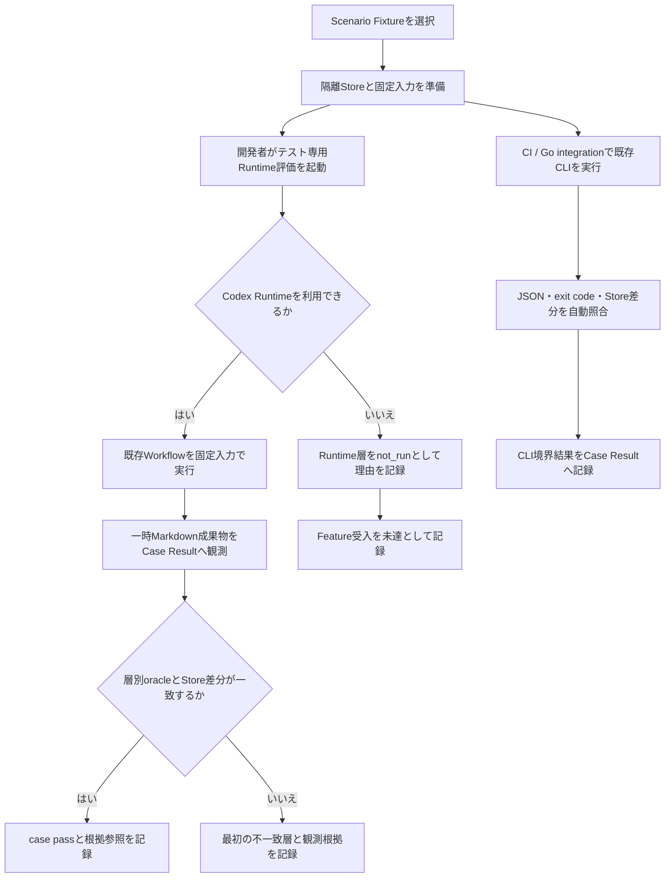
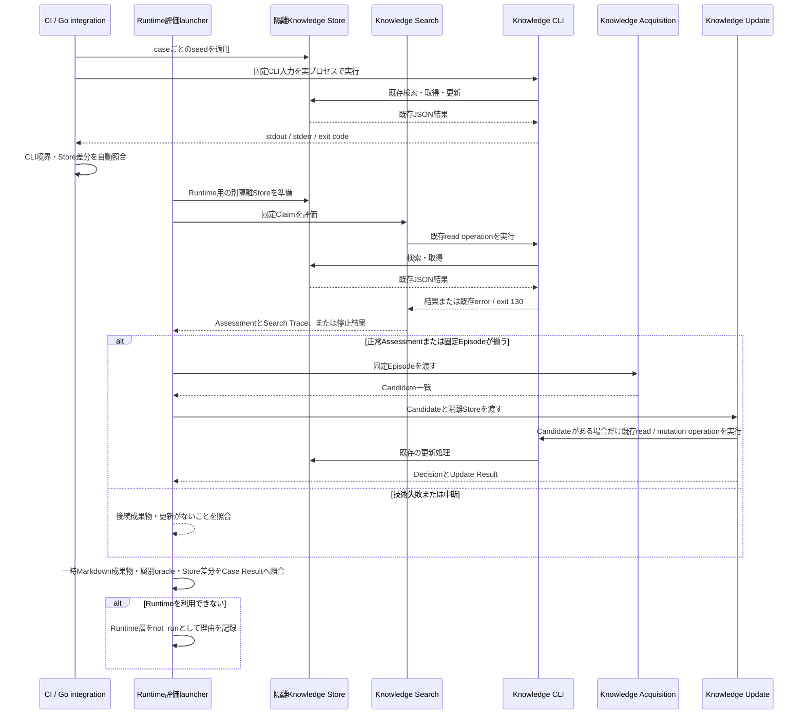

# FEAT-005 詳細設計: 知識評価の品質保証

## Feature Summary

Scenario A〜Jを、既存のKnowledge CLI、Knowledge Search、Knowledge Acquisition、Knowledge Updateの再現可能な受入Fixtureと、Reading Valueの既存検証契約への参照として対応付ける。目的は新しい知識判断を作ることではなく、固定済みの判断が層をまたいで保たれ、失敗を原因の層まで追跡できることを保証することである。

## Scope / Out of Scope

対象と対象外は[requirements.md](requirements.md)に従う。特に、本Featureは既存CLIとKnowledge Search／Knowledge Acquisition／Knowledge Updateの既存契約を**消費・観測するだけ**であり、Reading Valueは既存FEAT-003検証契約を参照する。公開CLI operation、保存先、公開設定、検索・更新・推奨の業務規則を変更しない。ただし[DEC-FEAT-020](decisions/DEC-FEAT-020.md)により、Evidence単位の任意Temporal metadataを保存するSQLite migrationと、既存`get-evidence`応答の省略可能な`temporal`表示だけを追加する。

## Related Requirements / Business Rules

- REQ-021、NFR-006
- BR-002、BR-003、BR-005、BR-008、BR-009
- NFR-001〜005、CON-002〜004、CON-006（Fixture隔離・根拠追跡・既存境界の検証に限る）
- [FEAT-001 CLI契約](../FEAT-001/design/command-catalog.md)
- [FEAT-002 Assessment／Trace契約](../FEAT-002/design.md)、[Search Trace](../FEAT-002/design/search-trace.md)
- [FEAT-003 Reading Value検証契約](../../../../skills/reading-value/references/verification.md)
- [FEAT-004 Workflow契約](../FEAT-004/design/workflow-contracts.md)

## Behavioral Scenarios

### Trigger / Preconditions / Postconditions

| 項目 | 設計 |
| --- | --- |
| Trigger | 開発者またはCIが、Scenario IDまたは全Scenarioの受入評価を開始する。 |
| Preconditions | 対象Featureの実装、既存CLI binary、固定Fixture、各Workflow契約が利用可能である。Storeはcaseごとの一時領域に初期化する。 |
| Main flow | Fixtureを読込み、隔離Storeをseedし、必要な層を単独実行またはEnd-to-End実行し、層別oracleと期待Store差分を照合してcase resultを記録する。 |
| Alternate flow | Scenario F／Gのように更新が禁止されたcaseは、Candidate／Decision／CLI更新がないことを照合する。検索不要のcaseはSearch Traceを要求しない。 |
| Error flow | CLI、Knowledge Search、Updateの失敗・中断は、成功結果に変換せず、既に観測できる成果物とプロセス記録から最初の不一致層をcase resultへ記録する。Reading Value参照の欠落は参照不備として記録し、Workflowを起動しない。 |
| Postconditions | Storeはcase終了後に破棄する。永続Store、公開設定、外部記事、共有fixtureを変更しない。 |

### 受入Scenario

[requirements.md](requirements.md#受入scenarioの正規対応)のA〜Jを正規一覧とし、各caseの不変な入力・seed・期待値は[固定受入Caseカタログ](design/scenario-catalog.md)で規定する。Scenario B、D、E、Hは実CLIと隔離Storeで履歴・検索結果を確認する。Scenario I、JおよびA/GのReading Value期待値は、既存FEAT-003検証契約の必須観測節への参照を固定する。F、Gは更新を発生させないこと自体を合格条件とする。加えて、既存Search停止契約を確認する技術失敗・中断の派生caseを実行する。

## Selected Design Analyses

| 分析 | 採否 | 理由 |
| --- | --- | --- |
| Use case / main・alternate・error flow | 採用 | 一つのFixtureから層別・End-to-Endの両方を実行し、停止結果を成功へ変換しない必要がある。 |
| Interaction / sequence | 採用 | Fixture、CLI、複数Workflow、Store差分の順序と失敗位置が診断可能性を左右する。 |
| Flowchart | 採用 | 層別oracle、禁止更新、最初の不一致の扱いに分岐がある。 |
| Interface / data contract | 採用 | テスト専用Fixtureの共通入力・期待出力を固定しないとScenarioの再現性がない。 |
| Persistence behavior | 採用 | caseごとの隔離、更新禁止、履歴保全、事後差分が受入条件である。 |
| Error model | 採用 | `technical_failure`、`canceled`、CLI errorを成功の知識状態・推奨へ変換しない。 |
| Security / privacy | 採用 | 実ユーザーStore・外部記事・認証情報をFixtureへ入れない。 |
| State transition | 不採用 | 製品の新状態は導入せず、既存成果物を観測するテスト実行の状態は下記flowで十分である。 |
| Concurrency / idempotency / transaction | 限定採用 | 新規transactionはない。既存mutationの原子性・履歴保全はHおよびUpdate関連caseで実CLI／Store差分として確認する。 |
| operation別資料 | 不要 | 新しいCLI/API operationを作らず、利用する既存operationのI/O・DB契約はFEAT-001の資料を正規根拠とする。 |

## Responsibilities

| 論理責務 | 内容 | 変更しない責務 |
| --- | --- | --- |
| Fixture catalog | Scenario ID、層、固定入力、期待oracle、参照契約を対応付ける。 | Claim意味判断・記事取得・検索query生成。 |
| Case setup | 一時Storeを作り、seed、固定Claim／Episodeをcaseへ渡す。Reading Value参照caseは既存FEAT-003検証契約の節参照だけを渡す。 | 通常Store、共有Store、外部サイト。 |
| Runtime evaluation launcher | 選択caseのテスト専用Fixtureと既存のKnowledge Search／Knowledge Acquisition／Knowledge UpdateをCodex Runtimeへ一回だけ渡し、一時Markdown成果物をCase Resultへ返す。 | Skill本文・通常呼出し契約・公開CLI・保存先の変更、外部記事取得、Reading Valueの起動。 |
| Layer executor | CLI、Knowledge Search、Knowledge Acquisition、Knowledge Updateを既存契約どおり順に実行する。 | 既存Workflowの振る舞い、公開I/O、Reading Valueの通常URL評価。 |
| Oracle evaluator | 成果物、CLI process記録、Trace、Store差分を期待値と照合する。 | 新しい知識状態・推奨の再判定。 |
| Diagnostic reporter | Scenario、実行層、最初の不一致、根拠への参照、未実行の後続層を記録する。 | Evidence原文・記事本文・個人Storeの恒久保存。 |

## Implementation Deliverables / Placement

親リポジトリの既存配置と`AGENTS.md`を根拠に、実装成果物はテスト専用領域を主とする。DEC-FEAT-019／020で許可したSQLite test gate・Evidence Temporal migration／Store read・既存`get-evidence`の任意表示だけは製品実装先に置く。`documents/`配下は正規設計資料であり、製品実装先ではない。既存Workflow Skillは検証の**被観測対象**であり、通常利用時のコンテキストを増やさないため変更しない。

| Root-relative placement | 責務 | 依存 | 変更しない領域 |
| --- | --- | --- | --- |
| `testdata/fixtures/acceptance/knowledge-quality/` | Scenario A〜Jの固定入力、seed参照、期待成果物・差分を保持する。 | 既存`testdata/fixtures/cli-boundary/`のJSON Fixture慣行、各Feature契約。 | 実ユーザーStore、外部記事本文、認証情報。 |
| 同Fixture領域のRuntime評価指示 | A〜J／Xのcase ID、渡す固定Claim／Episode、読み込む既存Skill、必須の一時Markdown成果物、Case Resultへの観測項目を定義する。 | FEAT-002／004の既存Workflow契約。 | 実行用Skill本文、通常利用の指示、公開I/O、Reading Value。 |
| `test/integration/` | 実`knowledge` binary、隔離SQLite Store、stdout/stderr、exit code、履歴・差分をプロセス境界で観測する。 | 既存integration testとFEAT-001 CLI契約、DEC-FEAT-020。 | 新operation、保存先、公開設定。 |
| `internal/persistence/sqlite/` の`integrationtest`限定同期gate | `FEAT005-X-SEARCH-CANCELED`で、最初の`search-text`開始後・response開始前にSIGINTを送る時点だけを同期する。 | 既存のtest-only中断gateとDEC-FEAT-019。 | 通常binary、公開CLI、SQLite schema・migration、通常の検索挙動、公開設定。 |
| `internal/persistence/sqlite/` のEvidence Temporal migration | `evidence_temporal_metadata`を非破壊で追加し、Evidence ID単位の任意Temporalを読出す。 | DEC-FEAT-020。 | 既存Evidence、既存operation、保存先、公開設定。 |

新しい実行可能成果物の詳細な組織化、symbol、test framework APIはImplementation領域で既存のGo／Fixture慣行に従う。本Featureは`testdata/fixtures/`と`test/integration/`が既に存在すること、検証対象のWorkflowが親リポジトリの`skills/`に存在することを確認済みである。

## State / Interaction

### 実行モード

全caseは同じFixtureと`case_id`を使うが、実行主体を混在させない。

| モード | 実行主体 | 対象 | 観測・合格の位置付け |
| --- | --- | --- | --- |
| 自動CLI境界 | CIまたは開発者の既存Go integration test | seed、既存`knowledge` binary、stdout/stderr、exit code、Store差分、Hの履歴、Xの`storage_error`／exit 130 | CIの自動gate。Fixture構造と実CLI／隔離Storeの一致を判定する。 |
| Runtime受入評価 | 開発者が起動するCodex Runtimeのテスト専用評価 | A〜J／XのKnowledge Search、Candidate、Decision／Result | Feature受入gate。RuntimeはFixtureの評価指示と既存Skillを読み、一時Markdown成果物とCase Resultを呼出しsessionへだけ返す。Reading Valueは実行しない。 |

Runtime受入評価は、通常のURL評価・会話とは別のテスト専用起動である。launcherは選択したFixture、既存Skillの通常契約、隔離Storeへの接続情報だけを渡し、成果物をStore、repository、公開UI/API、Skill本文へ保存しない。Codex RuntimeがCIに存在しない場合、CIはRuntime評価を実行・合格扱いにせず、対象caseを`not_run`として理由を出す。Feature全体の実行対象の受入は、開発者がRuntime評価を実行してA〜J／XのCase Resultを得るまで成立しない。I/JおよびA/GのReading Value期待値は実行対象に含めず、既存FEAT-003検証契約への参照が存在することを確認する。

### Fixture実行フロー

### End-to-End相互作用

## Interfaces / Data

### テスト専用Fixture契約

Fixtureは公開JSON APIではないが、再現性のため以下の論理項目を必須とする。既存のJSON Fixture慣行に従う具体形式はImplementationで選ぶが、項目の意味・必須性は変えない。

| 項目 | 必須 | 意味 |
| --- | --- | --- |
| `case_id` | 必須 | 不変のcase識別子。Scenario IDと層を含め、結果・報告から参照できる。 |
| `scenario_id` | 必須 | `A`〜`J`のいずれか。複数Scenarioを一caseに混在させない。 |
| `layers` | 必須 | `cli_store`、`knowledge_search`、`knowledge_acquisition`、`knowledge_update`、`end_to_end`から、このcaseが実行する層の集合。 |
| `store_seed` | 必須 | 空Storeまたは隔離Storeへ適用する既存seedの参照。実ユーザーStoreを指定しない。 |
| `claims` | 条件付き | Knowledge Searchを実行するcaseの固定Claim。Claim IDと既存Assessment入力に必要な属性を持つ。 |
| `episode` | 条件付き | Knowledge Acquisitionへ渡す順序付きユーザー寄与。F／G／Hでは該当入力を必須とする。Knowledge Updateは当該Candidateだけを受け取る。 |
| `expected` | 必須 | Assessment状態、Trace条件、Candidate／Decision／Result、禁止操作、Store差分、停止結果の期待値。 |
| `contract_references` | 必須 | 期待値の根拠となるFeature設計・検証契約への参照。 |
| `runtime_evaluation` | 条件付き | A〜J／XのRuntime評価で渡す既存Skill、固定入力、必須一時Markdown成果物、Case Resultへ転記する観測項目。通常SkillへCase固有情報を渡さない。 |
| `reading_value_reference` | 条件付き | A／G／I／Jが既存FEAT-003検証契約の該当する必須観測節へ一意に対応付ける参照。Case ResultやRuntime入力ではない。 |

`expected`は自由文だけで合格を決めず、少なくとも次の観測可能な項目を必要に応じて持つ。

| 観測 | 内容 |
| --- | --- |
| CLI / Store | argv、stdout、stderr、exit code、実行順、更新operation数、更新前後の履歴差分。 |
| Knowledge Search | Assessment状態、Confidence、Known、Knowledge Gap、Traceのoperation／query／ID／Budget／停止理由。 |
| Knowledge Acquisition | Candidate有無、Evidence kind・強度・順序、入力境界。 |
| Knowledge Update | Decision、Update Result、後続`not_started`、CLI順、履歴保全。 |
| Reading Value参照 | `reading_value_reference`が既存FEAT-003検証契約の指定節を一意に指すこと。 |
| 禁止結果 | `no_evidence`を未知へ変換しない、ExposureをEvidenceへ保存しない、失敗・中断を推奨へ変換しない。 |

### Case Result契約

実行結果は少なくとも`case_id`、`scenario_id`、`execution_mode`、実行済み層、`pass`／`failed`／`not_run`、`first_mismatch_layer`、観測根拠への参照、`not_executed_layers`、Store破棄の成否を記録する。`execution_mode`は`cli_boundary`または`runtime_acceptance`のいずれかであり、Case Resultの一意な論理キーはこの値と`case_id`の組である。同じ`case_id`の二モード結果を上書き・合算しない。`not_executed_layers`は当該caseの実行対象外、または最初の不一致・中断の後に未実行となった層だけを列挙し、実行済み層と重複させない。`first_mismatch_layer`は`cli_store`、`knowledge_search`、`knowledge_acquisition`、`knowledge_update`、`end_to_end`のいずれか、または不一致なしを表す`none`である。Searchを含むcaseは`cli_store → knowledge_search → knowledge_acquisition（対象時）→ knowledge_update（対象時）→ end_to_end`、Acquisition／Updateだけのcaseは`knowledge_acquisition → knowledge_update → end_to_end`で、実行対象の最初の不一致を採る。`failed`は新しい知識状態や推奨を合成しない。実行不能な依存がある`not_run`はpassとして集計しない。ScenarioのFeature受入は、要求された`runtime_acceptance`結果がすべて`pass`の場合だけ成立し、`cli_boundary=pass`だけでは成立しない。Reading Value参照はCase Resultとは別に存在確認する。

## Contract Completeness

| 性質 | 状態 | 根拠 |
| --- | --- | --- |
| 永続データまたは履歴 | complete | 本Featureは製品データを追加しない。隔離Storeのseed、更新差分、履歴非削除をFixtureの期待値として明示する。 |
| 検索・取得 | complete | Scenario A〜E、Hは既存CLI／Knowledge Searchを使い、状態・Trace・空結果・停止を上記Fixture契約で明示する。 |
| 更新・重複 | complete | F／Gは更新ゼロ、Hは訂正と履歴保持、既存Update契約の重複・部分適用・競合を参照する。 |
| Command / CLI / API | complete | 新operationは追加しない。DEC-FEAT-020により既存`get-evidence`のEvidenceへ任意`temporal`を表示し、値なしEvidenceの既存response形状を維持する。 |
| Schema / Store / Index変更 | complete | DEC-FEAT-020により`evidence_temporal_metadata`とIndexを非破壊migrationで追加し、V1 Storeから現行schemaへの移行と欠損schema拒否を検証する。 |
| テストFixture | complete | Fixture入力、期待oracle、case result、Scenario A〜Jの対応を本書で固定する。 |

## Physical / Wire Schema

DEC-FEAT-020により、SQLite DDLへ`evidence_temporal_metadata`とそのIndexを追加する。`get-evidence`の各EvidenceにはTemporalがある場合だけ`temporal`を追加し、既存の値なしEvidenceのJSON形状は維持する。新operationや他のwire contractは追加・変更しない。

テストFixtureの物理エンコードは公開契約ではない。ただし、[Interfaces / Data](#interfaces--data)の論理項目、各Scenarioの期待値、隔離と再現性は必ず満たす。既存FixtureがJSONを採用しているためJSONを既定とするが、これはテストデータのL2選択であり、CLI wire schemaを拡張しない。

## Operation Documentation

新しいJSON CLI／API operationは提供しない。DEC-FEAT-020で変更する`get-evidence`の任意Evidence `temporal`は、既存operationの読出し互換性を維持しつつ実プロセス境界で検証する。その他の入力、成功・error JSON、exit code、DB接続、transactionは[FEAT-001 Command Catalog](../FEAT-001/design/command-catalog.md)と各operation資料が正規根拠である。

## Error / Edge Cases

- 空Store、一致なし、`no_evidence`は成功の未知証明ではない。Scenario AおよびJでその禁止断定を確認する。
- CLIの`validation_error`、`not_found`、`storage_error`、`internal_error`、JSONプロトコル不整合は`technical_failure`、response開始前のexit 130・無出力は`canceled`として、Assessmentや推奨を作らない。`FEAT005-X-SEARCH-CANCELED`はDEC-FEAT-019のtest-only同期gateで`search-text`開始後に中断する。
- Search TraceはKnowledge Searchを実行したcaseでだけ必須にする。F／Gの更新禁止caseに架空のTraceを要求しない。
- Scenario F（質問）とG（AI説明）は、Candidate、Decision、CLI mutation、Store差分がいずれもないことを確認する。GのURL評価が正常完了しても、記事・Assessment・AI回答をEvidence化しない。
- Scenario Hは訂正前のEvidence、旧revision、既存Relationを削除せず、訂正後Evidenceと現行評価を追跡できることを確認する。
- Fixture、依存実装、またはCodex Runtimeが不足してcaseを実行できない場合は`not_run`として理由を残す。期待成功として扱わず、外部記事取得・CIのCLI境界passで穴埋めしない。

## Security / NFR Considerations

- Fixtureは一時Storeだけを使い、既定Store、共有DB、実ユーザー情報を読書きしない。
- 記事URLのライブ取得、Cookie、認証情報、セッション、状態変更をFixtureに含めない。URL取得安全性そのものはFEAT-003のV-009〜V-011を参照する。
- Trace、report、fixtureには検証に不要なEvidence原文・記事本文を重複保存しない。必要な場合も合成した最小入力だけを使用する。
- 既存のGo検証は`gofmt`、`go test ./...`、`go vet ./...`を守る。CLI／SQLiteに触れるcaseは`test/integration/`で実プロセス境界を観測する。
- Codex Runtimeを必要とする層別成果物は、CIのGo testへ偽装して組み込まない。テスト専用Runtime評価が返した一時MarkdownとCase Resultを観測し、未実行なら`not_run`とする。

## Acceptance / Test Design

### 層別評価と失敗切り分け

| 層 | 入力 | 主oracle | 失敗時に確認する根拠 |
| --- | --- | --- | --- |
| CLI / Store | seed、既存CLI argv | JSON、stdout/stderr、exit code、DB履歴 | process記録、隔離Store差分、FEAT-001 operation契約。 |
| Knowledge Search | 固定Claim、CLI応答 | Assessment、Search Trace、Budget、停止理由 | TraceとAssessment、CLI記録。 |
| Knowledge Acquisition | 固定Episode | Candidate、Evidence kind・強度・順序、入力境界 | Episode、Candidate一覧。 |
| Knowledge Update | Candidate、隔離Store | Decision／Result、CLI順、履歴、後続`not_started` | Candidate、Update Result、process記録、Store差分。 |
| Reading Value参照 | FEAT-003検証契約の該当節 | `reading_value_reference`の節IDと参照先の存在 | FEAT-003検証契約。 |
| End-to-End | 上記を同一case IDで連結 | 層間参照、更新禁止／履歴、最終成果物 | 各層の成果物とcase result。 |

最初の不一致層はCase Result契約の実行順にoracleを照合して定める。例えば、CLI結果が期待と異なれば後続のAssessment差異を原因として数えない。CLIが一致しTraceが不一致ならKnowledge Search、Candidateが禁止入力から作られればKnowledge Acquisition、Candidateが正しくてもその`search-text`、Decisionまたはmutationが違えばKnowledge Updateとする。Reading Value参照の不備はCase Resultの層不一致に混ぜず、参照不備として診断する。Knowledge Update内のread/searchとmutationはいずれも同じUpdate層のprocess記録・Store差分で診断する。

### Scenario coverage matrix

| Scenario | 固定case | CLI / Store | Knowledge Search / Trace | Acquisition | Update | Reading Value | End-to-End |
| --- | --- | --- | --- | --- | --- | --- | --- |
| A | `FEAT005-A-SEARCH-EMPTY` | 空Store | `no_evidence`・停止理由 | - | - | FEAT-003 V-002を参照 | Searchまで |
| B | `FEAT005-B-SEARCH-EXACT` | 完全一致・強いEvidence | `known` | - | - | - | - |
| C | `FEAT005-C-SEARCH-PARTIAL` | 構成Assertion・Evidence | `partially_known` | - | - | - | - |
| D | `FEAT005-D-SEARCH-CONTRADICTED` | 反対Evidence | `contradicted` | - | - | - | - |
| E | `FEAT005-E-SEARCH-OUTDATED` | 時点差分・訂正根拠 | `outdated` | - | - | - | - |
| F | `FEAT005-F-ACQUISITION-QUESTION` | 更新ゼロ | 不要 | Candidate空 | Decision／mutation空 | - | 必須 |
| G | `FEAT005-G-ACQUISITION-AI-ONLY` | 更新ゼロ | - | Candidate空 | Decision／mutation空 | FEAT-003 V-004を参照 | Updateまで |
| H | `FEAT005-H-UPDATE-CORRECTION`、`FEAT005-H-SEARCH-CORRECTED` | 訂正前後の履歴 | 更新後seedを再評価 | 訂正Candidate | revise・attach-evidence・履歴保持 | - | 更新caseのみ必須 |
| I | `FEAT005-I-READ-SELECTED` | 必要なseed | Claim別Trace | - | - | FEAT-003 V-002を参照 | Searchまで |
| J | `FEAT005-J-READ-TRIVIAL` | 必要なseed | `no_evidence`を未知化しないTrace | - | - | FEAT-003 V-002を参照 | Searchまで |

`-`は対象外であり、未実行をpassへ読み替えない。各行の固定入力・期待値・Store差分は[固定受入Caseカタログ](design/scenario-catalog.md)を正とし、任意caseとして省略しない。`FEAT005-X-SEARCH-TECHNICAL-FAILURE`と`FEAT005-X-SEARCH-CANCELED`は、成功Scenarioとは独立して停止位置と後続未実行を確認する。

### 実行・合格基準

1. A〜Jの各行にRuntime受入評価による少なくとも一つの`pass` caseがあり、`contract_references`で要求・既存契約へ遡れる。A／G／I／Jはさらに`reading_value_reference`でFEAT-003検証契約の必須観測節へ遡れる。CIのCLI境界passだけでこの条件を代替しない。
2. End-to-End必須のF、G、Hは、同じ`case_id`で入力から最終観測まで追跡できる。A、I、JはSearchのCase ResultとReading Value参照を同じ`case_id`で追跡できる。
3. Scenario A〜E、H、I、JでKnowledge Searchを実行するcaseは、Traceからoperation、query、結果ID、Evidence ID（存在時）、Budget、停止理由を確認できる。
4. FとGはAcquisitionのCandidateが空、UpdateのDecisionとmutation argvが空、Store差分がない。Hは過去Evidence等が削除されず、訂正後の結果が追跡できる。
5. I／Jの`reading_value_reference`は既存FEAT-003 V-002へ一意に遡れる。
6. `FEAT005-X-SEARCH-TECHNICAL-FAILURE`はerror JSON、`FEAT005-X-SEARCH-CANCELED`はresponse開始前のexit 130をプロセス境界で再現し、Trace停止位置、Assessment不在、後続層未実行、mutationなしを確認する。
7. `failed`／`not_run` caseはScenario合格を満たさず、最初の不一致層または実行不能理由を記録する。

## Assumptions

- FEAT-001〜004の実装が、それぞれのapproved handoffと既存検証契約に従って利用可能になる。未実装の依存に対するcaseは`not_run`であり、FEAT-005が代替実装を作らない。
- 固定Episodeは、実在ユーザー・外部記事の機微情報を含まない合成データで作成できる。Reading ValueのArticle Analysisは本FeatureのFixtureへ含めない。
- 既存のWorkflow成果物はMarkdownであり、受入oracleは必須section・識別子・参照・禁止断定を観測する。自然言語の表現全体一致を唯一の合否基準にしない。

## Decisions

- [DEC-FEAT-016](decisions/DEC-FEAT-016.md): 固定Fixtureと層別oracleを採用する。
- [DEC-FEAT-017](decisions/DEC-FEAT-017.md): 自動CLI境界とRuntime受入評価を分離する。
- [DEC-FEAT-018](decisions/DEC-FEAT-018.md): Reading Valueは既存検証契約への参照に限定する。
- [DEC-FEAT-019](decisions/DEC-FEAT-019.md): `search-text`の中断をtest-only同期gateで再現する。
- [DEC-FEAT-020](decisions/DEC-FEAT-020.md): Evidence単位Temporalの非破壊永続化と`get-evidence`の任意表示を許可する。
- [DEC-FEAT-021](decisions/DEC-FEAT-021.md): 明示起動だけを受けるテスト専用Runtime受入launcherを置く。
- 既存のCLI operation、Workflow契約は変更せず参照する。

## Open Issues

なし。Fixtureの具体的な合成文面・test helper・実行順のコード構造は、固定済みの論理契約を満たす範囲でImplementation領域が決める。
