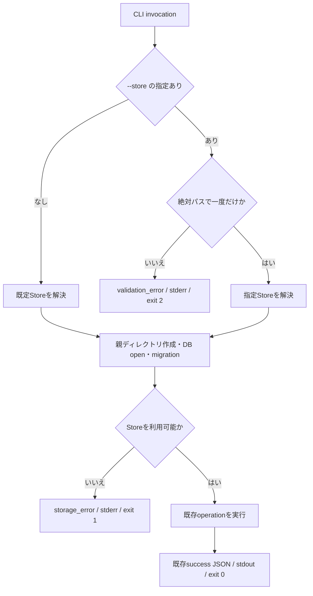
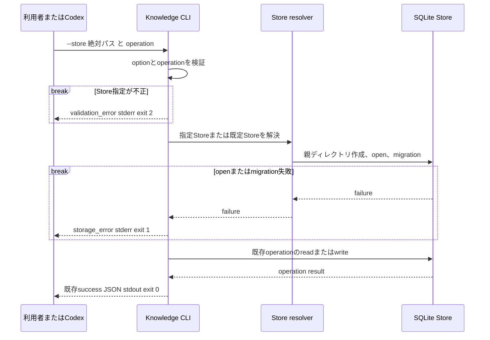

# FEAT-007 詳細設計: 隔離Knowledge Storeの明示選択

## Feature Summary

利用者が`--store`で絶対SQLiteファイルパスを指定したときだけ、Knowledge CLIはそのStoreを初期化・migration・利用する。指定がなければ、従来どおりOSユーザー設定領域の既定Storeを利用する。Codex sandboxはworkspace内のStoreを明示して実行できる。

## Scope / Out of Scope

Scopeは[要件](requirements.md)の受入条件に限る。既定Storeの移動、環境変数・設定ファイル、Store共有、権限昇格、schema変更、11operationのdomain I/O変更は対象外とする。

## Related Requirements / Business Rules

REQ-022、NFR-007、CON-002、CON-003、CON-007、BR-010、および[DEC-FEAT-023](decisions/DEC-FEAT-023.md)を正とする。指定なしの既定StoreはDEC-FEAT-005を維持する。

## Behavioral Scenarios

### S-001: Codex sandboxで指定Storeを使う

1. 利用者はworkspace内の絶対SQLiteパスを`--store`へ渡し、operationを指定する。
2. CLIは`--store`を一度だけ受理し、絶対パスかを検証する。
3. CLIは指定した親ディレクトリを作成し、そのDBだけをopenして未適用migrationを適用する。
4. CLIは既存operationを実行し、既存のsuccess JSONをstdout、exit 0で返す。

### S-002: 既存の指定なし呼出し

1. 利用者は従来の`knowledge <operation> ...`を実行する。
2. CLIは`os.UserConfigDir()/knowledge/knowledge.db`を解決し、既存どおり初期化・migration・operationを実行する。

### S-003: Store指定が不正

`--store`の値なし、重複、相対パスはStoreをopenせず、`validation_error` JSONをstderrへ出力してexit 2となる。

### S-004: 指定Storeを開けない

絶対パスでも親ディレクトリ作成、DB open、migrationに失敗したときは、指定先以外を試さず、`storage_error` JSONをstderrへ出力してexit 1となる。

## Selected Design Analyses

- **Main/error flow:** 必要。公開input、既定へのfallback禁止、初期化失敗の境界を定める。
- **Sequence:** 必要。CLI、Store resolver、SQLite migration、operationの責務と失敗戻り先を定める。
- **State transition:** 不要。Store選択はinvocation内で完結し、永続的な設定状態を持たない。
- **DB schema:** 変更なし。既存schema/migration contractを指定Storeへ適用するだけである。

## Responsibilities

| 責務 | 内容 |
| --- | --- |
| CLI input boundary | global `--store`をoperation前に構文解析し、絶対パス・一回性を検証する。 |
| Store resolver | 指定Storeまたは既定Storeを一意に決め、親ディレクトリ作成、open、migrationへ渡す。 |
| SQLite adapter | 既存のopen/migration transactionを、resolverが選んだ一つのパスへ適用する。 |
| Operation executor | 選択済みStoreを用いて既存operationのdomain処理を行う。 |
| Codex workflow | 利用者が開いた固定`verification/` workspaceの物理絶対パスから同一Storeパスを導出し、呼出すすべての`knowledge` commandへ渡す。 |

### 検証用workflowのStore伝播入口

検証用Skill群は`verification/.agents/skills/{reading-value,knowledge-acquisition,knowledge-search,knowledge-update}/`の4 rootだけをコピーする。利用者は`verification/`をworkspaceとして開き、`$reading-value <一件の絶対HTTP(S) URL>`だけを渡す。

1. 検証用`reading-value`は、Codex Runtimeが開いたworkspaceの物理絶対パスを`pwd -P`で一度取得する。この値は`verification/` workspace rootだけであり、利用者入力、環境変数、設定ファイル、親ディレクトリ探索からStoreを選ばない。`.agents/skills/reading-value/`と`bin/knowledge`がそのroot直下にあることを確認できなければ停止する。
2. Storeの絶対パスを`<verification-root>/knowledge.db`と一意に決める。この値は実行中のURL Evaluation Episodeだけに保持し、Article、Assessment、Candidate、Update Resultや永続設定へ保存しない。
3. 検証用`knowledge-search`と`knowledge-update`へ、その絶対パスを必須の実行コンテキストとして引き渡す。各CLI呼出しは`<verification-root>/bin/knowledge --store <verification-root>/knowledge.db <operation> ...`となる。
4. root確認失敗、Store解決不能、binary不在の場合はCLIを起動せず、既存workflowの技術的停止結果を返す。既定Storeへのfallback、権限昇格、別のStore候補探索は行わない。

これは検証用Skillの固定配置から導く明示的なCLI argvであり、公開CLIの環境変数・設定・暗黙のStore解決ではない。通常の`skills/`は`--store`を自動追加せず、指定なし既定Storeを使う。

## Implementation Deliverables / Placement

| 配置 | 変更 | 責務・依存 |
| --- | --- | --- |
| `cmd/knowledge/` | 変更 | global optionのparse、Store解決、11operationへの同一Store注入、既存errorへの写像。`internal/`のdomain I/Oは変更しない。 |
| `cmd/knowledge/*_test.go` | 変更 | parse、既定/指定Store選択、validation、open/migration失敗をunit testする。 |
| `test/integration/` | 変更 | 実バイナリで指定Storeの初期化・読書き・既定Store互換・stdout/stderr/exit codeを検証する。 |
| `documents/docs/features/FEAT-001/design/cli-input-conventions.md` | 変更 | 全operation共通のglobal optionとして公開入力資料を整合する。 |
| `documents/docs/features/FEAT-001/design.md`、`tasks.md`、`implementation-handoff.yaml`、`decisions/DEC-FEAT-005.md` | 変更 | DEC-FEAT-023が置換する「保存先optionを追加しない」限定だけを、指定なし既定Storeを維持した新共通契約へ整合する。 |
| `skills/knowledge-search/references/cli-operations.md`、`skills/knowledge-update/references/cli-operations.md` | 変更 | 通常Skillの既定Store利用を維持しつつ、呼出側から明示Store実行コンテキストを受けた場合のargv構文を正規化する。 |
| `verification/`（専用ブランチ `chore/verification-environment`） | 変更 | `README.md`、4つの検証用Skillコピー、`bin/knowledge`、`source-manifest.json`を、開いた`verification/` workspaceの`pwd -P`からStoreを導く実行手順と同期証跡へ更新する。review/audit済みのclean source commitを隔離worktreeでbuildし、commit・candidate/source fingerprint・binary/Skill SHA-256をmanifestへ記録してから同ブランチへ追従commitする。 |
| `internal/domain/`、`internal/persistence/sqlite/migrations/` | 変更しない | domain dataとschema/migration assetの契約は本Featureの対象外。 |

## Interfaces / Data

### CLI形式契約

```text
knowledge [--store <absolute-path>] <operation> [operation options]
```

| 項目 | 型・必須性 | 意味 |
| --- | --- | --- |
| `--store` | string、任意、最大1回 | operationより前に置く絶対SQLiteファイルパス。省略時は既定Store。 |
| `<operation>` | string、必須、1回 | 既存11operationのいずれか。operationとそのoptionの契約は変更しない。 |

`--store`は成功responseへ出力しない。既存operationのsuccess JSON schema、normal error envelope、stdout/stderr、exit codeは維持する。

### Store解決契約

| 条件 | 選ぶStore | 初期化・migration | fallback |
| --- | --- | --- | --- |
| `--store`なし | `os.UserConfigDir()/knowledge/knowledge.db` | 既存規約どおり | なし |
| 有効な`--store` | 指定した絶対パス | 既存規約をそのStoreへ適用 | なし |
| 不正な`--store` | なし | 実行しない | なし |
| 指定Storeのopen/migration失敗 | 指定した絶対パスだけ | 失敗を返す | 既定Storeへ切替しない |

### JSON error形式

```json
{
  "ok": false,
  "error": {
    "code": "validation_error",
    "message": "Storeパスは絶対パスで指定してください",
    "field": "store"
  }
}
```

不正な`--store`は`validation_error`、exit 2、stderrだけに出力する。指定Storeのfilesystem/SQLite/migration失敗は既存`storage_error`、exit 1、stderrだけに出力する。Ctrl-Cの既存無出力・exit 130規約を優先する。

## State / Interaction





## Operation Documentation

対象operationは`search-text`、`search-concept`、`search-related`、`get`、`get-evidence`、`search-contradictions`、`search-temporal`、`create`、`attach-evidence`、`revise`、`supersede`の全11件である。各operationは既存の個別I/O資料を維持し、共通global optionを[FEAT-001 CLI入力規約](../FEAT-001/design/cli-input-conventions.md)へ追加する。このFeatureはoperation固有のDB access・SQL・schemaを変更しないため、既存資料を再記述しない。

監査結果: 11operationすべてが同じcomposition rootでStoreを開くため、global `--store`はoperation資料の固有optionと衝突せず、全operationで一貫して適用する。複数operationを連続実行するworkflowは、同じ絶対パスを毎回渡すことでStoreを共有する。

### 既存正規資料の整合更新

DEC-FEAT-023が決定後に正とする共通契約は`knowledge [--store <absolute-path>] <operation> [operation options]`である。以下を同一変更で更新し、旧資料を並存させない。

| 資料 | 置換・維持する内容 |
| --- | --- |
| FEAT-001 `design.md` | Scope、CLI入力、Store、Security/NFR、Assumptionsにある「保存先optionを追加しない」を、指定なし既定Storeを維持しながら`--store`を一回だけ受理する記述へ置換する。 |
| FEAT-001 `design/cli-input-conventions.md` | 基本形をglobal option込みへ変更し、位置、重複、値なし、相対パスを`validation_error`（stderr JSON、exit 2）と明記する。 |
| FEAT-001 `decisions/DEC-FEAT-005.md` | Statusを置換済みにせず、DEC-FEAT-023により保存先option禁止だけがsupersededであること、既定Store・初回初期化は継続することを追記する。 |
| FEAT-001 `tasks.md` / `implementation-handoff.yaml` | 公開optionを追加しないという実装制約を削除し、指定なし既定Storeと明示Storeの両方を検証する後継契約を参照する。 |
| SkillのCLI operation references | operation固有optionの前に、呼出側が渡す任意のglobal `--store <absolute-path>`を置けることを記載する。検証用コピーは上記の固定`verification/` workspace rootから必ず値を渡す。 |

## Error / Edge Cases

- `--store`がoperationの後に現れる、またはunknown optionとして現れる場合は`validation_error`。
- `--store`が複数回、空値、相対パスの場合は`validation_error`。既存directoryを指すなどfilesystem上の不適合は、open結果として`storage_error`に分類する。
- 指定先の親ディレクトリの作成権限不足、SQLite DB open、migration失敗は`storage_error`。実行環境のsandbox制約はこの分類に含まれる。
- 指定Storeが既存の有効DBならmigrationは再実行可能であり、既存dataを別Storeへコピーしない。
- Ctrl-CはStore選択の前後を問わず既存のexit 130無出力規約を優先する。

## Security / NFR Considerations

Storeパスは利用者が明示してプロセスへ渡すローカルfilesystem inputである。CLIはパスがsandbox内かを推測せず、OSと実行環境のアクセス制御に従う。書込み権限がない場合に権限昇格、別パスへのfallback、pathの自動作成以外の回避をしない。`--store`をログまたはsuccess JSONへ追加しない。

## Acceptance / Test Design

- unit: global optionの位置・重複・空値・相対パス、既定/指定Storeの選択、context中断を検証する。
- process integration: workspace内一時絶対パスへの初回migration、指定Storeでのcreate後のsearch、指定なし既定Store互換、validation errorのstdout/stderr/exit、storage errorのstdout/stderr/exitを観測する。
- regression: 全11operationを指定Storeで少なくとも一度起動し、同じStoreを読書きすることを確認する。
- workflow verification: `verification/`をworkspaceとして起動した`$reading-value <URL>`が、入力URL以外を要求せず、`pwd -P`で取得しmarkerを確認したworkspace rootから導いた同一の`verification/knowledge.db`を全CLI invocationへ明示して渡すことを、実行記録とuser-run手順で観測する。

## Assumptions

- workspace内の絶対パスはCodex sandboxから書込み可能である。反証時はsandboxの実行権限を調査し、CLIのfallbackを追加しない。
- 検証用Skillを`verification/`以外へコピーして使用しない。コピー先を変える必要があれば、固定Store入口の再設計が必要である。

## Decisions

- [DEC-FEAT-023](decisions/DEC-FEAT-023.md)がL3承認済みである。

## Open Issues

なし。詳細設計の利用者承認後にTask Breakdownへ進む。
